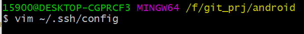

# <center>android</center>

[TOC]

## 一、开发环境及示例程序

直接上 android studio


## 二、Android Git服务器`gidder`

###[本文主要来自](https://blog.csdn.net/TaylorPotter/article/details/69808733) https://blog.csdn.net/TaylorPotter/article/details/69808733

###I、资源获取

```powershell
一、安卓市场下载 gidder
二、gidder源码：https://github.com/antoniy/Gidder
三、https://play.google.com/store/apps/details?id=net.antoniy.gidder.beta 
三、https://pan.baidu.com/s/1eRWFxRk
```

###II、概述/简介

```powershell
    推荐一款开源的在Android平台上的git服务器app：gidder。
    它可以将手机作为可移动的git服务器。
    感谢Bob的推荐，在这里推荐给大家使用。
	因为公司网络限制，evernote、为知笔记、有道笔记都上不了，github在国内网络状况不佳，所以找到这样一个工具，将自己的android手机变成一个移动的git服务器，每天下班前将公司记的笔记同步到自己的手机上，回家了再同步到私人电脑上，反之亦然。

	这样我们就可以随身携带git服务器管理笔记或者文件。使用这种方式不仅可以不依赖互联网，而且还可以看到到自己笔记每一笔提交，随时回退修改，方便很多。只可惜现在只有Android平台上能勾使用。
```

###III、ANDROID 上安装服务器

> ### 从安卓市场下载安装后
>
> 
>
> 
>
> 
>
> 
>
> 
>
> 
>
> 

###IV、客户端连接

> ### 我的服务器用户名密码配置为 `wishcell / wishcell`，仓库名为`fakegithub.git`

####1、连接出错


####2、解决方法

```powershell
修改：
	如果没有 ~/.ssh/config 文件，则创建之。
	然后在其中添加一行：
		HostkeyAlgorithms +ssh-dss
	然后更改访问权限：
		chmod 600 ~/.ssh/config
	然后 git clone 就能完美工作

原文：
I have found the problem , The new OpenSSH versions disable the ssh-dss (DSA) public key algorithm. 
DSA was deemed too weak and OpenSSH community recommends against its use.

If you see an error similar to this:

Unable to negotiate with 10.96.8.72: no matching host key type found. Their offer: ssh-dss
...then you must re-enable the DSA keys by editing your ~/.ssh/config file to add the following line:

HostkeyAlgorithms +ssh-dss
You may need to create the ~/.ssh/config file if it does not already exist.

After creating the file, you must restrict access permissions:

chmod 600 ~/.ssh/config
and then do the clone. That should work perfectly fine!
```




###V、由于ip经常更换，push出错

#### 1、修改每次不同的url

```shell
git remote set-url origin ssh://wishcell@192.168.43.153:2222/fakegithub.git
```

####2、出错 log

```
$ git push cdgnote master
@@@@@@@@@@@@@@@@@@@@@@@@@@@@@@@@@@@@@@@@@@@@@@@@@@@@@@@@@@@
@    WARNING: REMOTE HOST IDENTIFICATION HAS CHANGED!     @
@@@@@@@@@@@@@@@@@@@@@@@@@@@@@@@@@@@@@@@@@@@@@@@@@@@@@@@@@@@
IT IS POSSIBLE THAT SOMEONE IS DOING SOMETHING NASTY!
Someone could be eavesdropping on you right now (man-in-the-middle attack)!
It is also possible that a host key has just been changed.
The fingerprint for the DSA key sent by the remote host is
SHA256:MhOGEr5Oj3N9MoMM4DcHsNSfMKZk2bSEhGSsvFWUYco.
Please contact your system administrator.
Add correct host key in /c/Users/ni**.chen/.ssh/known_hosts to get rid of this message.
Offending DSA key in /c/Users/ni**.chen/.ssh/known_hosts:4
DSA host key for [10.0.56.201]:2222 has changed and you have requested strict checking.
Host key verification failed.
fatal: Could not read from remote repository.

Please make sure you have the correct access rights
and the repository exists.
```

> #### 解决办法：
>
> ​	删除 known_host 中对应url的条目，再push。 

---

#### 3、 git pull 报错

> ###A、服务器重启能解决的情况


> ### B、需要设置分支情况
>
> ```powershell
> chengang@chengang-dev:~/local_notes/xmlocalnotes$ git pull
> Password authentication
> Password: 
> 当前分支没有跟踪信息。
> 请指定您要合并哪一个分支。
> 详见 git-pull(1)。
> 
>     git pull <remote> <branch>
> 
> 如果您想要为此分支创建跟踪信息，您可以执行：
> 
>     git branch --set-upstream-to=origin/<branch> master
> ```
>
> 解决办法：
>
> ```powershell
> chengang@chengang-dev:~/local_notes/xmlocalnotes$ git remote
> origin
> chengang@chengang-dev:~/local_notes/xmlocalnotes$ git branch -a
> * master
>   remotes/origin/master
> chengang@chengang-dev:~/local_notes/xmlocalnotes$ git branch --set-upstream-to=origin/master master
> 分支 master 设置为跟踪来自 origin 的远程分支 master。
> chengang@chengang-dev:~/local_notes/xmlocalnotes$ git pull
> #pull 成功
> ```
>
> **注意git branch –set-upstream-to=origin/master master set前面是两个横杠。 **


---


---