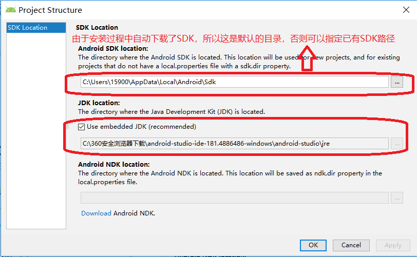
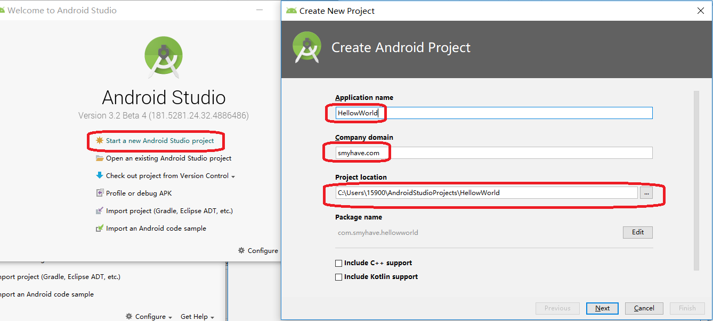
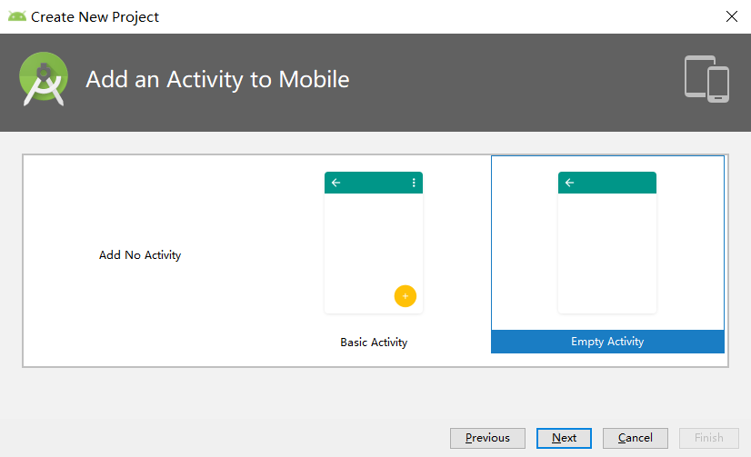
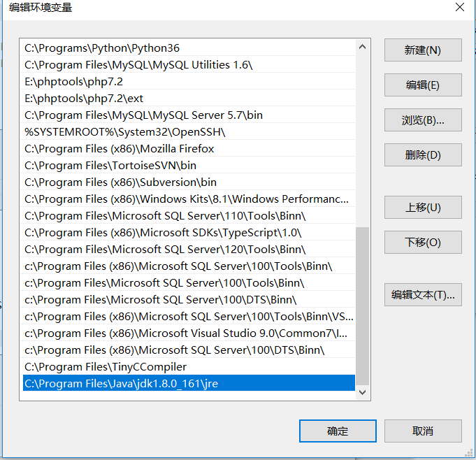
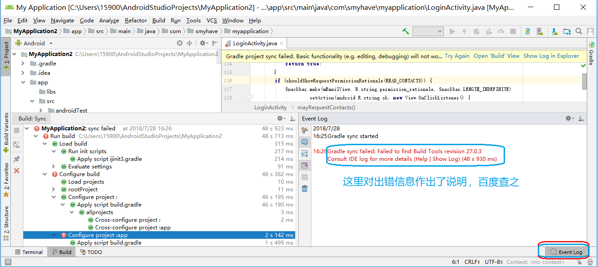
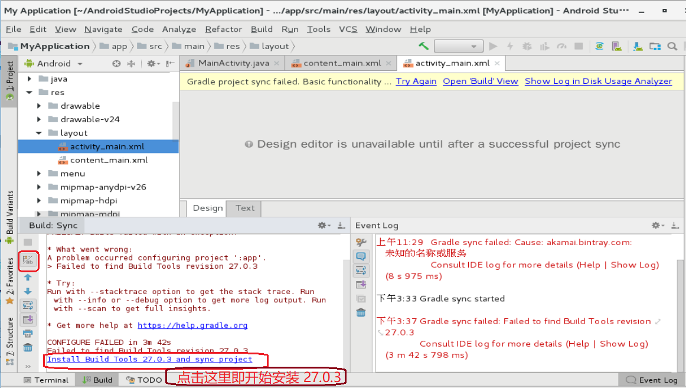
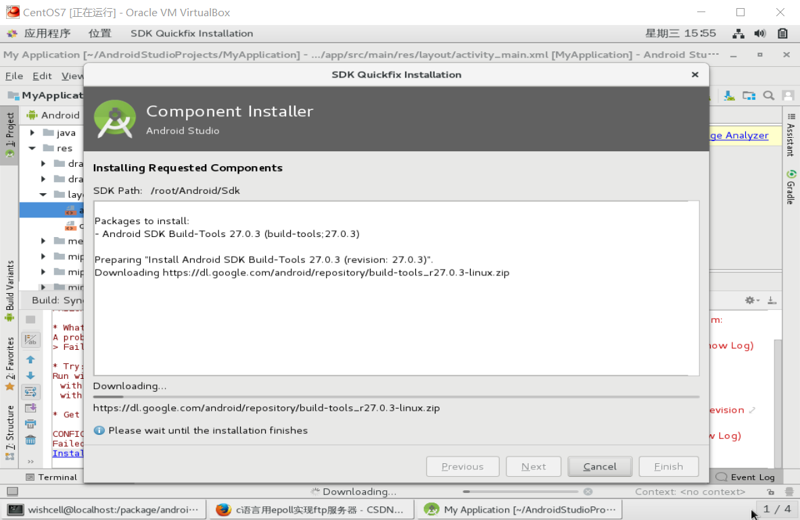
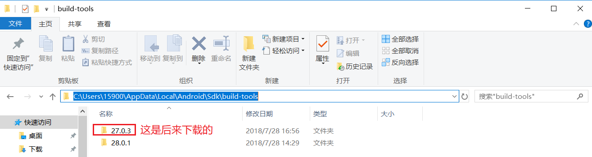
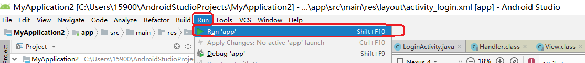
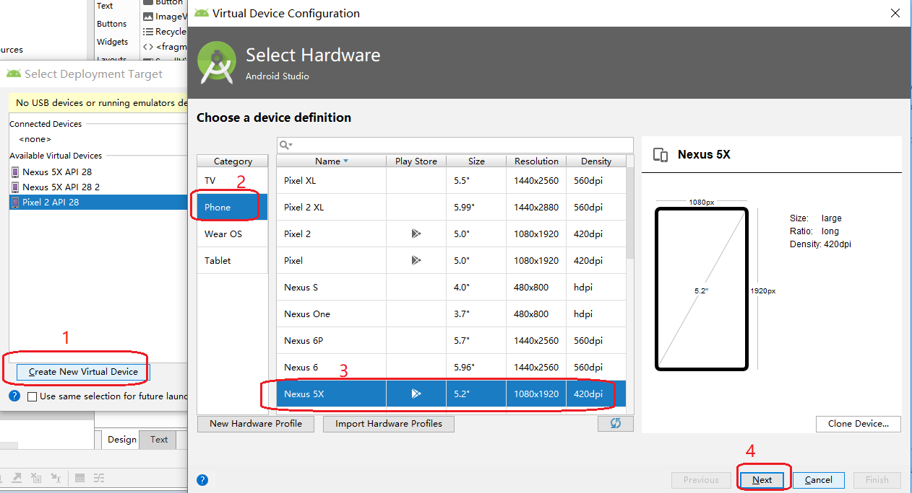

# <center>Android Studio</center>

[TOC]

# 一、资源获取

```powershell
一位做汇总的网站：http://www.androiddevtools.cn/，这里有各种资源

玩客云：
	玩客云》分区1》onecloud》tools》android_studio》android-studio-ide-181.4886486-windows.zip
	玩客云》分区1》onecloud》tools》android_studio》android-studio-ide-181.4886486-linux.zip
	玩客云》分区1》onecloud》tools》android_studio》sdk-tools-windows-3859397.zip
	玩客云》分区1》onecloud》tools》android_studio》27.0.3.zip
	玩客云》分区1》onecloud》tools》android_studio》28.0.1.zip
	玩客云》分区1》onecloud》tools》android_studio》android-studio-ide-181.4886486-windows.zip
	
百度网盘：
    我的网盘》android_studio》android-studio-ide-181.4886486-windows.zip
    我的网盘》android_studio》sdk-tools-windows-3859397.zip
    我的网盘》android_studio》27.0.3.zip
    我的网盘》android_studio》28.0.1.zip
    我的网盘》android_studio》android-studio-ide-181.4886486-windows.zip
    
android SDK：
	https://blog.csdn.net/sxbkelly/article/details/79469737
```

# 二、首次使用指南。[来自这里](https://www.cnblogs.com/smyhvae/p/4390905.html)

## I、安装

```powershell
双击 C:\360安全浏览器下载\android-studio-ide-181.4886486-windows\android-studio\bin\studio64.exe
进行安装.

Android Studio安装完成后，第一次启动AS前，为了避免重新下载新版本的SDK，需要做如下操作：
	AS启动前，打开安装目录，请先将bin目录的idea.properties文件中增加一行：disable.android.first.run=true就行了，避免第一次打开AS时自动重新下载SDK。mac平台的右键安装包->Show Package Contents 就找到bin目录了。
	
但是由于本人进行此项设置，导致下载SDK耗费了许多时间
```

## II、第一次打开 android studio 时，需要配置JDK和SDKS





#三、新建一个 android studio工程

> ### 配置好JDK和Android SDK后，就可以开始新建Android项目了： 
>
> 
>
> 
>
> 
>
> 
>
> 
>
> 
>
> 
>
> 
>
> 最终失败
>
> 然后添加自己的NDK jre环境变量
>
> 
>
> 然后重新指定自己的 JDK 路径：
>
> 
>
> 


# 四、修改显示主题

## I、修改主题


## II、导入第三方主题

> ### 系统提供的两种主题可能都不太好看，我们可以进入网站<http://color-themes.com/>来获取第三方主题，比如说Sublime主题就是我个人喜爱的。但是这个网站要收费。暂且作罢 


# 四、运行项目

## I、首先建立一个基础的项目

> 由于之前建立的项目都是 empty，无法直接运行。
>
> 于是直接将之前项目全部删除，重新创建一个 basic activity 项目。但是编译时仍然报错
>
> 
>
> 明明在各个 build.gradle 中，均指定编译器版本为 28。但是不知为何，实际编译时，调用的编译器是 27.0.3。查看当前环境已有编译器：
>
> 
>
> 
>
> 
>
> 
>
> 
>
> 
>
> 这时在 android studio 下方，自动出现一个链接，“下载 build tools 27.0.3"，直接点击下载。
>
> 下载之后，在编译器路径下，就看到了 27.0.3。
>
> 然后可以成功编译

## II、创建虚拟机，运行程序

###1、运行APP



###2、创建虚拟机



### 3、利用虚拟机，运行app


##III、将生成的app上传到手机安装，执行


上传到手机手，可以成功安装运行

# 五、第一个正式项目：跳转到指定主页

## I、需求来源

```powershell
小孩喂奶，时间、份量需要实时记录，实时更新。光告大脑记很容易混乱。用纸笔记录，又存在多人操作同步问题
```

## II、功能列表

### 1、APP部分：手机/PAD上安装一个APP，点击后，即跳转到相应主页

### 2、网站部分：

#### A、主页可显示登录界面，选择操作人员（妈妈、爸爸、爷爷、奶奶、外公、外婆）

#### B、列出老大、老二历次进食时间、份量（母乳不计份量）

####C、最下一行，是一个添加按钮。点击”添加“后，弹出人员（下拉列表）、吃奶是谁、吃奶类型、吃奶份量

#### D、之前已有记录，还要支持修改、删除功能

## III、APP开发

### 1、新建一个 android studio项目，类型为login，在此基础上进行改造

```powershell
改造起来很难。到处都不明白
```


# 六、 linux 下安装 android studio

## I、进入安装目录，需要在图形界面下操作

```powershell
[wishcell@localhost package]$ cd android-studio/
[wishcell@localhost android-studio]$ ls
bin  build.txt  gradle  Install-Linux-tar.txt  jre  lib  license  LICENSE.txt  NOTICE.txt  plugins
[wishcell@localhost android-studio]$ cd bin/
[wishcell@localhost bin]$ ls
appletviewer.policy  fsnotifier    idea.properties  lldb     printenv.py  studio64.vmoptions  studio.sh
format.sh            fsnotifier64  inspect.sh       log.xml  restart.py   studio.png          studio.vmoptions
[wishcell@localhost bin]$ sh studio.sh
```

## II、安装过程与 windows 下一样


