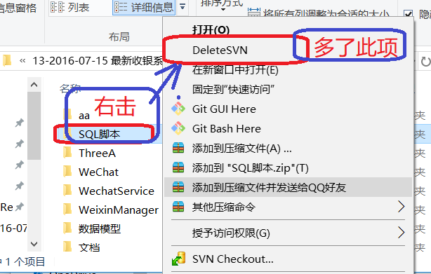

# <center>bat</center>

[TOC]

#一、级联删除`.svn`

## I、BAT脚本实现

```powershell
rem svndel.bat
echo "是否要将所有svn文件删除掉?"
pause
@for /r . %%I in (.svn) do if exist "%%I" rd/s/q "%%I"
```

##II、采用注册表的方式实现

> ### 将下面代码保存为 DelSVN.reg，双击注册之。

```powershell
Windows Registry Editor Version 5.00
 
[HKEY_LOCAL_MACHINE\SOFTWARE\Classes\Folder\shell\DeleteSVN] 
@="删除.SVN文件夹"
 
[HKEY_LOCAL_MACHINE\SOFTWARE\Classes\Folder\shell\DeleteSVN\command] 
@="cmd.exe /c \"TITLE Removing SVN Folders in %1 && COLOR 9A && FOR /r \"%1\" %%f IN (.svn) DO RD /s /q \"%%f\" \""
```




---

