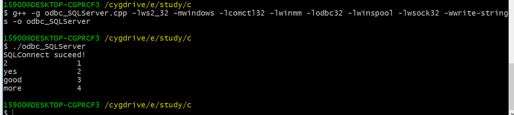

# <center>C++ ODBC 连接SQLServer2008</center>

[TOC]

# 一、数据库的安装，表的创建

> ###数据库安装好后，新建数据库 test_sql2008，并在该数据库中增加新表 first_test


# 二、为数据库配置连接密码

<iframe src="./sql_server安装时windows认证改为sql_server认证.html" width="1000px" height="1500px" boarder="1px" scrolling="yes"></iframe>

#三、ODBC的配置

```
win10=>cortana=>管理工具=>ODBC数据源(64位)=>
```


# 四、源码

##I、ODBC连接 SQL SERVER 2008

<a hred="odbc_SQLServer.cpp">源码如下 odbc_SQLServer.cpp</a><br/>

<iframe src="./odbc_SQLServer.cpp" width="1000px" height="1500px" boarder="1px" scrolling="yes" ></iframe>

> 编译执行
>
> ```powershell
> 15900@DESKTOP-CGPRCF3 /cygdrive/e/study/c
> $ g++ -g odbc_SQLServer.cpp -lws2_32 -mwindows -lcomctl32 -lwinmm -lodbc32 -lwinspool -lwsock32 -Wwrite-strings -o odbc_SQLServer
> 
> 15900@DESKTOP-CGPRCF3 /cygdrive/e/study/c
> $ ./odbc_SQLServer
> SQLConnect suceed!
> 2               1
> yes             2
> good            3
> more            4
> ```




## II、ODBC 连接 MySQL 数据库

###1、MySQL 的 ODBC 配置


###2、 MySQL 数据库查看


###3、源码

> 其接口与连接 SQLServer2008 相同。只是参数换一下即可
>
> 源码:<a href="./odbc_MySQL.cpp" width="1000px" height="1500px" boarder="1px" scrolling="yes">odbc_MySQL.cpp</a>

<iframe src="./odbc_MySQL.cpp" width="1000px" height="1500px" boarder="1px" scrolling="yes"></iframe>

### 4、效果

```powershell
15900@DESKTOP-CGPRCF3 /cygdrive/e/study/c
$ g++ -g odbc_MySQL.cpp -lws2_32 -mwindows -lcomctl32 -lwinmm -lodbc32 -lwinspool -lwsock32 -Wwrite-strings -o odbc_MySQL

15900@DESKTOP-CGPRCF3 /cygdrive/e/study/c
$ ./odbc_MySQL
SQLConnect suceed!
A       zhoujinhua
S       GoodMan
A       zhoujinhua
        GoodMan
A       zhoujinhua
S       GoodMan
A       zhoujinhua
S       GoodMan

15900@DESKTOP-CGPRCF3 /cygdrive/e/study/c
$
```


---

