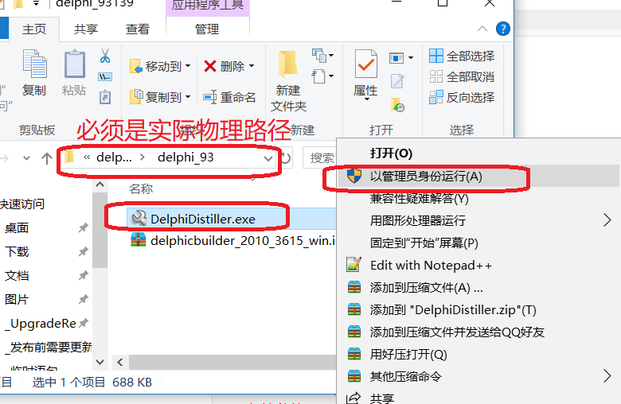
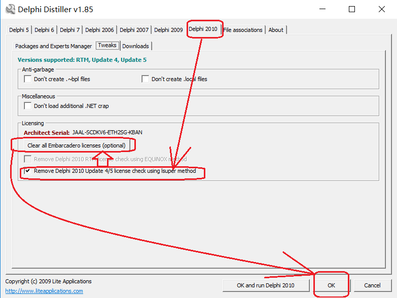

# <center>dephi</center>

[TOC]

# 一、delphi 介绍

```powershell
	“真正的程序员用C++，聪明的程序员用Delphi”，这句话是对Delphi最经典、最实在的描述。Delphi被称为第四代编程语言，它具有简单、高效、功能强大的特点。和VC相比，Delphi更简单、更易于掌握，而在功能上却丝毫不逊色；和VB相比，Delphi则功能更强大、更实用。可以说Delphi同时兼备了VC功能强大和VB简单易学的特点。它一直是程序员至爱的编程工具。Delphi具有以下的特性：基于窗体和面向对象的方法，高速的编译器，强大的数据库支持，与Windows编程紧密结合，强大而成熟的组件技术。但最重要的还是Object Pascal语言，它才是一切的根本。Object Pascal语言是在Pascal语言的基础上发展起来的
，简单易学。	
```

# 二、资源获取

```powershell
玩客云 》 分区1 》 onecloud 》 tools 》 delphi_93139.rar
```


# 三、安装

```powershell
delphi2010免费版安装教程和激活方法：
1.下载过来的文件为iso格式，直接用解压软件解压即可(小编用的是360解压)，解压完成后双击下图所示安装程序。
2.选择第一个即可。
3.正在收集数据，准备安装。
4.下图红色框框里要求你输入序列号，填HAAL-DANSGN-FZR5AG-M3BS或者HAAL-DANSGN-FZR5AG-M38S，然后点击下一步即可
5.这里不用管它，默认即可。
6.选择安装路径，如果你C盘内存够多的话可以安装在C盘，小编直接默认了，点击下一步。
7.选择有关的文件类型，下图左边都是勾选的，右边看需求勾选，这里勾不勾都没事，安装好之后还可以更改的。
8.安装中。大约需要2-3分钟。
9.紧接着就需要安装Rave Report。
10.同样需要大约3分钟。安装完成！
10.打开开始菜单栏，可以看到已经安装好了。
11.打开软件时，会需要我们注册，这时候我们运行安装包中的Distiller.v1.85，找到Delphi 2010,，点击“Clear all....”按钮，勾选“Remove...use lsuper method”,点击“OK”。关闭Delphi 2010再次打开即可！(如果还是需要注册，再重复此步骤即可)
```

# 四、破解






# 四、重启即可


