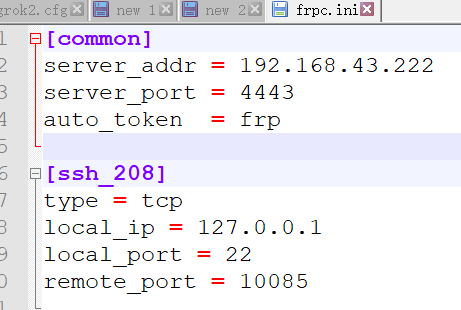

# <center>frp</center>

[TOC]

## 一、介绍。[来自](https://blog.csdn.net/qq_25351621/article/details/78947477)

```powershell
搭建 ngrok 进行内网穿透工作中。偶遇 frp。其作用与 ngrok 一样。遂尝试之
```

# 二、资源获取

```powershell
个人资源：
玩客云 》分区１　》　onecloud 》　tools 》　frp_0.20.0_linux_arm.tar.gz
玩客云 》分区１　》　onecloud 》　tools 》　frp_0.20.0_linux_amd64.tar.gz
玩客云 》分区１　》　onecloud 》　tools 》　frp_0.20.0_windows_amd64.zip

在线资源：
	https://github.com/fatedier/frp/releases
```


# 二、准备工作

```powershell
有一个公网IP的服务器(VPS),根据服务器环境，和主机环境下载相应的frp服务器端和客户端。到官网https://github.com/fatedier/frp/releases下载相应版本
```

> 下载解压后有如下的七个文件 :


# 三、配置服务器端

```powershell
服务器端只需要两个文件frps和frps.ini,其中frps为可执行文件，frps.ini为配置文件，是不是很方便？
配置文件如下图（很简单）：
	bind_addr为本机IP,
	bind_port为frp对客户端的端口号，
	auto_token是客户端连接服务器端的口令。	
```


```powershell
配置好后即可运行服务器端：
	./frps -c ./frps.ini
```


# 四、配置客户端

## I、在本机上配置客户端进行连接

###A、配置客户端

```powershell
同样将客户端解压后有七个文件，只需要frpc和frpc.ini,配置文件如下
```


```powershell
解释：
	server_addr是服务器端的公网IP地址，
	server_port是frp服务端口号，
	auto_token是连接服务器的口令，必须和服务器保持一致。
	
	[ssh_208]是客户端通过服务器与用户之间的通道名，每个客户端必须不一样，
	remote_port是服务器端对外提供本机服务的端口号，
	即用户连接192.168.43.230:10085，相当于连接127.0.0.1:22,即目标板上的ssh服务
```

###B、运行客户端

> 运行成功，显示已经连接上服务器


> 再看服务器的反应


## II、在windows 上运行客户端，连接linux 服务器

### A、客户端文件配置


```
[common]
server_addr = 192.168.43.222
server_port = 4443
auto_token  = frp

[ssh_208]
type = tcp
local_ip = 127.0.0.1
local_port = 22
remote_port = 10085
```



### B、运行 win10版客户端


> 再查看服务器端打印


---