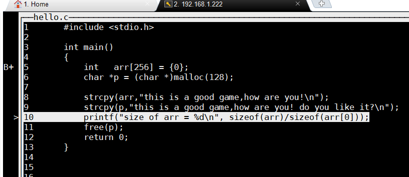

# GDB

[TOC]

##一、 项目编译中遇到奇怪问题，gdb 无法跟踪代码，问题解决

```powershell
(gdb)l
Line number 2 outof range
./path/code/serial.c has 1 lines
(gdb)l 1
1 ^M#include<sys/types.h>^M$include<sys/stat.h>^M//#include<sys/time.h>^M//#include<sys/ioctrl.h>^M#include<unistd.h>^M<termios.h>^M#...
```

> #### 查看出问题所在，在`gdb`下面输入`l`命令时，报错`Line number 2 outof range ./path/code/serial.c has 1 lines`，但是输入`l 1`或者`l 2`时，有杂乱的输出。
>
> 显然是代码换行出了问题
>
> #### 于是用vim 打开，`set ff=unix`，然后把`^M`替换成`\r`
>
> ```powershell
> ^M在 windows的 vim 上没有生成成功，但是在 linux 下成功了
> 就是按 ctrl-v然后回车，替换命令为
>  :%s/^M/\r/g
> ```
>
> 只是不知为什么 `dos2unix`工具为什么在这时候失灵


## 二、 gdb 中代码跟踪时，宏无法打印问题

```powershell
在 Makefile 中加入参数 -g3 和 --gdwarf-2 ，这样就可以在 gdb 中打印宏了
```

## 三、gdb 中如何查看内存



```powershell
child process 22295 In: main                                                       Line: 10   PC: 0x400692
(gdb) x/16x p
0x602010:       0x73696874      0x20736920      0x6f672061      0x6720646f
0x602020:       0x2c656d61      0x20776f68      0x20657261      0x21756f79
0x602030:       0x206f6420      0x20756f79      0x656b696c      0x3f746920
0x602040:       0x0000000a      0x00000000      0x00000000      0x00000000
(gdb) x/16c p
0x602010:       116 't' 104 'h' 105 'i' 115 's' 32 ' '  105 'i' 115 's' 32 ' '
0x602018:       97 'a'  32 ' '  103 'g' 111 'o' 111 'o' 100 'd' 32 ' '  103 'g'
(gdb) x/16d p
0x602010:       116     104     105     115     32      105     115     32
0x602018:       97      32      103     111     111     100     32      103
(gdb) x/16i p
   0x602010:    je     0x60207a
   0x602012:    imul   $0x61207369,0x20(%rbx),%esi
   0x602019:    and    %ah,0x6f(%rdi)
   0x60201c:    outsl  %ds:(%rsi),(%dx)
   0x60201d:    and    %ah,%fs:0x61(%rdi)
   0x602021:    insl   (%dx),%es:(%rdi)
   0x602022:    gs
   0x602023:    sub    $0x68,%al
   0x602025:    outsl  %ds:(%rsi),(%dx)
   0x602026:    ja     0x602048
   0x602028:    (bad)
   0x602029:    jb     0x602090
   0x60202b:    and    %bh,0x6f(%rcx)
   0x60202e:    jne    0x602051
   0x602030:    and    %ah,0x20(%rdi,%rbp,2)
   0x602034:    jns    0x6020a5
(gdb) x/16h p
0x602010:       0x6874  0x7369  0x6920  0x2073  0x2061  0x6f67  0x646f  0x6720
0x602020:       0x6d61  0x2c65  0x6f68  0x2077  0x7261  0x2065  0x6f79  0x2175
(gdb) x/16xh p
0x602010:       0x6874  0x7369  0x6920  0x2073  0x2061  0x6f67  0x646f  0x6720
0x602020:       0x6d61  0x2c65  0x6f68  0x2077  0x7261  0x2065  0x6f79  0x2175
(gdb)
```

## 四、快捷键

```powershell
layout：用于分割窗口，可以一边查看代码，一边测试。主要有以下几种用法：
layout：用于分割窗口，可以一边查看代码，一边测试。主要有以下几种用法：
layout src：显示源代码窗口
layout asm：显示汇编窗口
layout regs：显示源代码/汇编和寄存器窗口
layout split：显示源代码和汇编窗口
layout next：显示下一个layout
layout prev：显示上一个layout
Ctrl + L：刷新窗口
Ctrl + x，再按1：单窗口模式，显示一个窗口
Ctrl + x，再按2：双窗口模式，显示两个窗口
Ctrl + x，再按a：回到传统模式，即退出layout，回到执行layout之前的调试窗口。
```

