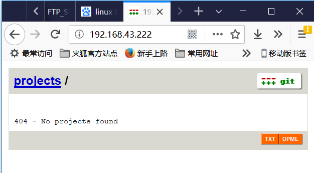

# GIT 知识汇总

[TOC]

##一、本地创建远程 git 仓库(抄录自[廖雪峰的网站](https://www.liaoxuefeng.com))

第一步，安装`git`：

```
$ sudo apt-get install git
```

第二步，创建一个`git`用户，用来运行`git`服务：

```
$ sudo adduser git
```

第三步，创建证书登录：

收集所有需要登录的用户的公钥，就是他们自己的`id_rsa.pub`文件，把所有公钥导入到`/home/git/.ssh/authorized_keys`文件里，一行一个。

第四步，初始化Git仓库：

先选定一个目录作为Git仓库，假定是`/srv/sample.git`，在`/srv`目录下输入命令：

```shell
$ sudo git init --bare sample.git
```

Git就会创建一个裸仓库，裸仓库没有工作区，因为服务器上的Git仓库纯粹是为了共享，所以不让用户直接登录到服务器上去改工作区，并且服务器上的Git仓库通常都以`.git`结尾。然后，把owner改为`git`：

```shell
$ sudo chown -R git:git sample.git
```

第五步，禁用shell登录：

出于安全考虑，第二步创建的git用户不允许登录shell，这可以通过编辑`/etc/passwd`文件完成。找到类似下面的一行：

```shell
git:x:1001:1001:,,,:/home/git:/bin/bash
```

改为：

```shell
git:x:1001:1001:,,,:/home/git:/usr/bin/git-shell
```

这样，`git`用户可以正常通过ssh使用git，但无法登录shell，因为我们为`git`用户指定的`git-shell`每次一登录就自动退出。

第六步，克隆远程仓库：

现在，可以通过`git clone`命令克隆远程仓库了，在各自的电脑上运行：

```shell
$ git clone git@server:/srv/sample.git
Cloning into 'sample'...
warning: You appear to have cloned an empty repository.
```

剩下的推送就简单了。

### 管理公钥

如果团队很小，把每个人的公钥收集起来放到服务器的`/home/git/.ssh/authorized_keys`文件里就是可行的。如果团队有几百号人，就没法这么玩了，这时，可以用[Gitosis](https://github.com/res0nat0r/gitosis)来管理公钥。

这里我们不介绍怎么玩[Gitosis](https://github.com/res0nat0r/gitosis)了，几百号人的团队基本都在500强了，相信找个高水平的Linux管理员问题不大。

### 管理权限

有很多不但视源代码如生命，而且视员工为窃贼的公司，会在版本控制系统里设置一套完善的权限控制，每个人是否有读写权限会精确到每个分支甚至每个目录下。因为Git是为Linux源代码托管而开发的，所以Git也继承了开源社区的精神，不支持权限控制。不过，因为Git支持钩子（hook），所以，可以在服务器端编写一系列脚本来控制提交等操作，达到权限控制的目的。[Gitolite](https://github.com/sitaramc/gitolite)就是这个工具。

这里我们也不介绍[Gitolite](https://github.com/sitaramc/gitolite)了，不要把有限的生命浪费到权限斗争中。


## 2018-01-17

###[21:53]查看 `git`每次的入库详情

```shell
1、git log --name-status   #每次修改的文件列表，显示状态
2、git log --name-only     #每次修改的文件列表
3、git log --stat          #每次修改的文件列表，及文件修改的统计
4、git whatchanged --stat  #每次修改的文件列表，及文件修改的统计
5、git show                #显示最后一次的文件改变的具体内容
```


## 二、Git 创建一个库，接收远程入库(吸收自[`Pro Git`](./progit_v2.1.13.pdf))

### 1、为git 创建一个用户，或者使用现有用户。

```powershell
本例使用账号 wishcell/wishcell
```

### 2、为 wishcell 用户添加 git 支持


### 3、添加客户机公钥

```powershell
15900@DESKTOP-CGPRCF3 MINGW64 ~/.ssh
$ ssh-keygen.exe -t rsa
Generating public/private rsa key pair.
Enter file in which to save the key (/c/Users/15900/.ssh/id_rsa):
Enter passphrase (empty for no passphrase):
Enter same passphrase again:
Your identification has been saved in /c/Users/15900/.ssh/id_rsa.
Your public key has been saved in /c/Users/15900/.ssh/id_rsa.pub.
The key fingerprint is:
SHA256:VszUc4m4u7uSAEK1A8A+B76lRppmI1PQVrg5T+AzZ8Q 15900@DESKTOP-CGPRCF3
The key's randomart image is:
+---[RSA 2048]----+
|oo.=o     .o . . |
|.o*.E.   +. + o  |
|o=.=o     +. o   |
| =Xo=.   ..      |
|oo*X .  S  .     |
|=B  . ..  .      |
|=..    . . .     |
|        o .      |
|         .oo     |
+----[SHA256]-----+

15900@DESKTOP-CGPRCF3 MINGW64 ~/.ssh
$ cat ~/.ssh/id_rsa.pub
ssh-rsa AAAAB3NzaC1yc2EAAAADAQABAAABAQC9vB6oXS0L4E/gComo04kuoyggRPDevMXLc6vDm//ep6L6QOxav/x/yO4yiyLbEDIzQVOBcxGmVhx4PJrOn6lhHcPlFgWC6/YzMHG01rFHjw27hLUejGxtOueyT2DisWvIX69a8IpTbJ4ZcwMP5lNypKAmlhDi41uWs0FKM2no7nkiVOKZ8YYoZ5tD0MF6xQgMg5y+oqSddg8uOm5r4t4Wsa7AWGqW33b7Yq6rrSqY188qJwwnsuyEbarvLvyezpGCC63javZ1WuLZdf0vjb8jbYwUKmejAVosZ5ZgUbDlDaqQ3bHyJAa4LOGl+6RcbHAlWZNBSmDDCc5NoABjUqLN 15900@DESKTOP-CGPRCF3

然后将此内容 cat 追加到git服务器的authorized_keys
```

### 4、在服务器上创建一个git 库目录

```powershell
[wishcell@localhost study]$ pwd
/home/wishcell/study
[wishcell@localhost study]$ mkdir gitRepository
[wishcell@localhost study]$ ls
ada  c  gitRepository  python
[wishcell@localhost study]$ cd gitRepository/
[wishcell@localhost gitRepository]$ ls
[wishcell@localhost gitRepository]$ git init --bare
Initialized empty Git repository in /home/wishcell/study/gitRepository/
[wishcell@localhost gitRepository]$ ls
branches  config  description  HEAD  hooks  info  objects  refs
[wishcell@localhost gitRepository]$
```

### 5、客户机上拉取代码，提交代码

```powershell
$ git clone wishcell@192.168.1.222:/home/wishcell/study/gitRepository
Cloning into 'gitRepository'...
The authenticity of host '192.168.1.222 (192.168.1.222)' can't be established.
ECDSA key fingerprint is SHA256:2U1eQw3P2lIyp6PE16sCkYuPvfBd6A9F8USXc4/nZUk.
Are you sure you want to continue connecting (yes/no)? yes
Warning: Permanently added '192.168.1.222' (ECDSA) to the list of knownhosts.
warning: You appear to have cloned an empty repository.

15900@DESKTOP-CGPRCF3 MINGW64 /e/tmp
$ ls
gitRepository/

15900@DESKTOP-CGPRCF3 MINGW64 /e/tmp
$ cd gitRepository/
15900@DESKTOP-CGPRCF3 MINGW64 /e/tmp/gitRepository (master)
$ touch a.c
$ git add ./
```

```powershell
提交代码时报错：
$ git commit
*** Please tell me who you are.
Run
  git config --global user.email "you@example.com"
  git config --global user.name "Your Name"
to set your account's default identity.
Omit --global to set the identity only in this repository.
fatal: unable to auto-detect email address (got '15900@DESKTOP-CGPRCF3.(none)')

配置用户解决之：
15900@DESKTOP-CGPRCF3 MINGW64 /e/tmp/gitRepository (master)
$ git config --global user.email "15900748704@139.com"

$ git commit
[master (root-commit) dca7e2d] this is the first test file
 1 file changed, 1 insertion(+)
 create mode 100644 a.c
```

### 6、推送远程服务器

```powershell
$ git commit
[master (root-commit) dca7e2d] this is the first test file
 1 file changed, 1 insertion(+)
 create mode 100644 a.c
 
 $ git push origin master
Counting objects: 3, done.
Writing objects: 100% (3/3), 227 bytes | 56.00 KiB/s, done.
Total 3 (delta 0), reused 0 (delta 0)
To 192.168.1.222:/home/wishcell/study/gitRepository
 * [new branch]      master -> master
```

### 7、另起一个目录，拉取刚刚提交上去的代码

```powershell
[wishcell@localhost gitClient]$ git clone wishcell@192.168.1.222:/home/wishcell/study/gitRepository
Cloning into 'gitRepository'...
The authenticity of host '192.168.1.222 (192.168.1.222)' can't be established.
ECDSA key fingerprint is SHA256:2U1eQw3P2lIyp6PE16sCkYuPvfBd6A9F8USXc4/nZUk.
ECDSA key fingerprint is MD5:44:c3:f5:03:7c:ca:17:81:61:41:2b:0b:12:11:49:16.
Are you sure you want to continue connecting (yes/no)? yes
Warning: Permanently added '192.168.1.222' (ECDSA) to the list of known hosts.
remote: Counting objects: 3, done.
remote: Total 3 (delta 0), reused 0 (delta 0)
Receiving objects: 100% (3/3), done.
[wishcell@localhost gitClient]$ ls
gitRepository
[wishcell@localhost gitClient]$ cd gitRepository/
[wishcell@localhost gitRepository]$ ls
a.c
[wishcell@localhost gitRepository]$ cat a.c
this is a file!
[wishcell@localhost gitRepository]$
```

## 三、`GIT`服务器IP改变怎么办

```powershell
git remote -v  查看远程库
git remote rm origin
git remote add origin ssh://*g*****.git
```

```powershell
实例，改变虚拟机GIT服务器IP地址：

[root@localhost gitRepository]# git remote -v
origin  wishcell@192.168.1.222:/home/wishcell/study/gitRepository (fetch)
origin  wishcell@192.168.1.222:/home/wishcell/study/gitRepository (push)
[root@localhost gitRepository]# git remote rm origin
[root@localhost gitRepository]# git remote -v
[root@localhost gitRepository]# git remote add origin wishcell@192.168.43.222:/home/wishcell/study/gitRepository
[root@localhost gitRepository]# git remote -v
origin  wishcell@192.168.43.222:/home/wishcell/study/gitRepository (fetch)
origin  wishcell@192.168.43.222:/home/wishcell/study/gitRepository (push)

修改完毕之后，尝试重新拉取代码，却被要求输入密码：
[root@localhost gitRepository]# git pull
The authenticity of host '192.168.43.222 (192.168.43.222)' can't be established.
ECDSA key fingerprint is SHA256:2U1eQw3P2lIyp6PE16sCkYuPvfBd6A9F8USXc4/nZUk.
ECDSA key fingerprint is MD5:44:c3:f5:03:7c:ca:17:81:61:41:2b:0b:12:11:49:16.
Are you sure you want to continue connecting (yes/no)? yes
Warning: Permanently added '192.168.43.222' (ECDSA) to the list of known hosts.
wishcell@192.168.43.222's password:
From 192.168.43.222:/home/wishcell/study/gitRepository
 * [new branch]      master     -> origin/master
There is no tracking information for the current branch.
Please specify which branch you want to merge with.
See git-pull(1) for details

    git pull <remote> <branch>

If you wish to set tracking information for this branch you can do so with:

    git branch --set-upstream-to=origin/<branch> master

[root@localhost gitRepository]#

```


##四、为`git`服务器提供 `http`拉取代码的方法

即[4.6 服务器上的 Git - Smart HTTP](./progit_v2.1.13.pdf)

### 1、

### 2、

###3、

##五、 `git`服务器提供 web 访问服务器代码的能力

[4.7 服务器上的 Git - GitWeb](./progit_v2.1.13.pdf)

### 1、下载 git 代码，然后编译 `gitweb`

```powershell
首先下载 git 代码
$ git clone git://git.kernel.org/pub/scm/git/git.git

然后进入到 git 目录，编译 gitweb，编译时要指定 git 项目的库所在位置
$ make GITWEB_PROJECTROOT="/opt/git" prefix=/usr gitweb
    SUBDIR gitweb
    SUBDIR ../
make[2]: `GIT-VERSION-FILE' is up to date.
    GEN gitweb.cgi
    GEN static/gitweb.js
    
    需要注意的是，你需要在命令中指定 GITWEB_PROJECTROOT 变量来让程序知道你的 Git 版本库的位置。 现在，你需要在 Apache 中使用这个 CGI 脚本，你需要为此添加一个虚拟主机
```

### 2、添加一个虚拟主机

```powershell
[root@localhost gitRepository]# cd /etc/httpd/conf
[root@localhost conf]# ls
httpd.conf  httpd.conf.bk  magic  vhosts
[root@localhost conf]# vim httpd.conf
[root@localhost conf]#

在 httpd.conf 中添加一句：Include /etc/httpd/conf/vhosts/gitserver，位置在 Group 之后， ServerAdmin 之前：

User apache
Group apache

# 'Main' server configuration
#
# The directives in this section set up the values used by the 'main'
# server, which responds to any requests that aren't handled by a
# <VirtualHost> definition.  These values also provide defaults for
# any <VirtualHost> containers you may define later in the file.
#
# All of these directives may appear inside <VirtualHost> containers,
# in which case these default settings will be overridden for the
# virtual host being defined.
#
Include /etc/httpd/conf/vhosts/gitserver
#
# ServerAdmin: Your address, where problems with the server should be
# e-mailed.  This address appears on some server-generated pages, such
# as error documents.  e.g. admin@your-domain.com
#
ServerAdmin root@localhost
```

然后编辑虚拟机配置文件：`/etc/httpd/conf/vhosts/gitserver`

```powershell
<VirtualHost *:80>
    ServerName gitserver
    DocumentRoot /var/www/gitweb
    <Directory /var/www/gitweb>
        Options ExecCGI FollowSymLinks SymLinksIfOwnerMatch
        AllowOverride All
        order allow,deny
        Allow from all
        AddHandler cgi-script cgi
        DirectoryIndex gitweb.cgi
    </Directory>
</VirtualHost>
```

### 3、运行/重启`apache`服务

```powershell
[root@localhost conf]# systemctl restart httpd.service
```

### 4、在客户机浏览器中查看代码

> 此效果很不尽如人意：
>
> 1、没有看到预期的 git 项目代码，按照理想状态，此实验 git 中有项目代码
>
> 2、虚拟机指定为80端口，不能指定为其它端口，否则无法访问
>
> ​     即只有一个虚拟机，意义不大



## 六、真正的公司级 `git`项目管理工具[`GitLab`](https://git-scm.com/book/zh/v2/%E6%9C%8D%E5%8A%A1%E5%99%A8%E4%B8%8A%E7%9A%84-Git-GitLab)

### 1、简介

```powershell
虽然 GitWeb 相当简单。 但如果你正在寻找一个更现代，功能更全的 Git 服务器，这里有几个开源的解决方案可供你选择安装。 因为 GitLab 是其中最出名的一个，我们将它作为示例并讨论它的安装和使用。 这比 GitWeb 要复杂的多并且需要更多的维护，但它的确是一个功能更全的选择。
```

### 2、


### 3、


### 4、


### 5、

## 七、[`gerrit`搭建](https://blog.csdn.net/u012769691/article/details/50214825)


