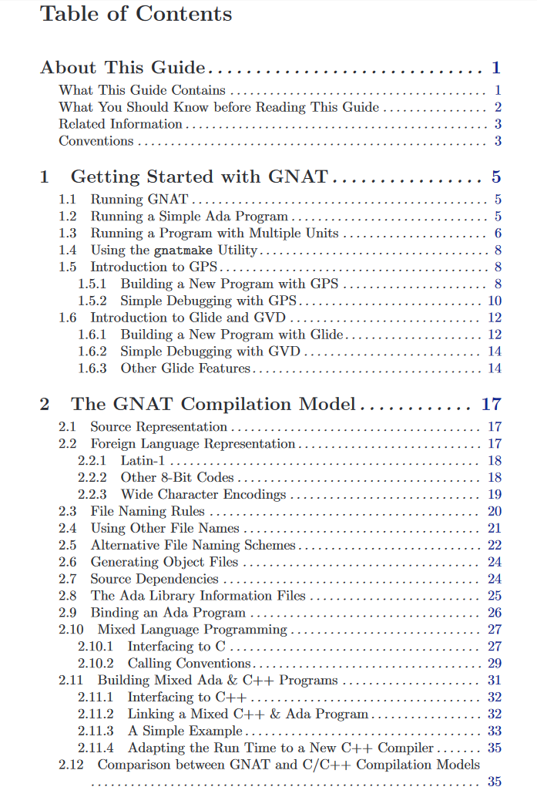
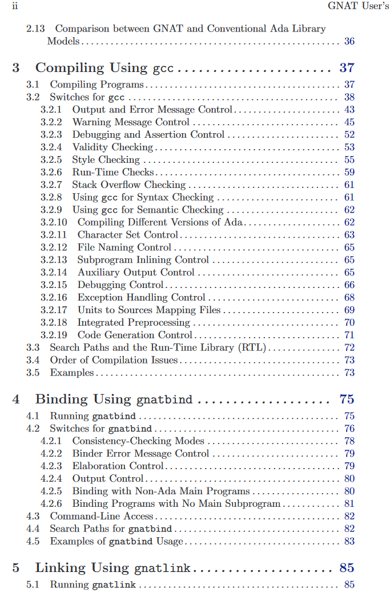

# <center>gnat 用户手册</center>

[TOC]

```powershell
本文讲述 ada 编译器、软件开发工具 GNAT 的用法、针对版本 ada 95。
讲述 gnat 的特征以及开发的细节

本文翻译自：
	http://share.wishcell.cn/gnat_ugn_unw.pdf

其它网站：
	http://www.gnavi.org/launch.php?URL=http%3A%2F%2Fwww.adaic.org%2Fstandards%2F95lrm%2Fhtml%2FRM-TTL.html
	
http://adapower.com/index.php?Command=Index&Title=Home	
```







##一、第一章 `gnat 走起`

### 1、 gnat 使用三步曲

> ####源码如下：

```vbscript
源文件 hello.adb 如下，故意将代码不对齐，可正常编译运行
with Ada.Text_IO;
use Ada.Text_IO;

procedure
Hello
 is

begin
  Put_Line ("Hello, world!");
end Hello;

整理对齐后是这样的：
with Ada.Text_IO; use Ada.Text_IO;
procedure Hello is
begin
Put_Line ("Hello WORLD!");
end Hello;
```

```
编译：
# gcc -c hello.adb

绑定：
$ gnatbind hello

链接：
$ gnatlink hello
```

###2、一步到位编译得到可执行文件

```
$ gnatmake hello.adb
$ ./hello
Hello WORLD!
```

### 3、编译运行多个源文件的小项目

####A、基础的编译、运行方法

```powershell
项目如果有三个文件：

[wishcell@localhost three_files]$ ls
gmain.adb  greetings.adb  greetings.ads

[wishcell@localhost three_files]$ cat gmain.adb
with Greetings;
procedure Gmain is
begin
    Greetings.Hello;
    Greetings.Goodbye;
end Gmain;

[wishcell@localhost three_files]$ cat greetings.ads
package Greetings is
    procedure Hello;
    procedure Goodbye;
end Greetings;

[wishcell@localhost three_files]$ cat greetings.adb
with Ada.Text_IO; use Ada.Text_IO;
package body Greetings is
    procedure Hello is
    begin
        Put_Line ("Hello WORLD!");
    end Hello;

    procedure Goodbye is
    begin
        Put_Line ("Goodbye WORLD!");
    end Goodbye;
end Greetings;

--body of packag of Greetings
[wishcell@localhost three_files]$
```

> 编译方法：

```powershell
[wishcell@localhost three_files]$ gcc -c gmain.adb
[wishcell@localhost three_files]$ ls
gmain.adb  gmain.ali  gmain.o  greetings.adb  greetings.ads
[wishcell@localhost three_files]$ gcc -c greetings.adb
[wishcell@localhost three_files]$ ls
gmain.adb  gmain.ali  gmain.o  greetings.adb  greetings.ads  greetings.ali  greetings.o
[wishcell@localhost three_files]$ gnatbind gmain
[wishcell@localhost three_files]$ gnatlink gmain
[wishcell@localhost three_files]$ ls
gmain  gmain.adb  gmain.ali  gmain.o  greetings.adb  greetings.ads  greetings.ali  greetings.o
[wishcell@localhost three_files]$ ./gmain
Hello WORLD!
Goodbye WORLD!
[wishcell@localhost three_files]$
```

> 更加简洁的编译方法，一步到位：

```powershell
[wishcell@localhost three_files]$ ls
gmain.adb  greetings.adb  greetings.ads
[wishcell@localhost three_files]$ gnatmake gmain.adb
gcc -c gmain.adb
gcc -c greetings.adb
gnatbind -x gmain.ali
gnatlink gmain.ali
[wishcell@localhost three_files]$ ls
gmain  gmain.adb  gmain.ali  gmain.o  greetings.adb  greetings.ads  greetings.ali  greetings.o
[wishcell@localhost three_files]$ ./gmain
Hello WORLD!
Goodbye WORLD!
[wishcell@localhost three_files]$
```

> 语法检查，而不进行代码生成：

```powershell
[wishcell@localhost three_files]$ ls
gmain.adb  greetings.adb  greetings.ads
[wishcell@localhost three_files]$ gcc -c greetings.adb -gnatc
[wishcell@localhost three_files]$ ls
gmain.adb  greetings.adb  greetings.ads  greetings.ali
[wishcell@localhost three_files]$
```


#### B、多个文件时， gnatmak 编译也会自动推导。

```powershell
如，之前已经编译成功，得到可执行文件。此时在  greetings.adb 中加入一条打印语句：

[wishcell@localhost three_files]$ gnatmake gmain.adb
gcc -c greetings.adb
gnatbind -x gmain.ali
gnatlink gmain.ali
[wishcell@localhost three_files]$ ls
gmain  gmain.adb  gmain.ali  gmain.o  greetings.adb  greetings.ads  greetings.ali  greetings.o
[wishcell@localhost three_files]$ ./gmain
Hello WORLD!
Hello WORLD,Mr Zhou!
Goodbye WORLD!
[wishcell@localhost three_files]$
```


### 4、ADA IDE GPS(GNAT Programming System) 介绍

```powershell
因工具软件太大，一时无法下载，暂且跳过
```

### 5、ADA IDE 开发环境 glide / gvd 介绍

```powershell
不甚明白，未弄清楚
```

###6、ADA 的 GDB 调试

```powershell
A、编译时和链接时，必须加上 -g 选项

[wishcell@localhost three_files]$ ls
gmain.adb  greetings.adb  greetings.ads
[wishcell@localhost three_files]$ gcc -c -g gmain.adb
[wishcell@localhost three_files]$ gcc -c -g greetings.adb
[wishcell@localhost three_files]$ gnatbind gmain
[wishcell@localhost three_files]$ gnatlink -g gmain
[wishcell@localhost three_files]$ ./gmain
Hello WORLD!
Hello WORLD,Mr Zhou!
Goodbye WORLD!

B、开始 gdb 调试，与 C 语言 GDB 方法如出一辙：
[wishcell@localhost three_files]$ gdb ./gmain
GNU gdb (GDB) Red Hat Enterprise Linux 7.6.1-100.el7
Copyright (C) 2013 Free Software Foundation, Inc.
License GPLv3+: GNU GPL version 3 or later <http://gnu.org/licenses/gpl.html>
This is free software: you are free to change and redistribute it.
There is NO WARRANTY, to the extent permitted by law.  Type "show copying"
and "show warranty" for details.
This GDB was configured as "x86_64-redhat-linux-gnu".
For bug reporting instructions, please see:
<http://www.gnu.org/software/gdb/bugs/>...
Reading symbols from /home/wishcell/study/ada/three_files/gmain...done.
(gdb) b main
Breakpoint 1 at 0x402320: file /home/wishcell/study/ada/three_files/b~gmain.adb, line 229.
(gdb) r
Starting program: /home/wishcell/study/ada/three_files/./gmain

Breakpoint 1, main (argc=1, argv=(system.address) 0x7fffffffe488, envp=(system.address) 0x7fffffffe498)
    at /home/wishcell/study/ada/three_files/b~gmain.adb:229
229           Ensure_Reference : aliased System.Address := Ada_Main_Program_Name'Address;
Missing separate debuginfos, use: debuginfo-install glibc-2.17-196.el7.x86_64 libgcc-4.8.5-16.el7_4.2.x86_64 libgnat-4.8.5-16.el7_4.2.x86_64
(gdb)layout src
```


```
同样可以在某一行下断点，进行单步跟踪。
```


## 二、第二章 gnat 编译模式

### 1、好复杂的文件名称规则，没看懂

### 2、 ada 与 C 的混合编程，主程序为 ada

#### A、源码如下

```powershell
共有三个文件：
[wishcell@localhost mix_ada_c]$ ls
file1.c  file2.c  my_main.adb

[wishcell@localhost mix_ada_c]$ cat file1.c
#include <stdio.h>
void print_num (int num)
{
    printf ("num is %d.\n", num);
    return;
}

[wishcell@localhost mix_ada_c]$ cat file2.c
extern int num_from_Ada;
int get_num (void)
{
    return num_from_Ada;
}

[wishcell@localhost mix_ada_c]$ cat my_main.adb
--  my_main.adb
procedure My_Main is
  --  Declare then export an Integer entity called num_from_Ada
  My_Num : Integer := 10;
  pragma Export (C, My_Num, "num_from_Ada");

  --  Declare an Ada function spec for Get_Num, then use
  --  C function get_num for the implementation.
  function Get_Num return Integer;
  pragma Import (C, Get_Num, "get_num");

  --  Declare an Ada procedure spec for Print_Num, then use
  --  C function print_num for the implementation.
  procedure Print_Num (Num : Integer);
  pragma Import (C, Print_Num, "print_num");

begin
  Print_Num (Get_Num);
end My_Main;
```


#### B、编译、运行流程

```powershell
[wishcell@localhost mix_ada_c]$ ls
file1.c  file2.c  my_main.adb
[wishcell@localhost mix_ada_c]$ gcc -c file1.c
[wishcell@localhost mix_ada_c]$ ls
file1.c  file1.o  file2.c  my_main.adb
[wishcell@localhost mix_ada_c]$ gcc -c file2.c
[wishcell@localhost mix_ada_c]$ ls
file1.c  file1.o  file2.c  file2.o  my_main.adb
[wishcell@localhost mix_ada_c]$ gnatmake -c my_main.adb
gcc -c my_main.adb
my_main.adb:5:21: warning: "My_Num" has been made static as a result of Export
my_main.adb:5:21: warning: this usage is non-standard and non-portable
[wishcell@localhost mix_ada_c]$ ls
file1.c  file1.o  file2.c  file2.o  my_main.adb  my_main.ali  my_main.o
[wishcell@localhost mix_ada_c]$ gnatbind my_main.ali
[wishcell@localhost mix_ada_c]$ ls
b~my_main.adb  file1.c  file2.c  my_main.adb  my_main.o
b~my_main.ads  file1.o  file2.o  my_main.ali
[wishcell@localhost mix_ada_c]$ gnatlink my_main.ali file1.o file2.o
[wishcell@localhost mix_ada_c]$ ls
file1.c  file2.c  my_main      my_main.ali
file1.o  file2.o  my_main.adb  my_main.o
[wishcell@localhost mix_ada_c]$ ./my_main
num is 10.
[wishcell@localhost mix_ada_c]$

所有这些编译、链接操作加上参数 -g 之后，即可以用 gdb 跟踪代码

最后三步可以合为一条语句完成：
[wishcell@localhost mix_ada_c]$ gnatmake my_main.adb -largs file1.o file2.o
```


###3、ada 与 C 的混合编程，主程序为C 

```powershell
与入口为 ada 的程序相比，主要就是要在调用 ada 之前进行初始化 ada，最后结束 ada
```

#### A、源码如下

```powershell
共有5个文件，一个C文件，包含 main 函数入口：
[wishcell@localhost mix_ada_c_CMain]$ ls
unit1.ads  unit2.ads   main.c  unit1.adb   unit2.adb  

主函数内容如下：
[wishcell@localhost mix_ada_c_CMain]$ cat main.c
/* main.c */
extern void adainit (void);
extern void adafinal (void);
extern int add (int, int);
extern int sub (int, int);
int main (int argc, char *argv[])
{
    int a = 21, b = 7;
    adainit();
    /* Should print "21 + 7 = 28" */
    printf ("%d + %d = %d\n", a, b, add (a, b));
    /* Should print "21 - 7 = 14" */
    printf ("%d - %d = %d\n", a, b, sub (a, b));
    adafinal();
}

[wishcell@localhost mix_ada_c_CMain]$ cat unit1.ads
package Unit1 is
    function Add (A, B : Integer) return Integer;
    pragma Export (C, Add, "add");
end Unit1;
[wishcell@localhost mix_ada_c_CMain]$ cat unit1.adb
package body Unit1 is
    function Add (A, B : Integer) return Integer is

    begin
        return A + B;
    end Add;
end Unit1;

[wishcell@localhost mix_ada_c_CMain]$ cat unit2.ads
package Unit2 is
    function Sub (A, B : Integer) return Integer;
    pragma Export (C, Sub, "sub");
end Unit2;
[wishcell@localhost mix_ada_c_CMain]$ cat unit2.adb
package body Unit2 is
    function Sub (A, B : Integer) return Integer is
    begin
        return A - B;
    end Sub;
end Unit2;
[wishcell@localhost mix_ada_c_CMain]$
```

#### B、编译、运行步骤如下

```powershell
[wishcell@localhost mix_ada_c_CMain]$ ls
main.c  unit1.adb  unit1.ads  unit2.adb  unit2.ads
[wishcell@localhost mix_ada_c_CMain]$ gcc -c -g main.c
main.c: In function ‘main’:
main.c:11:5: warning: incompatible implicit declaration of built-in function ‘printf’ [enabled by default]
     printf ("%d + %d = %d\n", a, b, add (a, b));
     ^
[wishcell@localhost mix_ada_c_CMain]$ ls
main.c  main.o  unit1.adb  unit1.ads  unit2.adb  unit2.ads
[wishcell@localhost mix_ada_c_CMain]$ gnatmake -c -g unit1.adb
gcc -c -g unit1.adb
unit1.adb:6:09: missing "end Unit1;"
gnatmake: "unit1.adb" compilation error
[wishcell@localhost mix_ada_c_CMain]$ vim unit1.adb
[wishcell@localhost mix_ada_c_CMain]$ gnatmake -c -g unit1.adb
gcc -c -g unit1.adb
[wishcell@localhost mix_ada_c_CMain]$ ls
main.c  main.o  unit1.adb  unit1.ads  unit1.ali  unit1.o  unit2.adb  unit2.ads
[wishcell@localhost mix_ada_c_CMain]$ gnatmake -c -g unit2.adb
gcc -c -g unit2.adb

gnatbind 参数 -n 的作用是告诉 ada，主函数入口不在 ada 程序中 
[wishcell@localhost mix_ada_c_CMain]$ gnatbind -n unit1.ali unit2.ali

链接生成目标文件，注意，两个 .ali 到了这里只用了一个，因为它们被绑定了一个：
[wishcell@localhost mix_ada_c_CMain]$ gnatlink unit2.ali main.o -o exec_file
[wishcell@localhost mix_ada_c_CMain]$ ls
exec_file  main.o     unit1.ads  unit1.o    unit2.ads  unit2.o
main.c     unit1.adb  unit1.ali  unit2.adb  unit2.ali
[wishcell@localhost mix_ada_c_CMain]$ ./exec_file
21 + 7 = 28
21 - 7 = 14
```


###4、ada 与 C++ 的混合编程

```powershell
ada 与 c++ 混合编程，主要手段有二：
1、采用 extern "c" ，把 c++ 代码转化为C代码
2、指明 c++ 的中间文件名

混合编程用到的工具：
CPP_Class 、 CPP_Virtual

C++ 编译器： g++ (gnu c++ compiler)
c++ 链接器： c++

```

#### A、源码如下，此例涉及类结构的传递

```powershell
共有5个文件，入口为 cpp 实现：
[wishcell@localhost mix_ada_cpp_CppMain]$ ll
total 20
-rw-rw-r--. 1 wishcell wishcell 217 Feb 27 00:41 cpp_main.c
-rw-rw-r--. 1 wishcell wishcell 358 Feb 27 00:41 example.c
-rw-rw-r--. 1 wishcell wishcell 139 Feb 27 00:19 example.h
-rw-rw-r--. 1 wishcell wishcell 208 Feb 27 00:16 simple_cpp_interface.adb
-rw-rw-r--. 1 wishcell wishcell 382 Feb 27 00:16 simple_cpp_interface.ads

[wishcell@localhost mix_ada_cpp_CppMain]$ cat cpp_main.c
#include "example.h"
extern "C" {
    void adainit (void);
    void adafinal (void);
    void method1 (A *t);
}
void method1 (A *t)
{
    t->method1 ();
}
int main ()
{
    A obj;
    adainit ();
    obj.method2 (3030);
    adafinal ();
    return 0;
}
[wishcell@localhost mix_ada_cpp_CppMain]$

[root@localhost mix_ada_cpp_CppMain]# cat example.h
class Origin {
    public:
    int o_value;
};
class A : public Origin {
    public:
    void method1 (void);
    void method2 (int v);
    A();
    int   a_value;
};

[root@localhost mix_ada_cpp_CppMain]# cat example.c
#include "example.h"
#include <stdio.h>
extern "C" { void ada_method2 (A *t, int v);}
void A::method1 (void)
{
    a_value = 2020;
    printf ("in A::method1, a_value = %d \n",a_value);
}
void A::method2 (int v)
{
    ada_method2 (this, v);
    printf ("in A::method2, a_value = %d \n",a_value);
}
A::A(void)
{
    a_value = 1010;
    printf ("in A::A, a_value = %d \n",a_value);
}
[root@localhost mix_ada_cpp_CppMain]#

[root@localhost mix_ada_cpp_CppMain]# cat simple_cpp_interface.ads
package Simple_Cpp_Interface is
    type A is  limited
        record
            O_Value : Integer;
            A_Value : Integer;
        end  record;
    pragma Convention (C, A);
    procedure Method1 (This :in  out A);
    pragma Import (C, Method1);

    procedure Ada_Method2 (This :in  out A; V : Integer);
    pragma Export (C, Ada_Method2);
end Simple_Cpp_Interface;

[root@localhost mix_ada_cpp_CppMain]# cat simple_cpp_interface.adb
package body Simple_Cpp_Interface is
    procedure Ada_Method2 (This : in out A; V : Integer) is
    begin
         Method1 (This);
         This.A_Value := V;
    end  Ada_Method2;
end Simple_Cpp_Interface;
[root@localhost mix_ada_cpp_CppMain]#
```


#### B、编译、执行

```powershell
[root@localhost mix_ada_cpp_CppMain]# gnatmake -c simple_cpp_interface
[root@localhost mix_ada_cpp_CppMain]# c++ -c cpp_main.c
[root@localhost mix_ada_cpp_CppMain]# c++ -c example.c
[root@localhost mix_ada_cpp_CppMain]# gnatbind -n simple_cpp_interface
[root@localhost mix_ada_cpp_CppMain]# gnatlink simple_cpp_interface -o cpp_main --LINK=g++ -lstdc++ example.o cpp_main.o
[root@localhost mix_ada_cpp_CppMain]# ./cpp_main
in A::A, a_value = 1010
in A::method1, a_value = 2020
in A::method2, a_value = 3030
[root@localhost mix_ada_cpp_CppMain]#

详细执行流程打印：
虽然 simple_cpp_interface.adb 中说 Simple_Cpp_Interface，但是文件名必须全小写，否则报错：
[root@localhost mix_ada_cpp_CppMain]# ls
cpp_main.c  example.c  example.h  simple_cpp_interface.adb  simple_cpp_interface.ads
[root@localhost mix_ada_cpp_CppMain]# gnatmake -c simple_cpp_interface
gcc -c simple_cpp_interface.adb
[root@localhost mix_ada_cpp_CppMain]# c++ -c cpp_main.c
[root@localhost mix_ada_cpp_CppMain]# c++ -c example.
example.c  example.h
[root@localhost mix_ada_cpp_CppMain]# c++ -c example.c
[root@localhost mix_ada_cpp_CppMain]# gnatbind -n simple_cpp_interface
[root@localhost mix_ada_cpp_CppMain]# gnatlink simple_cpp_interface -o cpp_main --LINK=g++ -lstdc++ example.o cpp_main.o
[root@localhost mix_ada_cpp_CppMain]# ls
cpp_main    cpp_main.o  example.h  simple_cpp_interface.adb  simple_cpp_interface.ali
cpp_main.c  example.c   example.o  simple_cpp_interface.ads  simple_cpp_interface.o
[root@localhost mix_ada_cpp_CppMain]# ./cpp_main
in A::A, a_value = 1010
in A::method1, a_value = 2020
in A::method2, a_value = 3030
[root@localhost mix_ada_cpp_CppMain]#
```


##三、第三章 使用 gcc 编译

```powershell
本章介绍怎样使用 gcc 编译 ada，同时介绍控制编译器行为的选项
```

### 1、`-c`

> 通知编译器编译，但是不 `link`

```powershell
gcc 实际上只是一个驱动程序，根据文件后缀名选择合适的编译器
如 GNU C 的编译器是 cc1，而 ada 编译器是 gnat1。这些程序都在内部目录中，当然 gcc 知道在哪里。
```

> 一条命令行编译多种类型的源文件：
>
> ```powershell
> [wishcell@localhost mix_ada_c_CMain]$ ls
> main.c  unit1.adb  unit1.ads  unit2.adb  unit2.ads
>
> 一条语句编译两个 .adb 文件和一个 .c 文件：
> [wishcell@localhost mix_ada_c_CMain]$ gcc -c unit1.adb unit2.adb main.c
> main.c: In function ‘main’:
> main.c:11:5: warning: incompatible implicit declaration of built-in function ‘printf’ [enabled by default]
>      printf ("%d + %d = %d\n", a, b, add (a, b));
>      ^
> 可以看到，已经生成了相应的中间文件：
> [wishcell@localhost mix_ada_c_CMain]$ ls
> main.c  main.o  unit1.adb  unit1.ads  unit1.ali  unit1.o  unit2.adb  unit2.ads  unit2.ali  unit2.o
>
> 将多个 .ali 文件绑定为一个。 -n 的作用说明 main 函数不在 ada 中：
> [wishcell@localhost mix_ada_c_CMain]$ gnatbind -n unit1 unit2
>
> 链接，同时输入多个 .ali 文件时报错，因为 unit1.ali 和 unit2.ali 已经合并成立一个,unit2.ali：
> [wishcell@localhost mix_ada_c_CMain]$ gnatlink unit1.ali unit2.ali main.o -o main
> gnatlink: cannot handle more than one ALI file
> [wishcell@localhost mix_ada_c_CMain]$ ls
> b~unit2.adb  main.c  unit1.adb  unit1.ali  unit2.adb  unit2.ali
> b~unit2.ads  main.o  unit1.ads  unit1.o    unit2.ads  unit2.o
>
> 尝试链接第一个 unit1.ali，发现根本不认：
> [wishcell@localhost mix_ada_c_CMain]$ gnatlink unit1.ali main.o -o main
> gnatlink: Failed to open binder output
>
> 再次采用 unit2.ali 进行链接，终于成功：
> [wishcell@localhost mix_ada_c_CMain]$ gnatlink unit2.ali main.o -o main
> [wishcell@localhost mix_ada_c_CMain]$ ls
> main  main.c  main.o  unit1.adb  unit1.ads  unit1.ali  unit1.o  unit2.adb  unit2.ads  unit2.ali  unit2.o
> [wishcell@localhost mix_ada_c_CMain]$ ./main
> 21 + 7 = 28
> 21 - 7 = 14
> [wishcell@localhost mix_ada_c_CMain]$
> ```


###2、`gcc`选项作用于所有文件，除非 `-gnatx`仅作用于 `ada`文件

### 3、列出全部选项，一一描述

> ```powershell
> -b target     跨平台，填写目标平台
>     
> -Bdir         指定编译器版本路径，而不从默认路径。多个版本编译器情况下有用
>
> -c	          指定编译
>     
> -fno-inline   忽略代码中的 inline 关键字
> 	
> -fno-strict-aliasing  允许指针指向同一块内存地址
> -fstack-check         的准确性较差，特别是在代码执行了 O2 以上的优化后
> -fbounds-check        可以执行数组边界错误，主要是检查对数组赋值越界
> -fstack-protector-all 可以防止缓冲区溢出攻击，也可以利用此选项来检查代码是否有缓冲区溢出的错误
> -fstack-usage         编译器打印出程序中每个函数栈的使用情况。 gcc 文档中有详细说明  
> -g                    生成高度信息
> -gnat83               强制 ada83 限制
> -gnat95               强制 ada95 限制
> -gnat05               支持 ada 2005 全部特性
> -gnata                支持断言
> ......
> ......
> 还是看英文手册
> ```


> ```powershell
> -gnatv 等一系列选项，可用于控制编译错误的输出打印格式
> ```
>
> ```powershell
> -gnatwx 等一系列选项，可控制编译告警输出格式化
> ```
>
> ```powershell
> -gnatVa 等一系列选项，可用于配置合法检查参数
> ```
>
> ```powershell
> 代码格式选项，可检查代码的编写风格
> ```
>
> ```powershell
> gcc -c -fstack-check main.c 栈检测
> ```


## 四、 GNAT 项目管理器

```powershell
这是一套项目管理工具，其功能如下；
1、指定一个或多个包含项目代码的目录
2、指定编译目标文件(*.ali, *.o, ...，可执行文件) 的输出路径
3、切换各种工具选项(gnatmake / compiler / binder / linker / gnatls / gnatls / gnatxref / gnatfind)，可以设置全局选项或者单独应用
4、指定编译包含入口 main 函数的程序
5、指定当前编程语言
6、指定文件命名约定。可以全局指定或者单独应用。
```


