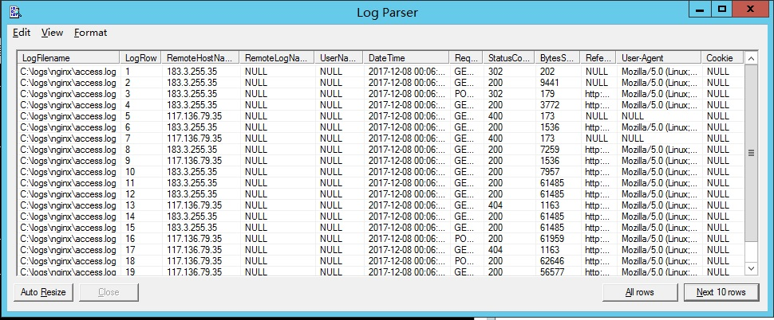
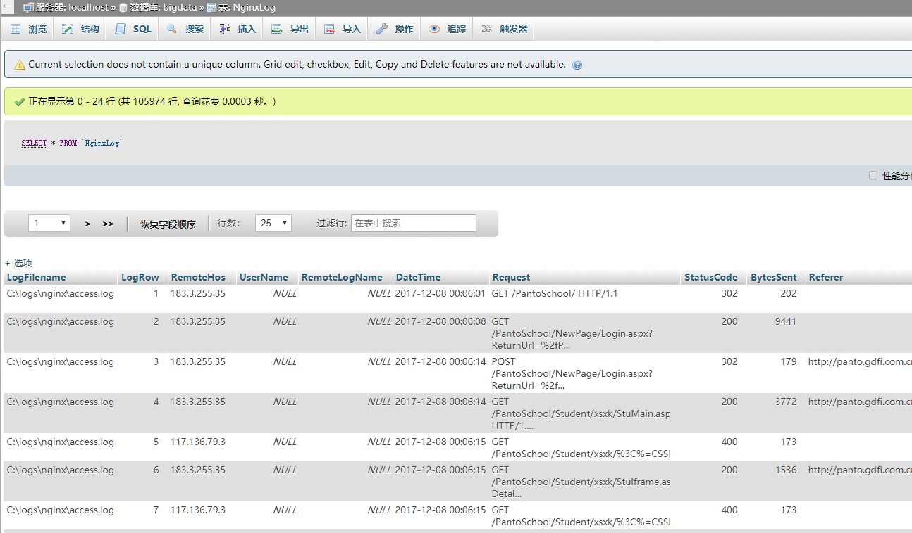

# <center>logparser</center>

[TOC]

## 一、把IIS数据数据写入 SQL server 2005

```powershell
正确用法：
logparser "SELECT * FROM D:\1.log TO IISLog_table" -o:SQL -server:192.168.1.88 -driver:"SQL Server" -database:Test -username:sa -password:111111 -createtable:ON
```


## 二、把 nginix 数据写入 mysql

```powershell
转自：
https://blog.csdn.net/olinbsoft/article/details/78869299
```

> 把nginx日志也写入mysql数据库，最后成功方法如下：
>
> ```powershell
> logparser.exe  "SELECT *  FROM  'C:\logs\nginx\access.log' " -i:NCSA -o:DATAGRID
> ```
>
> 
>
> ```powershell
> logparser.exe  "SELECT *  FROM  'C:\logs\nginx\access.log' to NginxLog" -i:NCSA -o:SQL -oConnString:"Dsn=iislog32" -createtable:ON
> ```
>
> ```powershell
> 注意几点：
>
> 1. -i NCSA 这是nginx日志的 input-format
>
> 2. -createtable:ON  第一次建表时使用
>
> 3. 运行中可能会因错误中断，我的问题是自动建的表结构，有些字段不够长，容不下数据，长生 too long错误提示，这时可以修改数据库提示的列的宽度为足够大，然后删除所有数据，保留表结构，重新导入数据，这时不要-createtable:ON参数，就会把数据重新导入到改好表结构的表里。
> ```
>
> 


