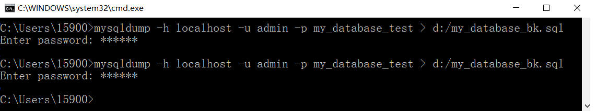
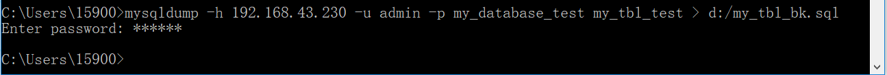
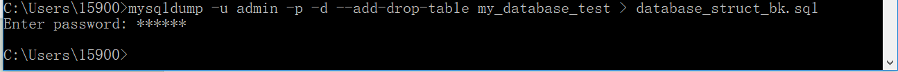

#<center>mysql</center>

[TOC]

## 一、环境安装与配置

> <a href = "./MySQL5.7_Setup_And_Cfg.html"> MySQL5.7_Setup_And_Cfg.html </a>

## 二、连接上数据库后

###1、连接数据库

```powershell
C:\Users\15900>mysql -h 127.0.0.1 -u admin -p
Enter password: ******
Welcome to the MySQL monitor.  Commands end with ; or \g.
Your MySQL connection id is 45
Server version: 5.7.20-log MySQL Community Server (GPL)

Copyright (c) 2000, 2017, Oracle and/or its affiliates. All rights reserved.

Oracle is a registered trademark of Oracle Corporation and/or its
affiliates. Other names may be trademarks of their respective
owners.

Type 'help;' or '\h' for help. Type '\c' to clear the current input statement.

mysql>
```


### 2、查看已有数据库

```mysql
mysql> show databases;
+--------------------+
| Database           |
+--------------------+
| information_schema |
| mysql              |
| performance_schema |
| sakila             |
| sys                |
| world              |
+--------------------+
6 rows in set (0.00 sec)
```

### 3、修改账号密码

> * ####A、 给root加个密码ab12。首先在DOS下进入目录mysql\bin，然后键入以下命令
>
>   ```p
>   mysqladmin -u root -password ab12
>   ```
>
>
> * ####B、再将root的密码改为djg345
>
>   ```
>   mysqladmin -u root -p ab12 password ******
>   ```

### 4、创建数据库

```powershell
创建数据库
mysql> create database my_test;
Query OK, 1 row affected (0.01 sec)

查看之
mysql> show databases;
+--------------------+
| Database           |
+--------------------+
| information_schema |
| my_test            |
| mysql              |
| performance_schema |
| sakila             |
| sys                |
| world              |
+--------------------+
7 rows in set (0.00 sec)
```

###5、创建表

####A、首先，要选中一个数据库，在其上操作

```powershell
mysql> use my_test;
Database changed
```

####B、创建一个表

```powershell
mysql> create table first_tbl (name VARCHAR(20), age CHAR(1));
Query OK, 0 rows affected (0.09 sec)

mysql> show tables;
+-------------------+
| Tables_in_my_test |
+-------------------+
| first_tbl         |
+-------------------+
1 row in set (0.00 sec)

mysql>
```

### 6、删除表

```
mysql> show tables;
+-------------------+
| Tables_in_my_test |
+-------------------+
| first_tbl         |
+-------------------+
1 row in set (0.00 sec)

mysql> drop table first_tbl;
Query OK, 0 rows affected (0.02 sec)

mysql> show tables;
Empty set (0.00 sec)
```


### 7、删除数据库

```
mysql> show databases;
+--------------------+
| Database           |
+--------------------+
| information_schema |
| my_test            |
| mysql              |
| performance_schema |
| sakila             |
| sys                |
| world              |
+--------------------+
7 rows in set (0.00 sec)

mysql> drop database my_test;
Query OK, 0 rows affected (0.02 sec)

mysql> show databases;
+--------------------+
| Database           |
+--------------------+
| information_schema |
| mysql              |
| performance_schema |
| sakila             |
| sys                |
| world              |
+--------------------+
6 rows in set (0.00 sec)
```

###8、向表中插入记录

```powershell
mysql> create database my_database_test;
Query OK, 1 row affected (0.00 sec)

mysql> show databases;
+--------------------+
| Database           |
+--------------------+
| information_schema |
| my_database_test   |
| mysql              |
| performance_schema |
| sakila             |
| sys                |
| world              |
+--------------------+
7 rows in set (0.00 sec)

mysql> use my_database_test;
Database changed
mysql> create table my_tbl_test(name VARCHAR(20), age CHAR(1));
Query OK, 0 rows affected (0.03 sec)

mysql> show tables;
+----------------------------+
| Tables_in_my_database_test |
+----------------------------+
| my_tbl_test                |
+----------------------------+
1 row in set (0.00 sec)

向表中插入一条记录
mysql> insert into my_tbl_test values("zhoujinhua", "A");
Query OK, 1 row affected (0.02 sec)

查看表中的记录
mysql> select * from my_tbl_test;
+------------+------+
| name       | age  |
+------------+------+
| zhoujinhua | A    |
+------------+------+
1 row in set (0.00 sec)

再插入一条记录
mysql> insert into my_tbl_test values("GoodMan", "C");
Query OK, 1 row affected (0.01 sec)

mysql> select * from my_tbl_test;
+------------+------+
| name       | age  |
+------------+------+
| zhoujinhua | A    |
| GoodMan    | C    |
+------------+------+
2 rows in set (0.00 sec)
```

### 9、更新表中记录

```powershell
mysql> select * from my_tbl_test;
+------------+------+
| name       | age  |
+------------+------+
| zhoujinhua | A    |
| GoodMan    | C    |
+------------+------+
2 rows in set (0.00 sec)

mysql> update my_tbl_test set age='M' where name='zhoujinhua';
Query OK, 1 row affected (0.00 sec)
Rows matched: 1  Changed: 1  Warnings: 0

可以看到， zhoujinhua 的 age 由 A 变成了 M
mysql> select * from my_tbl_test;
+------------+------+
| name       | age  |
+------------+------+
| zhoujinhua | M    |
| GoodMan    | C    |
+------------+------+
2 rows in set (0.00 sec)

mysql>
```


###10、将表中数据清空

```powershell
mysql> select * from my_tbl_test;
+------------+------+
| name       | age  |
+------------+------+
| zhoujinhua | M    |
| GoodMan    | C    |
+------------+------+
2 rows in set (0.00 sec)

mysql>  DELETE FROM my_tbl_test;
Query OK, 2 rows affected (0.01 sec)

查看发现所有内容都被清空
mysql> select * from my_tbl_test;
Empty set (0.00 sec)

mysql>
```


###11、用文本方式将数据导入表中

> 文本内容：
>
> 

```powershell
mysql> select * from my_tbl_test;
Empty set (0.00 sec)

导入并查看之
mysql> LOAD DATA LOCAL INFILE "D:/mysql.txt" INTO TABLE my_tbl_test;
Query OK, 2 rows affected, 2 warnings (0.01 sec)
Records: 2  Deleted: 0  Skipped: 0  Warnings: 2

发现格式比较混乱
mysql> select * from my_tbl_test;
+---------------+------+
| name          | age  |
+---------------+------+
 | NULL |hua A
| GoodMan    S  | NULL |
+---------------+------+
2 rows in set (0.00 sec)

mysql>
```

> ####第二次尝试，为各个量都添加引号，并且中间只有一个空格

```
mysql> delete from my_tbl_test;
Query OK, 4 rows affected (0.01 sec)

mysql> select * from my_tbl_test;
Empty set (0.00 sec)

mysql> LOAD DATA LOCAL INFILE "D:/mysql.txt" INTO TABLE my_tbl_test;
Query OK, 2 rows affected, 2 warnings (0.01 sec)
Records: 2  Deleted: 0  Skipped: 0  Warnings: 2

mysql> select * from my_tbl_test;
+-------------------+------+
| name              | age  |
+-------------------+------+
 | NULL |nhua" "A"
| "GoodMan" "S"     | NULL |
+-------------------+------+
2 rows in set (0.00 sec)

mysql>
```

> #### 经历N次尝试，终于成功
>
> 

代码如下：

```powershell
如果遇到  NULL 值，应当采用 `\n` 代替

查看，发现是一个空表
mysql> select * form my_tbl_test;
ERROR 1064 (42000): You have an error in your SQL syntax; check the manual that corresponds to your MySQL server version for the right syntax to use near 'form my_tbl_test' at line 1

从本地加载一个文件
mysql> LOAD DATA LOCAL INFILE "D:/mysql.txt" INTO TABLE my_tbl_test;
Query OK, 2 rows affected (0.01 sec)
Records: 2  Deleted: 0  Skipped: 0  Warnings: 0

成功查看到数据，加载之后，格式正确
mysql> select * from my_tbl_test;
+------------+------+
| name       | age  |
+------------+------+
| zhoujinhua | A    |
| GoodMan    | S    |
+------------+------+
2 rows in set (0.00 sec)
```

### 12、导入 `sql`命令

> #### sql 文件内容如下：
>
> 

```
mysql> use my_database_test;
Database changed

mysql> source d:/show_tbl.sql
+------------+------+
| name       | age  |
+------------+------+
| zhoujinhua | A    |
| GoodMan    | S    |
+------------+------+
8 rows in set (0.00 sec)
```

### 13、修改命令行 root 密码（危险性太高，未尝试）

```
　　mysql> UPDATE mysql.user SET password=PASSWORD('新密码') WHERE User='root';
　　mysql> FLUSH PRIVILEGES;
```


##三、备份&恢复数据库：(命令在`DOS`的`\mysql\bin`目录下执行)

###1、导出整个数据库（备份）

> #### 网上小朋友们的教材很不走心，让我卡了好长时间，备份的最小单位是一个数据库
>
> ```powershell
> 先查看有哪些数据库
> mysql> show databases;
> +--------------------+
> | Database           |
> +--------------------+
> | information_schema |
> | my_database_test   |
> | mysql              |
> | performance_schema |
> | sakila             |
> | sys                |
> | world              |
> +--------------------+
> 7 rows in set (0.00 sec)
> ```
>
> #### 然后，选择一个数据库，备份之
>
> ```powershell
> 最关键的一点，mysqldump 这个命令，是在命令行中执行，而不是在 mysql 内部执行。主要在这里浪费了时间
> ```
>
> 
>
> 
>
> #### 的个姿势，采用 IP 来备份
>
> ```powershell
> C:\Users\15900>mysqldump -h 192.168.43.230 -u admin -p my_database_test > d:/my_database_bk2.sql
> Enter password: ******
>
> 同样生成了目标文件。
> ```

###2、数据库的导入（恢复）

```powershell
先另创建一个数据库
mysql> create database my_abc;
Query OK, 1 row affected (0.00 sec)

mysql> show databases;
+--------------------+
| Database           |
+--------------------+
| information_schema |
| my_abc             |
| my_database_test   |
| mysql              |
| performance_schema |
| sakila             |
| sys                |
| world              |
+--------------------+
8 rows in set (0.00 sec)

切换新建的数据库
mysql> use my_abc;
Database changed

查看表，啥都没有
mysql> show tables;
Empty set (0.00 sec)

将之前备份的数据库恢复
mysql> source d:/my_database_bk.sql
Query OK, 0 rows affected (0.00 sec)

Query OK, 0 rows affected (0.00 sec)

Query OK, 0 rows affected (0.00 sec)

Query OK, 0 rows affected (0.01 sec)

Query OK, 0 rows affected (0.00 sec)

Query OK, 0 rows affected (0.00 sec)

Query OK, 0 rows affected (0.00 sec)

Query OK, 0 rows affected (0.00 sec)

Query OK, 0 rows affected, 1 warning (0.00 sec)

Query OK, 0 rows affected (0.00 sec)

Query OK, 0 rows affected (0.00 sec)

Query OK, 0 rows affected (0.00 sec)

Query OK, 0 rows affected (0.00 sec)

Query OK, 0 rows affected (0.03 sec)

Query OK, 0 rows affected (0.00 sec)

Query OK, 0 rows affected (0.00 sec)

Query OK, 0 rows affected (0.00 sec)

Query OK, 8 rows affected (0.00 sec)
Records: 8  Duplicates: 0  Warnings: 0

Query OK, 0 rows affected (0.00 sec)

Query OK, 0 rows affected (0.00 sec)

Query OK, 0 rows affected (0.00 sec)

Query OK, 0 rows affected, 2 warnings (0.00 sec)

Query OK, 0 rows affected (0.00 sec)

Query OK, 0 rows affected (0.00 sec)

Query OK, 0 rows affected (0.00 sec)

Query OK, 0 rows affected (0.00 sec)

Query OK, 0 rows affected (0.00 sec)

Query OK, 0 rows affected (0.00 sec)

查看之，果然有新建的表
mysql> show tables;
+------------------+
| Tables_in_my_abc |
+------------------+
| my_tbl_test      |
+------------------+
1 row in set (0.00 sec)

查看表的结构
mysql> desc my_tbl_test;
+-------+-------------+------+-----+---------+-------+
| Field | Type        | Null | Key | Default | Extra |
+-------+-------------+------+-----+---------+-------+
| name  | varchar(20) | YES  |     | NULL    |       |
| age   | char(1)     | YES  |     | NULL    |       |
+-------+-------------+------+-----+---------+-------+
2 rows in set (0.00 sec)

查看表中内容，很完美的恢复
mysql> select * from my_tbl_test;
+------------+------+
| name       | age  |
+------------+------+
| zhoujinhua | A    |
| GoodMan    | S    |
| zhoujinhua | A    |
| GoodMan    |      |
| zhoujinhua | A    |
| GoodMan    | S    |
| zhoujinhua | A    |
| GoodMan    | S    |
+------------+------+
8 rows in set (0.00 sec)
```

### 3、导出一个表



### 4、导出一个数据结构



```powershell
-d 没有数据 
--add-drop-table 在每个create语句之前增加一个drop table
```

### 5、带语言参数导出

```powershell
不知道这条语句干了什么，先写在这里
mysqldump -uadmin -p --default-character-set=latin1 --set-charset=gbk --skip-opt database_name > outfile_name.sql
```