# <center>ngrok</center>

[TOC]

# 一、学习资料来源

```powershell
https://blog.csdn.net/u013216667/article/details/50782084
https://segmentfault.com/a/1190000010338848
```

# 二、我的学习过程

## I、安装必须的环境

### 1、go语言，是ngrok 的编译环境

```powershell
在 CentOS7 上，连网情况下，最简单的方法（https://segmentfault.com/a/1190000010338848）：
    yum install go

或者其它办法，下载安装包，逐步安装(file:///F:/git_prj/HateIron/2017/2017-11.html#header-n363)：
//请下载合适自己的go语言包  我是centos 6.8 64位 所以选择以下包
wget https://storage.googleapis.com/golang/go1.8.3.linux-amd64.tar.gz
tar -C /usr/local -xzf go1.8.3.linux-amd64.tar.gz
vim /etc/profile
//添加以下内容：
export PATH=$PATH:/usr/local/go/bin
source /etc/profile
//检测是否安装成功go
go version
```

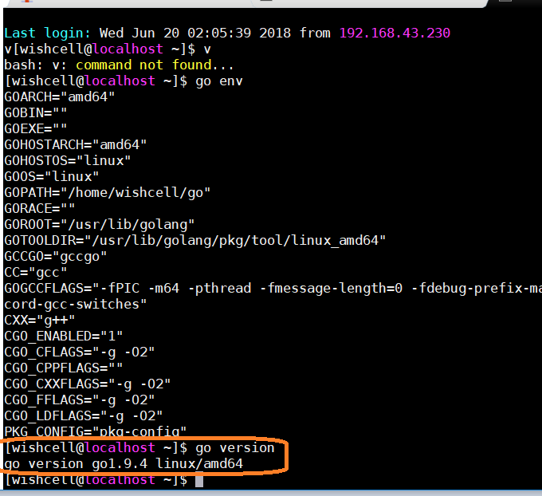

### 2、`CentOS`安装其它必须环境

```powershell
yum -y install zlib-devel openssl-devel perl hg cpio expat-devel gettext-devel curl curl-devel perl-ExtUtils-MakeMaker hg wget gcc gcc-c++ git
```

## II、利用ngrok 源码搭建环境

### 1、安装服务器

```powershell
mkdir /ngrok
cd /ngrok
git clone https://github.com/inconshreveable/ngrok.git
```

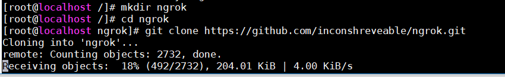

### 2、生成证书

```powershell
cd /ngrok
mkdir cert
cd cert
openssl genrsa -out rootCA.key 2048
openssl req -x509 -new -nodes -key rootCA.key -subj "/CN=myngork.com" -days 5000 -out rootCA.pem
openssl genrsa -out device.key 2048
openssl req -new -key device.key -subj "/CN=myngork.com" -out device.csr
openssl x509 -req -in device.csr -CA rootCA.pem -CAkey rootCA.key -CAcreateserial -out device.crt -days 5000
```

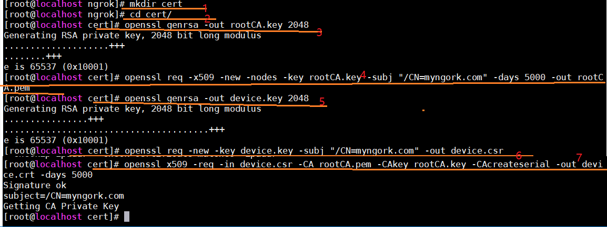

### 3、覆盖原本证书

```powershell
yes|cp rootCA.pem /ngrok/ngrok/assets/client/tls/ngrokroot.crt
yes|cp device.crt /ngrok/ngrok/assets/server/tls/snakeoil.crt
yes|cp device.key /ngrok/ngrok/assets/server/tls/snakeoil.key
```

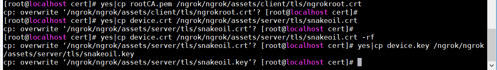

### 4、编译生成ngrok

```powershell
go env //查看环境
GOOS=linux GOARCH=amd64 make release-server
```

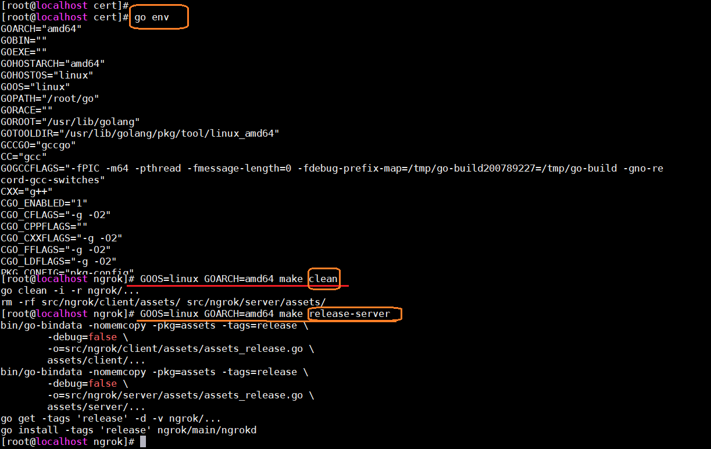

### 5、运行测试

```powershell
./bin/ngrokd -tlsKey="assets/server/tls/snakeoil.key" -tlsCrt="assets/server/tls/snakeoil.crt" -domain="myngrok.com"  -httpAddr=":8081" -httpsAddr=":8082" -tunnelAddr=":8083"

#参数说明：
#-domain 访问ngrok是所设置的服务地址生成证书时那个
#-httpAddr http协议端口 默认为80
#-httpsAddr https协议端口 默认为443 （可配置https证书）
#-tunnelAddr 通道端口 默认4443
```

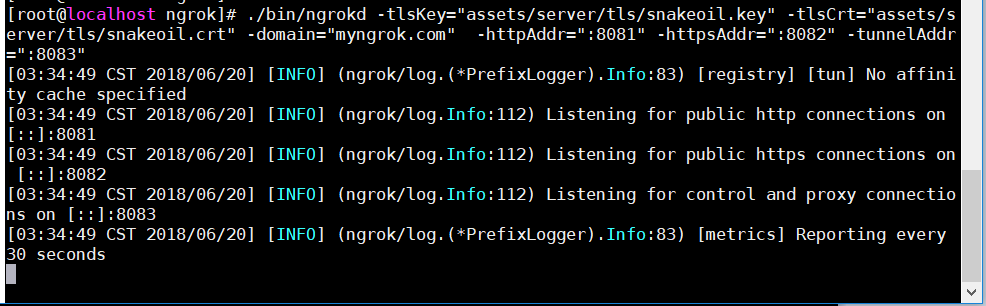

### 6、后台运行

```powershell
cd /ngrok/ngrok
setsid ./bin/ngrokd -tlsKey="assets/server/tls/snakeoil.key" -tlsCrt="assets/server/tls/snakeoil.crt" -domain="myngrok"  -httpAddr=":8081" -httpsAddr=":8082" -tunnelAddr=":8083"
```


## II、客户端编译和使用

### 1、编译生成win64位客户端（其他自行编译测试）

```powershell
GOOS=windows GOARCH=amd64 make release-client
#编译成功后会在ngrok/bin/下面生成一个windows_amd64目录下面有ngrok.exe

#Linux 平台 32 位系统：GOOS=linux GOARCH=386
#Linux 平台 64 位系统：GOOS=linux GOARCH=amd64
#Windows 平台 32 位系统：GOOS=windows GOARCH=386
#Windows 平台 64 位系统：GOOS=windows GOARCH=amd64
#MAC 平台 32 位系统：GOOS=darwin GOARCH=386
#MAC 平台 64 位系统：GOOS=darwin GOARCH=amd64
#ARM 平台：GOOS=linux GOARCH=arm
```

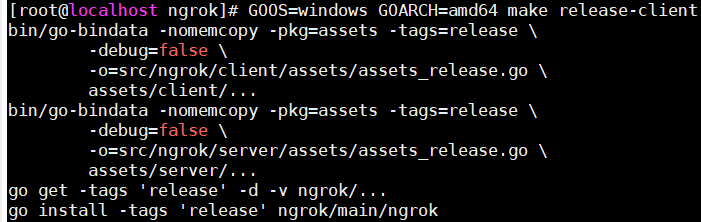

### 2、部署使用 windows 64 位的客户端

> ####将在 linux CentOS 上编译出来的 windows 64 位的客户端，复制到win10 上，并运行之
>
> 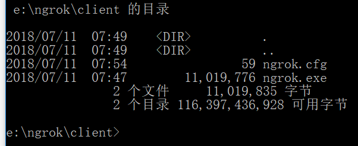

```powershell
先为其创建一个简单的 ngrok.cfg 文件，内容如下：
server_addr: "myngrok.com:80"
trust_host_root_certs: false
```

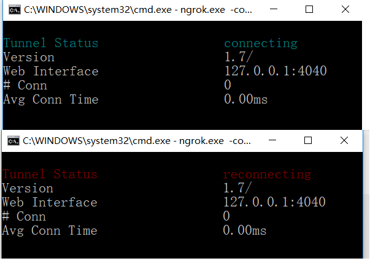


### 3、编译 linux 环境下的客户端

```power
[root@localhost ngrok]# GOOS=linux GOARCH=amd64 make release-client
bin/go-bindata -nomemcopy -pkg=assets -tags=release \
        -debug=false \
        -o=src/ngrok/client/assets/assets_release.go \
        assets/client/...
bin/go-bindata -nomemcopy -pkg=assets -tags=release \
        -debug=false \
        -o=src/ngrok/server/assets/assets_release.go \
        assets/server/...
go get -tags 'release' -d -v ngrok/...
go install -tags 'release' ngrok/main/ngrok
[root@localhost ngrok]#
```

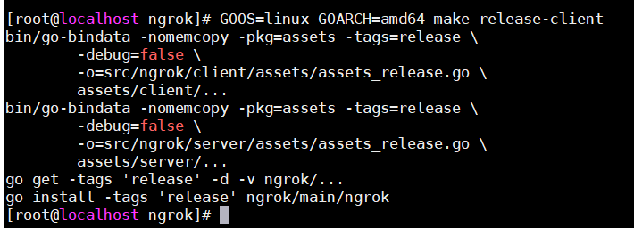

### 4、运行linux 环境下的客户端

> ```powershell
> 与 windows 上情况一样，应该是 linux 服务器上 web server 没有搭建好的原因
> ```
>
> 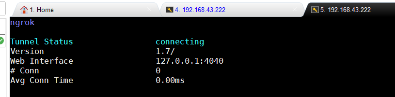


***