#<center>php</center>

[TOC]

##一、基于win10搭建php环境

```powershell
这里是基于win10配置php-7.1.0+apache2.4.23+mysql-5.7.16的介绍
```

###工具/原料

>- 环境 win10 64位（32位的电脑选择下载32位的，32位的软件能在64位的电脑运行，反之则不行，最好是下载和电脑位数匹配的）
>- php-7.1.0 php-7.1.0-Win32-VC14-x64.zip 
>- apache 2.4.23 httpd-2.4.23-win64-VC14.zip 
>- mysql-5.7.16 mysql-5.7.16-winx64.zip

###方法/步骤 1、下载相应的软件（没有装vc14的一定要安装)

>- 先去微软官网下载vc14,网址为https://www.microsoft.com/zh-cn/download/details.aspx?id=48145，这里下载中文简体的，然后下载好之后一步步安装就好了。
>- 下载apache 2.4.23， httpd-2.4.23-win64-VC14.zip，网址为http://www.apachelounge.com/download/，这里选择的是免安装版的
>- 下载php-7.1.0，php-7.1.0-Win32-VC14-x64.zip 
>   这里我们选择的是线程安全版，关于线程安全版与非线程安全版的区别可 
>    自行上网查阅相关资料，下载网址为http://windows.php.net/download/ 
>   ，最后注意选择相应位数的版本下载，这里我是下载64位的
>- 下载mysql-5.7.16，mysql-5.7.16-winx64.zip，下载网址为http://dev.mysql.com/downloads/mysql/，同样的选择64位的下载。32位的电脑下载32位的。这个软件也是免安装版的，到时候只要解压到某个文件夹就好了。

###方法/步骤2、开始安装

>* Apache我们这里下载的是zip压缩包，解压后放到合适的位置就好了，这里我们放在E盘的phptools文件夹中的ApacheServer文件夹中，这个文件夹是自己新建的，可以自己命名。
>* php 下载后也是zip包，同样解压到合适位置，我们这里也将其放在E盘的phptools文件夹下的php7.1目录下,php7.1文件夹需要自己新建
>* MySQL选择的是免安装版的，也就是Zip压缩包，这就更简单了，同样是解压到合适的位置，这里我们也将其放在E盘的phptools文件夹下的MySQL目录下,解压安装后如下图

###方法/步骤3、配置PHP

> * 首先将`E:\phptools\php7.1\php.ini-production`  复制一份，并重命名为php.ini；
> * 将 
>   `E:\phptools\php7.1和E:\phptools\php7.1\ext`加入环境变量PATH中,选中计算机，右键属性-->高级系
>    统设置 -->环境变量-->系统变量，找到Path，编辑，在其后加上`;E:\phptools\php7.1;E:\phptools
>    \php7.1\ext`

### 方法/步骤4、配置Apache

> * 用记事本打开E:\phptools\ApacheServer\Apache\conf
>
>   查找ServerRoot，修改ServerRoot `"C:/Apache24" => ServerRoot "E:/phptools/ApacheServer/Apache"`（这里输入的是你解压apache安装包后放的位置）
>
> * 查找#ServerName www.example.com:80 ，修改为 ServerName 
>   localhost:80 (去掉前面的#)，如果你的电脑的80端口已经被占用了的话，这里我们就不能用80端口了，可以修改成其它的端口，比如90。当然我们还要搜索Listen，把80端口改成90，其它的就不用修改了，只需要修改这两个地方。
>
> * 查找DocumentRoot "c:/Apache24/htdocs" ， 修改为DocumentRoot "E:/phptools/ApacheServer/Apache/htdocs" 
>
> * 查找`<Directory "c:/Apache24/htdocs"> `，修改为 `<Directory " E:/phptools/ApacheServer/Apache/htdocs ">`
>
> * 找到DirectoryIndex index.html ，修改为 DirectoryIndex index.html index.php index.htm (这里我们添加了index.php index.htm)
>
> * 查找ScriptAlias /cgi-bin/ "c:/Apache24/cgi-bin/"  ，修改为 ScriptAlias /cgi- bin/ "E:/phptools/ApacheServer/Apache/cgi-bin"
>
> * 查找`<Directory "c:/Apache24/cgi-bin"> `修改为 `<Directory "E:/phptools/ApacheServer/Apache/cgi-bin/">`
>
> * 最后在E:/phptools/ApacheServer/Apache/conf/httpd.conf最后一行加上
>
>   ````
>   LoadModule php7_module "E:/phptools/php7.1/php7apache2_4.dll"
>   AddHandler application/x-httpd-php .php .html .htm
>   AddType application/x-http-php .php .html .htm
>   PHPIniDir "E:/phptools/php7.1"
>   ````

###方法/步骤5、然后将Apache安装到系统服务中

> + 然后我们如果把Apache安装到系统服务中的话，我们就可以直接在系统服务中启动了。具体方法是打开任务管理器——>服务——>找到Apache，然后右键启动就好了。
> + 当然这里不安装也是可以的，只是启动Apache的时候要到E:\phptools\ApacheServer\Apache\bin\ApacheMonitor.exe中去，启动前还要运行httpd.exe

### 方法/步骤6、开启几个常用的php扩展

> - 用记事本打开E:\phptools\php7.1\php.ini
>
>   将`; extension_dir = "ext"`修改为` extension_dir = "ext" `（去掉extension前面的分号）
>
>   将`;extension=php_mbstring.dll `修改为`extension=php_mbstring.dll`（去掉extension前面的分号,这是php多字节字符串扩展）
>
>   将`;extension=php_mysqli.dll `修改为 `extension=php_mysqli.dll`（去掉extension前面的分号） 

### 方法/步骤7、MySQL的配置

```
MySQL免安装版环境配置已有朋友写过相关经验，我就不赘述了，参考

经验朋友niyikai写的经验即可。

但是这里需要注意的是5.7版本里面没有data文件夹。在启动之前需要初始化，使用cmd命令行进入bin文件夹后，再输入mysqld --initialize ,这样才能正常启动MySQL。还有密码的问题，5.7版本的MySQL随机附带了一个登录密码。这个密码在后来生成的data文件夹下。文件的名字是你的计算机名.err。

2016-12-10T16:18:50.886005Z 1 [Note] A temporary password is generated for root@localhost: fdglskdjggsl    加粗的即为登录密码。还有需要注意的是cmd命令必须是以管理员权限运行的，否则权限不够，会报错。下图就是MySQL成功启动并且登录后的界面。
```

## 二、环境配置好后，验证一下

<a href="./win10_PHP_Apache_MySQL_EnvSetup.html">win10_PHP_Apache_MySQL_EnvSetup.html</a>


## 三、第一个页面

###1、第一个静态页面

```powershell
在 E:\phptools\ApacheServer\Apache\htdocs 目录下，建立一个 index.php ，内容如下：

<!DOCTYPE html>
<html>
    <body>
    <?php
        echo "Hello World!<br/>";
        echo strlen("Hello world!\n"); 
    ?>
    </body>
</html>
```

> 
>
> 启动 apache服务器，并浏览之
>
> 

### 2、用于调试的函数

#### A、exit 和 die 函数，效果相同，输出一个字符串，然后退出

```php
<?php exit("hello word"); ?>
<?php die("hello word"); ?>
```

####B、var_dump()和print_r()

```powershell
网页内容：
<pre>
	<?php
		$a = array  ('a' => 'apple',
					'b' => 'banana',
					'c' => array ('x','y','z'));
		var_dump  ($a);
		print_r   ($a);
	?>
</pre>

输出：
array(3) {
  ["a"]=>
  string(5) "apple"
  ["b"]=>
  string(6) "banana"
  ["c"]=>
  array(3) {
    [0]=>
    string(1) "x"
    [1]=>
    string(1) "y"
    [2]=>
    string(1) "z"
  }
}
Array
(
    [a] => apple
    [b] => banana
    [c] => Array
        (
            [0] => x
            [1] => y
            [2] => z
        )
)
```

###3、`PHP file_put_contents()`将内容打印到后台文件中查看


##四、 PHP 学习正式开始（runoob 誊写）

### 1、helloworld 样例

```powershell
//基本输出指令是 echo 和 print
<!DOCTYPE html>
<html>
<body>

<h1>My first PHP page</h1>

<?php
echo "Hello World!";
?>

</body>
</html>
```

### 2、PHP变量

```powershell
php 文件内容：
<?php
	$x=5;
	$y=6;
	$z=$x+$y;
	echo $z;
?>

将此文件放到 apache 根目录的一个子目录下，然后访问之：
http://127.0.0.1/study/var.php

输出
11
```


###3、变量作用域

```powershell
<?php
$x=5; // 全局变量

function myTest()
{
    $y=10; // 局部变量
    echo "<p>测试函数内变量:<p>";
    echo "变量 x 为: $x";
    echo "<br>";
    echo "变量 y 为: $y";
} 

myTest();

echo "<p>测试函数外变量:<p>";
echo "变量 x 为: $x";
echo "<br>";
echo "变量 y 为: $y";
?> 
```

### 4、global 关键字

```powershell
<?php
$x=5;
$y=10;
 
function myTest()
{
    //声明 x 、 y 为全局变量
    global $x,$y;
    $y=$x+$y;
}
 
myTest();
echo $y; // 输出 15
?>


PHP 将所有全局变量存储在一个名为 $GLOBALS[index] 的数组中。 index 保存变量的名称。这个数组可以在函数内部访问，也可以直接用来更新全局变量。

上面的实例可以写成这样：

<?php
$x=5;
$y=10;
 
function myTest()
{
    $GLOBALS['y']=$GLOBALS['x']+$GLOBALS['y'];
} 
 
myTest();
echo $y;
?>
```

### 5、static 关键字

```powershell
<?php
function myTest()
{
    static $x=0;
    echo $x;
    $x++;
}
 
myTest();
myTest();
myTest();
?>
输出：
012
```

### 6、参数

```php
<?php
function myTest($x)
{
    echo $x;
}
myTest(5);
?>
```

### 7、`echo / print` 语句

> echo 语句

```php
<?php
	$txt1="学习 PHP";
	$txt2="RUNOOB.COM";
	$cars=array("Volvo","BMW","Toyota");
	 
	echo $txt1;
	echo "<br>";
	echo "在 $txt2 学习 PHP ";
	echo "<br>";
	echo "我车的品牌是 {$cars[0]}";
?>

//输出如下：
学习 PHP
在 RUNOOB.COM 学习 PHP
我车的品牌是 Volvo
```

> print 语句

```php
<?php
$txt1="学习 PHP";
$txt2="RUNOOB.COM";
$cars=array("Volvo","BMW","Toyota");
 
print $txt1;
print "<br>";
print "在 $txt2 学习 PHP ,use print";
print "<br>";
print "我车的品牌是 {$cars[0]}";
?>
//输出如下：
学习 PHP
在 RUNOOB.COM 学习 PHP ,use print
我车的品牌是 Volvo
```

### 8、EOF关键字

```powershell
<?php
echo <<<EOF
    <h1>我的第一个标题</h1>
    <p>我的第一个段落。</p>
EOF;
// 结束需要独立一行且前后不能空格
?>
```

### 9、数据类型

```powershell
String（字符串）, Integer（整型）, Float（浮点型）, 
Boolean（布尔型）, Array（数组）, Object（对象）, NULL（空值）。
```

```powershell
<?php 
	$x = 5985;
	var_dump($x);
	echo "<br>"; 
	$x = -345; // 负数 
	var_dump($x);
	echo "<br>"; 
	$x = 0x8C; // 十六进制数
	var_dump($x);
	echo "<br>";
	$x = 047; // 八进制数
	var_dump($x);
?>

输出：
int(5985)
int(-345)
int(140)
int(39) 
```

> 浮点类型数据

```powershell
<?php 
	$x = 10.365;
	var_dump($x);
	echo "<br>"; 
	$x = 2.4e3;
	var_dump($x);
	echo "<br>"; 
	$x = 8E-5;
	var_dump($x);
?>

//输出
float(10.365)
float(2400)
float(8.0E-5) 
```

> 数组类型

```powershell
<?php 
$cars=array("Volvo","BMW","Toyota");
var_dump($cars);
?>
输出：
array(3) { [0]=> string(5) "Volvo" [1]=> string(3) "BMW" [2]=> string(6) "Toyota" } 
```

> NULL 数据类型

```powershell
<?php
$x="Hello world!";
$x=null;
var_dump($x);
?>
输出：
NULL 
```

> 常量

```powershell
区分大小写的常量
<?php
// 区分大小写的常量名
define("GREETING", "欢迎访问 Runoob.com");
echo GREETING;    // 输出 "欢迎访问 Runoob.com"
echo '<br>';
echo greeting;   // 输出 "greeting"
?>
输出：
欢迎访问 Runoob.com
greeting
```

```powershell
不区分大小写的常量
<?php
// 不区分大小写的常量名
define("GREETING", "欢迎访问 Runoob.com", true);
echo greeting;  // 输出 "欢迎访问 Runoob.com"
?>

输出：
欢迎访问 Runoob.com
```


```powershell
常量是全局的：
<?php
define("GREETING", "欢迎访问 Runoob.com");
 
function myTest() {
    echo GREETING;
}
 
myTest();    // 输出 "欢迎访问 Runoob.com"
?>
```

###10、PHP`合并`运算符

```powershell
 <?php
$txt1="Hello world!";
$txt2="What a nice day!";
echo $txt1 . " " . $txt2;
?> 

输出：
Hello world! What a nice day! 
```

### 11、库函数

```powershell
<?php
	//strlen 函数不包含最后的`\n`
	echo strlen("Hello world!"); //输出：12
?> 

<?php
	echo strpos("Hello world!","world"); //输出：6
?> 

完整的 php 函数手册：
	http://www.runoob.com/php/php-ref-string.html
```


### 12、PHP 运算符

```php
<?php 
	$x=10; 
	$y=6;
	echo ($x + $y); // 输出16
	echo '<br>';  // 换行
	 
	echo ($x - $y); // 输出4
	echo '<br>';  // 换行
	 
	echo ($x * $y); // 输出60
	echo '<br>';  // 换行
	 
	echo ($x / $y); // 输出1.6666666666667
	echo '<br>';  // 换行
	 
	echo ($x % $y); // 输出4
	echo '<br>';  // 换行
	 
	echo -$x;     //输出：-10
	
	echo '<br>';
	var_dump(intdiv(10, 3)); //输出： int(3) 
?>
```

```powershell
赋值运算：

<?php 
	$x=10; 
	echo $x; // 输出10
	echo '<br/>';
	$y=20; 
	$y += 100;
	echo $y; // 输出120
    echo '<br/>';
	$z=50;
	$z -= 25;
	echo $z; // 输出25
	echo '<br/>';
	$i=5;
	$i *= 6;
	echo $i; // 输出30
	echo '<br/>';
	$j=10;
	$j /= 5;
	echo $j; // 输出2
	echo '<br/>';
	$k=15;
	$k %= 4;
	echo $k; // 输出3
?>

输出：
10
120
25
30
2
3
```

```powershell
字符串连接并赋值：
<?php
	$a = "Hello";
	$b = $a . " world!";
	echo $b; // 输出Hello world! 
	print '<br/>';
	
	$x="Hello";
	$x .= " world!";
	echo $x; // 输出Hello world! 
?>

输出：
Hello world!
Hello world!
```

```powershell
自加自减操作：
<?php
	$x=10; 
	echo ++$x; // 输出11
	echo '<br/>';

	$y=10; 
	echo $y++; // 输出10
	echo '<br/>';

	$z=5;
	echo --$z; // 输出4
	echo '<br/>';

	$i=5;
	echo $i--; // 输出5
	echo '<br/>';
?>
```


###13、PHP 比较运算符

| 运算符  | 名称       | 描述                                           | 实例               |
| ------- | ---------- | ---------------------------------------------- | ------------------ |
| x == y  | 等于       | 如果 x 等于 y，则返回 true                     | 5==8 返回 false    |
| x === y | 绝对等于   | 如果 x 等于 y，且它们类型相同，则返回 true     | 5==="5" 返回 false |
| x != y  | 不等于     | 如果 x 不等于 y，则返回 true                   | 5!=8 返回 true     |
| x <> y  | 不等于     | 如果 x 不等于 y，则返回 true                   | 5<>8 返回 true     |
| x !== y | 绝对不等于 | 如果 x 不等于 y，或它们类型不相同，则返回 true | 5!=="5" 返回 true  |
| x > y   | 大于       | 如果 x 大于 y，则返回 true                     | 5>8 返回 false     |
| x < y   | 小于       | 如果 x 小于 y，则返回 true                     | 5<8 返回 true      |
| x >= y  | 大于等于   | 如果 x 大于或者等于 y，则返回 true             | 5>=8 返回 false    |
| x <= y  | 小于等于   | 如果 x 小于或者等于 y，则返回 true             | 5<=8 返回 true     |

```php
<!DOCTYPE html>
<html>
	<body>
	<?php
		$x=100; 
		$y="100";

		var_dump($x == $y); // returns true because values are equal
		echo "<br>";
		var_dump($x === $y); // returns false because types are not equal
		echo "<br>";
		var_dump($x != $y); // returns false because values are equal
		echo "<br>";
		var_dump($x !== $y); // returns true because types are not equal
		echo "<br>";

		$a=50;
		$b=90;

		var_dump($a > $b);
		echo "<br>";
		var_dump($a <  $b);
	?>  
	</body>
</html>
        
//输出：
bool(true)
bool(false)
bool(false)
bool(true)
bool(false)
bool(true) 
```


###14、PHP 逻辑运算符

| 运算符   | 名称 | 描述                                         | 实例                                |
| -------- | ---- | -------------------------------------------- | ----------------------------------- |
| x and y  | 与   | 如果 x 和 y 都为 true，则返回 true           | x=6 y=3(x < 10 and y > 1) 返回 true |
| x or y   | 或   | 如果 x 和 y 至少有一个为 true，则返回 true   | x=6 y=3(x==6 or y==5) 返回 true     |
| x xor y  | 异或 | 如果 x 和 y 有且仅有一个为 true，则返回 true | x=6 y=3 (x==6 xor y==3) 返回 false  |
| x && y   | 与   | 如果 x 和 y 都为 true，则返回 true           | x=6 y=3 (x < 10 && y > 1) 返回 true |
| x \|\| y | 或   | 如果 x 和 y 至少有一个为 true，则返回 true   | x=6 y=3 (x==5 \|\| y==5) 返回 false |
| ! x      | 非   | 如果 x 不为 true，则返回 true                | x=6 y=3 !(x==y) 返回 true           |

### 15、三元运算符

```powershell
<?php
	$test = '菜鸟教程';
	// 普通写法
	$username = isset($test) ? $test : 'nobody';
	echo $username, PHP_EOL,"<br/>";

	// PHP 5.3+ 版本写法
	$username = $test ?: 'nobody';
	echo $username, PHP_EOL;
?>

输出：
菜鸟教程
菜鸟教程
```

> 日期函数

```powershell
<?php
	echo "今天是 " . date("Y/m/d") . "<br>";
	echo "今天是 " . date("Y.m.d") . "<br>";
	echo "今天是 " . date("Y-m-d") . "<br>";
	echo "今天是 " . date("l");
?>

输出：
今天是 2018/05/06
今天是 2018.05.06
今天是 2018-05-06
今天是 Sunday
```

### 16、switch 语句

```powershell
<?php
$favcolor="red";
switch ($favcolor)
{
case "red":
    echo "你喜欢的颜色是红色!";
    break;
case "blue":
    echo "你喜欢的颜色是蓝色!";
    break;
case "green":
    echo "你喜欢的颜色是绿色!";
    break;
default:
    echo "你喜欢的颜色不是 红, 蓝, 或绿色!";
}
?>

输出：
你喜欢的颜色是红色!
```

### 17、数组

```powershell
<?php
	$cars=array("Volvo","BMW","Toyota");
	echo "I like " . $cars[0] . ", " . $cars[1] . " and " . $cars[2] . "."."<br/>";
	echo "array size: " . count($cars);
?>

输出：
I like Volvo, BMW and Toyota.
array size: 3
```

> #### 遍历数组

```powershell
<?php
	$cars=array("Volvo","BMW","Toyota");
	$arrlength=count($cars);
	 
	for($x=0;$x<$arrlength;$x++)
	{
		echo $cars[$x];
		echo "<br>";
	}
?>

输出：
Volvo
BMW
Toyota
```

> 关联数组

```powershell
<?php
	$age=array("Peter"=>"35","Ben"=>"37","Joe"=>"43");
	echo "Peter is " . $age['Peter'] . " years old.";
?>
输出：
Peter is 35 years old.
```

> 关联数组2

```powershell
<?php
	$age=array("Peter"=>"35","Ben"=>"37","Joe"=>"43");
	
	foreach($age as $x=>$x_value)
	{
		echo "Key=" . $x . ", Value=" . $x_value;
		echo "<br>";
	}
?>

输出：
Peter is 35 years old.
```

### 18、排序

```powershell
<?php
	$cars=array("Volvo","BMW","Toyota");
	$arrlength=count($cars);
	 
	for($x=0;$x<$arrlength;$x++)
	{
		echo $cars[$x];
		echo "<br>";
	}
	echo($cars);
	echo("<br/>-----------------<br/>");
	sort($cars);
	
	for($x=0;$x<$arrlength;$x++)
	{
		echo $cars[$x];
		echo "<br>";
	}
	echo($cars);
?> 
输出：
Volvo
BMW
Toyota
Array
-----------------
BMW
Toyota
Volvo
Array 
```


> 排序：一个数字数组的排序

```powershell
<?php
	$numbers=array(4,6,2,22,11);
	$arrlength=count($numbers);
	for($x=0;$x<$arrlength;$x++)
	{
		echo $numbers[$x];
		echo "<br>";
	}
	echo($numbers);
	echo("<br/>-----------------<br/>");
	sort($numbers);
	
	for($x=0;$x<$arrlength;$x++)
	{
		echo $numbers[$x];
		echo "<br>";
	}
	echo($numbers);
?> 

输出：
4
6
2
22
11
Array
-----------------
2
4
6
11
22
Array 
```


```powershell
其它相关的排序函数：rsort / asort / ksort / arsort / krsort
```

```powershell
php 写的冒泡排序：

<?php
	// 从大到小排序
	$numArray = array(3,2,6,5,8,10);
	$numCount = count($numArray);
	for($i=$numCount-1;$i>=0;$i--){
		for($j=0;$j<$i;$j++){
			if($numArray[$j]< $numArray[$j+1]){
				$aa = $numArray[$j+1];
				$numArray[$j+1]=$numArray[$j];
				$numArray[$j]=$aa;
			}
		}
	}

	print_r($numArray);
?>

输出：
Array ( [0] => 10 [1] => 8 [2] => 6 [3] => 5 [4] => 3 [5] => 2 ) 
```


### 19、php 超全局变量，是 PHP系统自带的变量

- $GLOBALS
- $_SERVER
- $_REQUEST
- $_POST
- $_GET
- $_FILES
- $_ENV
- $_COOKIE
- $_SESSION

####A、$GLOBALS 是PHP的一个超级全局变量组，在PHP脚本的全部作用域中都可以访问。

```powershell
<?php 
    $x = 75; 
    $y = 25;

    function addition() 
    { 
        $GLOBALS['z'] = $GLOBALS['x'] + $GLOBALS['y']; 
    }

    addition(); 
    echo $z; 
?>
输出：
100
```

####B、`_SERVER`

```php
$_SERVER 是一个包含了诸如头信息(header)、路径(path)、以及脚本位置(script locations)等等信息的数组。这个数组中的项目由 Web 服务器创建。不能保证每个服务器都提供全部项目；服务器可能会忽略一些，或者提供一些没有在这里列举出来的项目。 

<?php 
    echo "\$_SERVER['PHP_SELF'] --->>> ".$_SERVER['PHP_SELF'] . "<br/>";
    echo "\$_SERVER['GATEWAY_INTERFACE']  --->>> ".$_SERVER['GATEWAY_INTERFACE'] . "<br/>";
    echo "\$_SERVER['SERVER_ADDR'] --->>> ".$_SERVER['SERVER_ADDR'] . "<br/>";
    echo "\$_SERVER['SERVER_NAME'] --->>> ".$_SERVER['SERVER_NAME'] . "<br/>";
    echo "\$_SERVER['SERVER_SOFTWARE'] --->>> ".$_SERVER['SERVER_SOFTWARE'] . "<br/>";
    echo "\$_SERVER['SERVER_PROTOCOL'] --->>> ".$_SERVER['SERVER_PROTOCOL'] . "<br/>";
    echo "\$_SERVER['REQUEST_METHOD'] --->>> ".$_SERVER['REQUEST_METHOD'] . "<br/>";
    echo "\$_SERVER['REQUEST_TIME'] --->>> ".$_SERVER['REQUEST_TIME'] . "<br/>";
    echo "\$_SERVER['QUERY_STRING'] --->>> ".$_SERVER['QUERY_STRING'] . "<br/>"; 
    echo "\$_SERVER['HTTP_ACCEPT'] --->>> ".$_SERVER['HTTP_ACCEPT'] . "<br/>";
    echo "\$_SERVER['HTTP_ACCEPT_CHARSET']--->>> ".$_SERVER['HTTP_ACCEPT_CHARSET']  . "<br/>";
    echo "\$_SERVER['HTTP_HOST'] --->>> ".$_SERVER['HTTP_HOST'] . "<br/>";
    echo "\$_SERVER['HTTP_REFERER'] --->>> ".$_SERVER['HTTP_REFERER'] . "<br/>";
    echo "\$_SERVER['HTTPS'] --->>> ".$_SERVER['HTTPS'] . "<br/>";
    echo "\$_SERVER['REMOTE_ADDR'] --->>> ".$_SERVER['REMOTE_ADDR']."<br/>";
    echo "\$_SERVER['REMOTE_HOST'] --->>> ".$_SERVER['REMOTE_HOST']."<br/>";
    echo "\$_SERVER['REMOTE_PORT'] --->>> ".$_SERVER['REMOTE_PORT']."<br/>";
    echo "\$_SERVER['SCRIPT_FILENAME'] --->>> ".$_SERVER['SCRIPT_FILENAME']. "<br/>";
    echo "\$_SERVER['SERVER_ADMIN'] --->>> ".$_SERVER['SERVER_ADMIN']. "<br/>";
    echo "\$_SERVER['SERVER_PORT'] --->>> ".$_SERVER['SERVER_PORT']."<br/>";
    echo "\$_SERVER['SERVER_SIGNATURE'] --->>> ".$_SERVER['SERVER_SIGNATURE']."<br/>";
    echo "\$_SERVER['PATH_TRANSLATED'] --->>> ".$_SERVER['PATH_TRANSLATED']."<br/>";
    echo "\$_SERVER['SCRIPT_NAME'] --->>> ".$_SERVER['SCRIPT_NAME']."<br/>";
    echo "\$_SERVER['SCRIPT_URI'] --->>> ".$_SERVER['SCRIPT_URI']."<br/>";
?>

输出：
$_SERVER['PHP_SELF'] --->>> /study/server.php
$_SERVER['GATEWAY_INTERFACE'] --->>> CGI/1.1
$_SERVER['SERVER_ADDR'] --->>> 127.0.0.1
$_SERVER['SERVER_NAME'] --->>> 127.0.0.1
$_SERVER['SERVER_SOFTWARE'] --->>> Apache/2.4.33 (Win64) PHP/7.2.4
$_SERVER['SERVER_PROTOCOL'] --->>> HTTP/1.1
$_SERVER['REQUEST_METHOD'] --->>> GET
$_SERVER['REQUEST_TIME'] --->>> 1525787770
$_SERVER['QUERY_STRING'] --->>>
$_SERVER['HTTP_ACCEPT'] --->>> text/html,application/xhtml+xml,application/xml;q=0.9,*/*;q=0.8
$_SERVER['HTTP_ACCEPT_CHARSET']--->>>
$_SERVER['HTTP_HOST'] --->>> 127.0.0.1
$_SERVER['HTTP_REFERER'] --->>>
$_SERVER['HTTPS'] --->>>
$_SERVER['REMOTE_ADDR'] --->>> 127.0.0.1
$_SERVER['REMOTE_HOST'] --->>>
$_SERVER['REMOTE_PORT'] --->>> 55243
$_SERVER['SCRIPT_FILENAME'] --->>> E:/phptools/ApacheServer/Apache/htdocs/study/server.php
$_SERVER['SERVER_ADMIN'] --->>> admin@example.com
$_SERVER['SERVER_PORT'] --->>> 80
$_SERVER['SERVER_SIGNATURE'] --->>>
$_SERVER['PATH_TRANSLATED'] --->>>
$_SERVER['SCRIPT_NAME'] --->>> /study/server.php
$_SERVER['SCRIPT_URI'] --->>> 
```


| 元素/代码                       | 描述                                                         |
| ------------------------------- | ------------------------------------------------------------ |
| $_SERVER['PHP_SELF']            | 当前执行脚本的文件名，与 document root 有关。例如，在地址为 http://example.com/test.php/foo.bar 的脚本中使用 $_SERVER['PHP_SELF'] 将得到 /test.php/foo.bar。__FILE__ 常量包含当前(例如包含)文件的完整路径和文件名。 从 PHP 4.3.0 版本开始，如果 PHP 以命令行模式运行，这个变量将包含脚本名。之前的版本该变量不可用。 |
| $_SERVER['GATEWAY_INTERFACE']   | 服务器使用的 CGI 规范的版本；例如，"CGI/1.1"。               |
| $_SERVER['SERVER_ADDR']         | 当前运行脚本所在的服务器的 IP 地址。                         |
| $_SERVER['SERVER_NAME']         | 当前运行脚本所在的服务器的主机名。如果脚本运行于虚拟主机中，该名称是由那个虚拟主机所设置的值决定。(如: www.runoob.com) |
| $_SERVER['SERVER_SOFTWARE']     | 服务器标识字符串，在响应请求时的头信息中给出。 (如：Apache/2.2.24) |
| $_SERVER['SERVER_PROTOCOL']     | 请求页面时通信协议的名称和版本。例如，"HTTP/1.0"。           |
| $_SERVER['REQUEST_METHOD']      | 访问页面使用的请求方法；例如，"GET", "HEAD"，"POST"，"PUT"。 |
| $_SERVER['REQUEST_TIME']        | 请求开始时的时间戳。从 PHP 5.1.0 起可用。 (如：1377687496)   |
| $_SERVER['QUERY_STRING']        | query string（查询字符串），如果有的话，通过它进行页面访问。 |
| $_SERVER['HTTP_ACCEPT']         | 当前请求头中 Accept: 项的内容，如果存在的话。                |
| $_SERVER['HTTP_ACCEPT_CHARSET'] | 当前请求头中 Accept-Charset: 项的内容，如果存在的话。例如："iso-8859-1,*,utf-8"。 |
| $_SERVER['HTTP_HOST']           | 当前请求头中 Host: 项的内容，如果存在的话。                  |
| $_SERVER['HTTP_REFERER']        | 引导用户代理到当前页的前一页的地址（如果存在）。由 user agent 设置决定。并不是所有的用户代理都会设置该项，有的还提供了修改 HTTP_REFERER 的功能。简言之，该值并不可信。) |
| $_SERVER['HTTPS']               | 如果脚本是通过 HTTPS 协议被访问，则被设为一个非空的值。      |
| $_SERVER['REMOTE_ADDR']         | 浏览当前页面的用户的 IP 地址。                               |
| $_SERVER['REMOTE_HOST']         | 浏览当前页面的用户的主机名。DNS 反向解析不依赖于用户的 REMOTE_ADDR。 |
| $_SERVER['REMOTE_PORT']         | 用户机器上连接到 Web 服务器所使用的端口号。                  |
| $_SERVER['SCRIPT_FILENAME']     | 当前执行脚本的绝对路径。                                     |
| $_SERVER['SERVER_ADMIN']        | 该值指明了 Apache 服务器配置文件中的 SERVER_ADMIN 参数。如果脚本运行在一个虚拟主机上，则该值是那个虚拟主机的值。(如：someone@runoob.com) |
| $_SERVER['SERVER_PORT']         | Web 服务器使用的端口。默认值为 "80"。如果使用 SSL 安全连接，则这个值为用户设置的 HTTP 端口。 |
| $_SERVER['SERVER_SIGNATURE']    | 包含了服务器版本和虚拟主机名的字符串。                       |
| $_SERVER['PATH_TRANSLATED']     | 当前脚本所在文件系统（非文档根目录）的基本路径。这是在服务器进行虚拟到真实路径的映像后的结果。 |
| $_SERVER['SCRIPT_NAME']         | 包含当前脚本的路径。这在页面需要指向自己时非常有用。__FILE__ 常量包含当前脚本(例如包含文件)的完整路径和文件名。 |
| $_SERVER['SCRIPT_URI']          | URI 用来指定要访问的页面。例如 "/index.html"。               |

####C、`$_REQUEST`

```powershell
PHP $_REQUEST 用于收集HTML表单提交的数据。

以下实例显示了一个输入字段（input）及提交按钮(submit)的表单(form)。 当用户通过点击 "Submit" 按钮提交表单数据时, 表单数据将发送至<form>标签中 action 属性中指定的脚本文件。 在这个实例中，我们指定文件来处理表单数据。如果你希望其他的PHP文件来处理该数据，你可以修改该指定的脚本文件名。 然后，我们可以使用超级全局变量 $_REQUEST 来收集表单中的 input 字段数据:
```

```powershell
例1，如来自 runoob ：

<html>
	<body>
		<!-- 这一句的作用，是指定按下‘提交’按钮后，发送给服务器的命令由谁来处理
		     而 "<?php echo $_SERVER['PHP_SELF'];?>" 这条语句，则是输出了这个 html 文件的文件名。
		     所以这条语句实际效果：
		         form method="post" action="./自身文件名" 
         -->
		<form method="post" action="<?php echo $_SERVER['PHP_SELF'];?>">
			Name: <input type="text" name="fname">
			<input type="submit">
		</form>

         <!-- 
              这是响应页面的后台脚本。
              文本框内输入的内容，是一个名叫 'fname' 的变量，被提取到 $name 中去
              然后再打印出来
         -->
		<?php
			$name = $_REQUEST['fname'].' is here';
			echo $name;
		?>
	</body>
</html>
```


```powershell
例2，对上例的改造，代码逻辑更加直观：

<html>
	<body>
	    <!-- 按下‘提交’按钮后，指定处理此命令的脚本为 ./echo.php -->
		<form method="post" action="./echo.php">
			Name: <input type="text" name="fname">
			<input type="submit">
		</form>
	</body>
</html>

相应的 ./echo.php 内容：
<?php
	$txt1="学习 PHP";
	$txt2="RUNOOB.COM";
	$cars=array("Volvo","BMW","Toyota");
	 
	print $txt1;
	print "<br>";
	print "在 $txt2 学习 PHP ";
	print "<br>";
	print "我车的品牌是 {$cars[0]}";
?>
```

> 运行效果：


####D、`$_POST`

```powershell
PHP $_POST 被广泛应用于收集表单数据，在HTML form标签的指定该属性："method="post"。
以下实例显示了一个输入字段（input）及提交按钮(submit)的表单(form)。 当用户通过点击 "Submit" 按钮提交表单数据时, 表单数据将发送至<form>标签中 action 属性中指定的脚本文件。
```

```php+HTML
<html>
	<body>
		<form method="post" action="<?php echo $_SERVER['PHP_SELF'];?>">
			Name: <input type="text" name="fname">
				  <input type="submit">
		</form>

		<?php
             //<!-- 这里使用 _POST 和使用 _REQUEST 效果相同，都能提取到前台发送过来的字符串 -->
			$name = $_POST['fname'];
			echo $name.' from post mesage<br/>';
		?>

	</body>
</html>
```


####E、`$_GET`

```POWERSHELL
PHP $_GET 同样被广泛应用于收集表单数据，在HTML form标签的指定该属性："method="get"。
$_GET 也可以收集URL中发送的数据

HTTP GET 方法不适合大型的变量值。它的值是不能超过 2000 个字符的
```

```html
<html>
    <body>
        <!-- 指定此链接由哪个 php 文件处理，并给它带上参数 -->
        <a href="test_get.php?subject=PHP&web=runoob.com">Test $GET</a>
    </body>
</html> 
```

```powershell
处理事件 php 脚本内容如下：
<html>
	<body>
		<?php
			echo "Study " . $_GET['subject'] . " at " . $_GET['web'];
		?>
	</body>
</html>
```

##五、语法

####1、`while`循环

```php+HTML
<html>
	<body>
		<?php
			$i=1;
			while($i<=5)
			{
				echo "The number is " . $i . "<br>";
				$i++;
			}
		?>
	</body>
</html>

浏览器输出：
The number is 1
The number is 2
The number is 3
The number is 4
The number is 5
```

####2、`do_while`

```php+HTML
<html>
    <body>
        <?php
            $i=1;
            do
            {
                $i++;
                echo "The number is " . $i . "<br>";
            }
            while ($i<=5);
        ?>
    </body>
</html>
```

####3、`for`

```php+HTML
<?php
	for ($i=1; $i<=5; $i++)
	{
		echo "The number is " . $i . "<br>";
	}
?>
```

####4、`foreach`

```powershell
<?php
    $x=array("one","two","three");
    foreach ($x as $value)
    {
        echo $value . "<br>";
    }
?>
输出：
one
two
three
```

##六、函数

#### 1、创建函数

```powershell
<?php
	function writeName()
	{
		echo "Kai Jim Refsnes";
	}
	 
	echo "My name is ";
	writeName();
?>
浏览器输出：
My name is Kai Jim Refsnes
```

#### 2、带参数的函数

```powershell
<?php
	function writeName($fname)
	{
		echo $fname . " Refsnes.<br>";
	}
	 
	echo "My name is ";
	writeName("Kai Jim");
	echo "My sister's name is ";
	writeName("Hege");
	echo "My brother's name is ";
	writeName("Stale");
?>
浏览器输出：
My name is Kai Jim Refsnes.
My sister's name is Hege Refsnes.
My brother's name is Stale Refsnes.
```

#### 3、带两个参数的函数

```powershell
<?php
	function writeName($fname,$punctuation)
	{
		echo $fname . " Refsnes" . $punctuation . "<br>";
	}
	 
	echo "My name is ";
	writeName("Kai Jim",".");
	echo "My sister's name is ";
	writeName("Hege","!");
	echo "My brother's name is ";
	writeName("Ståle","?");
?>
浏览器输出：
My name is Kai Jim Refsnes.
My sister's name is Hege Refsnes!
My brother's name is Ståle Refsnes?
```

#### 4、函数返回值

```powershell
<?php
	function add($x,$y)
	{
		$total=$x+$y;
		return $total;
	}
	 
	echo "1 + 16 = " . add(1,16);
?>

浏览器输出：
1 + 16 = 17
```

##七、魔术变量8个

####1、`__LINE__`

```powershell
<?php
	echo '这是第 " '  . __LINE__ . ' " 行';
?>
浏览器输出：
这是第 " 2 " 行
```

#### 2、`__FILE__`

```powershell
<?php
	echo '该文件位于 " '  . __FILE__ . ' " ';
?>
浏览器输出：
该文件位于 " E:\phptools\ApacheServer\Apache\htdocs\study\__FILE__.php " 
```

#### 3、`__DIR__`

```powershell
<?php
	echo '该文件位于 " '  . __DIR__ . ' " ';
?>
浏览器输出了一个路径：
该文件位于 " E:\phptools\ApacheServer\Apache\htdocs\study " 
```


#### 4、`__FUNCTION__`

```powershell
<?php
	function test() {
		echo  '函数名为：' . __FUNCTION__ ;
	}
	test();
?>
浏览器输出：
函数名为：test
```


#### 5、`__CLASS__`

```powershell
类的名称（PHP 4.3.0 新加）。自 PHP 5 起本常量返回该类被定义时的名字（区分大小写）。
在 PHP 4 中该值总是小写字母的。类名包括其被声明的作用区域（例如 Foo\Bar）。注意自 PHP 5.4 起 __CLASS__ 对 trait 也起作用。当用在 trait 方法中时，__CLASS__ 是调用 trait 方法的类的名字
```


```powershell
<?php
	class test {
		function _print() {
			echo '类名为：'  . __CLASS__ . "<br>";
			echo  '函数名为：' . __FUNCTION__ ;
		}
	}
	$t = new test();
	$t->_print();
?>
浏览器输出：
类名为：test
函数名为：_print
```


#### 6、`__TRAIT__`（暂时没有看明白）

```php
<?php
	class Base {
		public function sayHello() {
			echo 'Hello ';
		}
	}
	 
	trait SayWorld {
		public function sayHello() {
			parent::sayHello();
			echo 'World!';
		}
	}
	 
	class MyHelloWorld extends Base {
		use SayWorld;
	}
	 
	$o = new MyHelloWorld();
	$o->sayHello();
?>

浏览器输出：
Hello World!
```


#### 7、`__METHOD__`

```powershell
<?php
	function test() {
		echo  '函数名为：' . __METHOD__ ;
	}
	test();
?>
浏览器输出：
函数名为：test
```


####8、`__NAMESPACE__`

```powershell
当前命名空间的名称（区分大小写）。此常量是在编译时定义的（PHP 5.3.0 新增）。
```

```powershell
<?php
	namespace MyProject;
	echo '命名空间为："', __NAMESPACE__, '"'; // 输出 "MyProject"
?>
浏览器输出：
命名空间为："MyProject"
```

##八、命名空间`(namespace)`

####1、基础知识

````powershell
 PHP 命名空间可以解决以下两类问题：

    用户编写的代码与PHP内部的类/函数/常量或第三方类/函数/常量之间的名字冲突。
    为很长的标识符名称(通常是为了缓解第一类问题而定义的)创建一个别名（或简短）的名称，提高源代码的可读性。
    
默认情况下，所有常量、类和函数名都放在全局空间下，就和PHP支持命名空间之前一样。
命名空间通过关键字namespace 来声明。如果一个文件中包含命名空间，它必须在其它所有代码之前声明命名空间。
````

```powershell
推荐的 namespace 写法：
<?php
    namespace MyProject {
        const CONNECT_OK = 1;
        class Connection { /* ... */ }
        function connect() { /* ... */  }
    }

    namespace AnotherProject {
        const CONNECT_OK = 1;
        class Connection { /* ... */ }
        function connect() { /* ... */  }
    }
?>
```


```powershell
将全局的非命名空间中的代码与命名空间中的代码组合在一起，只能使用大括号形式的语法。全局代码必须用一个不带名称的 namespace 语句加上大括号括起来，
<?php
    namespace MyProject {
        const CONNECT_OK = 1;
        class Connection { /* ... */ }
        function connect() { /* ... */  }
    }

    namespace { // 全局代码
        session_start();s
        $a = MyProject\connect();
        echo MyProject\Connection::start();
    }
?>
```

```powershell
在声明命名空间之前唯一合法的代码是用于定义源文件编码方式的 declare 语句。所有非 PHP 代码包括空白符都不能出现在命名空间的声明之前。
<?php
    declare(encoding='UTF-8'); //定义多个命名空间和不包含在命名空间中的代码
    namespace MyProject {
        const CONNECT_OK = 1;
        class Connection { /* ... */ }
        function connect() { /* ... */  }
    }

    namespace { // 全局代码
        session_start();
        $a = MyProject\connect();
        echo MyProject\Connection::start();
    }
?>
```

#### 2、子命名空间

```powershell
与目录和文件的关系很象，PHP 命名空间也允许指定层次化的命名空间的名称。因此，命名空间的名字可以使用分层次的方式定义： 

<?php
    namespace MyProject\Sub\Level;  //声明分层次的单个命名空间

    const CONNECT_OK = 1;
    class Connection { /* ... */ }
    function Connect() { /* ... */  }
?>

例子创建了常量 MyProject\Sub\Level\CONNECT_OK，类 MyProject\Sub\Level\Connection 和函数 MyProject\Sub\Level\Connect。
```

#### 3、命名空间的使用

```powershell
文件名：namespace1.php
<?php
	namespace Foo\Bar\subnamespace; 

	const FOO = 1;
	function foo() { 
		echo 'in function Foo\Bar\subnamespace\foo, const Foo\Bar\subnamespace\FOO='.FOO.'<br/>';
	}
	class foo
	{
		static function staticmethod() {
			echo 'Foo\Bar\subnamespace\foo->staticmethod() runs<br/>';
		}
	}
	
	foo();
	$o = new foo();
	$o->staticmethod();
?>
浏览器输出：
in function Foo\Bar\subnamespace\foo, const Foo\Bar\subnamespace\FOO=1
Foo\Bar\subnamespace\foo->staticmethod() runs
```

```powershell
<?php
	namespace Foo\Bar;
	//包含 namespace1.php，包含过程中， namespace1.php 中的函数已经执行了一遍
	include 'namespace1.php';

	const FOO = 2;
	function foo()  { 
		echo 'in function Foo\Bar\foo, const Foo\Bar\FOO='.FOO.'<br/>';
	}
	class foo
	{
		static function staticmethod() {
			echo 'Foo\Bar\foo->staticmethod() runs<br/>';
		}
	}

	/* 非限定名称 */
	foo(); // 解析为当前的 foo 函数
	foo::staticmethod(); // 解析为当前类 Foo\Bar\foo 的 staticmethod 
	echo 'FOO = '. FOO .'<br/>'; // 解析为当前 FOO 值

	/* 限定名称 */
	subnamespace\foo(); // 解析为函数 Foo\Bar\subnamespace\foo
	subnamespace\foo::staticmethod(); // 解析为类 Foo\Bar\subnamespace\foo, 以及类的方法 staticmethod
	echo 'subnamespace\FOO = '.subnamespace\FOO.'<br/>'; // 解析为常量 Foo\Bar\subnamespace\FOO
									  
	/* 完全限定名称 */
	\Foo\Bar\foo(); // 解析为函数 Foo\Bar\foo
	\Foo\Bar\foo::staticmethod(); // 解析为类 Foo\Bar\foo, 以及类的方法 staticmethod
	echo \Foo\Bar\FOO; // 解析为常量 Foo\Bar\FOO
?>
```

```powershell
注意访问任意全局类、函数或常量，都可以使用完全限定名称，例如 \strlen() 或 \Exception 或 \INI_ALL。
在命名空间内部访问全局类、函数和常量：

<?php
	namespace Foo;

	function strlen() {}
	const INI_ALL = 3;
	class Exception {}

	$a = \strlen('hi'); // 调用全局函数strlen
	$b = \INI_ALL; // 访问全局常量 INI_ALL
	$c = new \Exception('error'); // 实例化全局类 Exception
	echo 'a = '.$a.'<br/>';
	echo 'b = '.$b.'<br/>';
	echo 'c = '.$c.'<br/>';
?>

浏览器输出：
a = 2
b = 7
c = Exception: error in E:\phptools\ApacheServer\Apache\htdocs\study\namespace_global.php:10 Stack trace: #0 {main}
```

####命名空间的顺序

```powershell
自从有了命名空间之后，最容易出错的该是使用类的时候，这个类的寻找路径是什么样的了。 
```

```powershell
<?php
    namespace A;
    use B\D, C\E as F;

    // 函数调用

    foo();      // 首先尝试调用定义在命名空间"A"中的函数foo()
                // 再尝试调用全局函数 "foo"

    \foo();     // 调用全局空间函数 "foo" 

    my\foo();   // 调用定义在命名空间"A\my"中函数 "foo" 

    F();        // 首先尝试调用定义在命名空间"A"中的函数 "F" 
                // 再尝试调用全局函数 "F"

    // 类引用

    new B();    // 创建命名空间 "A" 中定义的类 "B" 的一个对象
                // 如果未找到，则尝试自动装载类 "A\B"

    new D();    // 使用导入规则，创建命名空间 "B" 中定义的类 "D" 的一个对象
                // 如果未找到，则尝试自动装载类 "B\D"

    new F();    // 使用导入规则，创建命名空间 "C" 中定义的类 "E" 的一个对象
                // 如果未找到，则尝试自动装载类 "C\E"

    new \B();   // 创建定义在全局空间中的类 "B" 的一个对象
                // 如果未发现，则尝试自动装载类 "B"

    new \D();   // 创建定义在全局空间中的类 "D" 的一个对象
                // 如果未发现，则尝试自动装载类 "D"

    new \F();   // 创建定义在全局空间中的类 "F" 的一个对象
                // 如果未发现，则尝试自动装载类 "F"

    // 调用另一个命名空间中的静态方法或命名空间函数

    B\foo();    // 调用命名空间 "A\B" 中函数 "foo"

    B::foo();   // 调用命名空间 "A" 中定义的类 "B" 的 "foo" 方法
                // 如果未找到类 "A\B" ，则尝试自动装载类 "A\B"

    D::foo();   // 使用导入规则，调用命名空间 "B" 中定义的类 "D" 的 "foo" 方法
                // 如果类 "B\D" 未找到，则尝试自动装载类 "B\D"

    \B\foo();   // 调用命名空间 "B" 中的函数 "foo" 

    \B::foo();  // 调用全局空间中的类 "B" 的 "foo" 方法
                // 如果类 "B" 未找到，则尝试自动装载类 "B"

    // 当前命名空间中的静态方法或函数

    A\B::foo();   // 调用命名空间 "A\A" 中定义的类 "B" 的 "foo" 方法
                  // 如果类 "A\A\B" 未找到，则尝试自动装载类 "A\A\B"

    \A\B::foo();  // 调用命名空间 "A\B" 中定义的类 "B" 的 "foo" 方法
                  // 如果类 "A\B" 未找到，则尝试自动装载类 "A\B"
?>
```

##九、面向对象

#### 1、重要概念

```powershell
多态 − 多态性是指相同的函数或方法可作用于多种类型的对象上并获得不同的结果。不同的对象，收到同一消息可以产生不同的结果，这种现象称为多态性。

重载 − 简单说，就是函数或者方法有同样的名称，但是参数列表不相同的情形，这样的同名不同参数的函数或者方法之间，互相称之为重载函数或者方法。
```

```powershell
<?php
class Site {
	  /* 成员变量 */
	  var $url;
	  var $title;
	  
	  //构造函数，支持多个参数的构造函数
      function  __construct()
      { 
          $num   = func_num_args();
		  if($num>0) 
		  {
   		     $args=func_get_args();
		  }	  
          switch ($num)
          {   
              case 0:   
                  echo "in func 0 para construct<br/>";
                  break;   
              case 1:
                  echo "in func 1 para construct<br/>";
                  break;   
              case 2:     
                  echo "in func 2 para construct<br/>";
	              $this->url   = $args[0];
	              $this->title = $args[1];
                  break;   
          }   
      }
	
	  /* 成员函数 */
	  function setUrl($par){
		 $this->url = $par;
	  }
	  
	  function getUrl(){
		 echo $this->url . PHP_EOL . '<br/>';
	  }
	  
	  function setTitle($par){
		 $this->title = $par;
	  }
	  
	  function getTitle(){
		 echo $this->title . PHP_EOL . '<br/>';
	  }
	}

	$obj = new Site;
	var_dump($obj);
	echo '<br/>';
	$obj->setUrl("http://www.google.com");
	$obj->setTitle("good man");
	$obj->getUrl();
	$obj->getTitle();
	
	$runoob = new Site('www.runoob.com', '菜鸟教程');
	$taobao = new Site('www.taobao.com', '淘宝');
	$google = new Site('www.google.com', 'Google 搜索'); 
	
	$runoob->getTitle();
	$taobao->getTitle();
	$google->getTitle();

	$runoob->getUrl();
	$taobao->getUrl();
	$google->getUrl();
?>
//浏览器输出：
in func 0 para construct
object(Site)#1 (2) { ["url"]=> NULL ["title"]=> NULL }
http://www.google.com
good man
in func 2 para construct
in func 2 para construct
in func 2 para construct
菜鸟教程
淘宝
Google 搜索
www.runoob.com
www.taobao.com
www.google.com
```


#### 2、类的继承与重写

```powershell
<?php
/**
 * Define MyClass
 */
class MyClass
{
    // 声明一个公有的构造函数
    public function __construct() { echo '__construct()<br/>';}

    // 声明一个公有的方法
    public function MyPublic() { echo 'MyPublic()<br/>';}

    // 声明一个受保护的方法
    protected function MyProtected() { echo 'MyProtected()<br/>';}

    // 声明一个私有的方法
    private function MyPrivate() { echo 'MyPrivate()<br/>';}

    // 此方法为公有
    function Foo()
    {
		echo 'Foo()<br/>';
        $this->MyPublic();
        $this->MyProtected();
        $this->MyPrivate();
    }
}

$myclass = new MyClass;
$myclass->MyPublic(); // 这行能被正常执行
//$myclass->MyProtected(); // 这行会产生一个致命错误
//$myclass->MyPrivate(); // 这行会产生一个致命错误
$myclass->Foo(); // 公有，受保护，私有都可以执行


echo '-------MyClass finish------<br/>';
echo '-------MyClass2 begins------<br/>';
/**
 * Define MyClass2
 */
class MyClass2 extends MyClass
{
    // 此方法为公有
    function Foo2()
    {
        $this->MyPublic();
        $this->MyProtected();
        //$this->MyPrivate(); // 这行会产生一个致命错误，无法被继承
    }
}

$myclass2 = new MyClass2;
$myclass2->MyPublic(); // 这行能被正常执行
$myclass2->Foo2(); // 公有的和受保护的都可执行，但私有的不行

echo '-------MyClass2 finish------<br/>';
echo '-------class Bar begins------<br/>';

class Bar 
{
    public function test() {
        $this->testPrivate();
        $this->testPublic();
    }

    public function testPublic() {
        echo "Bar::testPublic<br/>";
    }
    
    private function testPrivate() {
        echo "Bar::testPrivate<br/>";
    }
}

class Foo extends Bar 
{
    public function testPublic() {
        echo "Foo::testPublic<br/>";
    }
    
    private function testPrivate() {
        echo "Foo::testPrivate<br/>";
    }
}

$myFoo = new Foo();
$myFoo->test(); // Bar::testPrivate 
                // Foo::testPublic
?>
```

#### 3、接口

```powershell
使用接口（interface），可以指定某个类必须实现哪些方法，但不需要定义这些方法的具体内容。

接口是通过 interface 关键字来定义的，就像定义一个标准的类一样，但其中定义所有的方法都是空的。

接口中定义的所有方法都必须是公有，这是接口的特性。

要实现一个接口，使用 implements 操作符。
```


```powershell
<?php

// 这个例子具体什么意思，没有看懂

// 声明一个'iTemplate'接口
interface iTemplate
{
    public function setVariable($name, $var);
    public function getHtml($template);
}


// 实现接口
class Template implements iTemplate
{
    private $vars = array();
  
    public function setVariable($name, $var)
    {
        $this->vars[$name] = $var;
    }
  
    public function getHtml($template)
    {
        foreach($this->vars as $name => $value) {
            $template = str_replace('{' . $name . '}', $value, $template);
        }
 
        return $template;
    }
}
?>
```

#### 4、抽象类

```powershell
<?php
    abstract class AbstractClass
    {
     // 强制要求子类定义这些方法
        abstract protected function getValue();
        abstract protected function prefixValue($prefix);

        // 普通方法（非抽象方法）
        public function printOut() {
            print $this->getValue() . PHP_EOL;
        }
    }

    class ConcreteClass1 extends AbstractClass
    {
        protected function getValue() {
            return "ConcreteClass1";
        }

        public function prefixValue($prefix) {
            return "{$prefix}ConcreteClass1";
        }
    }

    class ConcreteClass2 extends AbstractClass
    {
        public function getValue() {
            return "ConcreteClass2";
        }

        public function prefixValue($prefix) {
            return "{$prefix}ConcreteClass2";
        }
    }

    $class1 = new ConcreteClass1;
    $class1->printOut();
    echo $class1->prefixValue('FOO_') . PHP_EOL.'<br/>';

    $class2 = new ConcreteClass2;
    $class2->printOut();
    echo $class2->prefixValue('FOO_') . PHP_EOL.'<br/>';
?>
浏览器输出：
ConcreteClass1 FOO_ConcreteClass1
ConcreteClass2 FOO_ConcreteClass2 
```

#### 5、Final 关键字

```powershell
PHP 5 新增了一个 final 关键字。
如果父类中的方法被声明为 final，则子类无法覆盖该方法。
如果一个类被声明为 final，则不能被继承。
```

##十、表单

```powershell
PHP 中的 $_GET 和 $_POST 变量用于检索表单中的信息，比如用户输入。
当处理 HTML 表单时，PHP 能把来自 HTML 页面中的表单元素自动变成可供 PHP 脚本使用
```

#### 1、表单交给后台 php 处理

```powershell
<html>
	<head>
		<meta charset="utf-8">
		<title>菜鸟教程(runoob.com)</title>
	</head>
	
	<body>
		<form action="welcome.php" method="post">
			名字: <input type="text" name="fname">
			年龄: <input type="text" name="age">
			<input type="submit" value="提交">
		</form>
	</body>
</html>

相应的 welcome.php 后台处理脚本：
欢迎<?php echo $_POST["fname"]; ?>!<br>
你的年龄是 <?php echo $_POST["age"]; ?>  岁。

浏览器输出：
欢迎ad!
你的年龄是 33 岁。 
```

#### 2、PHP 获取下拉菜单的数据

```powershell
<?php
	$q = isset($_GET['q'])? htmlspecialchars($_GET['q']) : '';
	if($q) {
			if($q =='RUNOOB') {
					echo '菜鸟教程<br>http://www.runoob.com';
			} else if($q =='GOOGLE') {
					echo 'Google 搜索<br>http://www.google.com';
			} else if($q =='TAOBAO') {
					echo '淘宝<br>http://www.taobao.com';
			}
	} else {
?>

	// action 属性为空，表示提交到当前文件进行事件处理
	<form action="" method="get"> 
		<select name="q">
			<option value="">选择一个站点:</option>
			<option value="RUNOOB">Runoob</option>
			<option value="GOOGLE">Google</option>
			<option value="TAOBAO">Taobao</option>
		</select>
		<input type="submit" value="提交" />
	</form>
	
<?php
}   //这里是神奇的写法，将完整的 php 分隔成两段，写在一起本来是没有问题的
?>

浏览器（随便选择一个下拉菜单，如RunoobRunoob），浏览器地址变为：http://127.0.0.1/study/form_select.php?q=RUNOOB，输出为：
菜鸟教程
http://www.runoob.com
```


#### 3、处理多选菜单

```php+HTML
<form action="" method="post"> 
    <select multiple="multiple" name="q[]">
    <option value="">选择一个站点:</option>
    <option value="RUNOOB">Runoob</option>
    <option value="GOOGLE">Google</option>
    <option value="TAOBAO">Taobao</option>
    </select>
    <input type="submit" value="提交">
</form>

<?php
	$q = isset($_POST['q'])? $_POST['q'] : '';
	if(is_array($q)) {
		$sites = array(
				'RUNOOB' => '菜鸟教程: http://www.runoob.com',
				'GOOGLE' => 'Google 搜索: http://www.google.com',
				'TAOBAO' => '淘宝: http://www.taobao.com',
		);
		foreach($q as $val) {
			// PHP_EOL 为常量，用于换行
			echo $sites[$val] . PHP_EOL.'<br/>';
		}
		  
	} else {
	}
?>
```

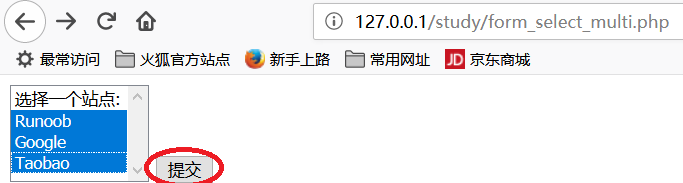

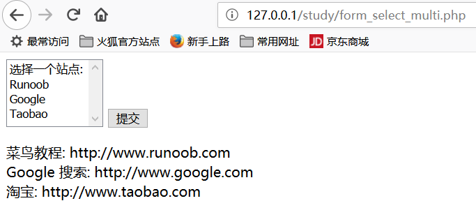

#### 4、单选按钮表单

```php+HTML
<?php
$q = isset($_GET['q'])? htmlspecialchars($_GET['q']) : '';
if($q) {
        if($q =='RUNOOB') {
                echo '菜鸟教程<br>http://www.runoob.com';
        } else if($q =='GOOGLE') {
                echo 'Google 搜索<br>http://www.google.com';
        } else if($q =='TAOBAO') {
                echo '淘宝<br>http://www.taobao.com';
        }
} else {
?>
    <form action="" method="get"> 
        <input type="radio" name="q" value="RUNOOB" />Runoob
        <input type="radio" name="q" value="GOOGLE" />Google
        <input type="radio" name="q" value="TAOBAO" />Taobao
        <input type="submit" value="提交">
    </form>
<?php
}
?>
```

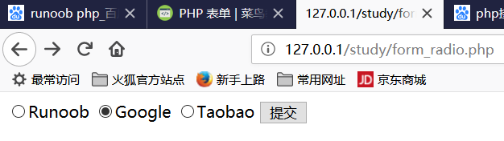

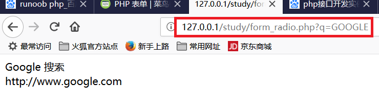

#### 5、复选框

```php+HTML
<?php
$q = isset($_POST['q'])? $_POST['q'] : '';
if(is_array($q)) {
    $sites = array(
            'RUNOOB' => '菜鸟教程: http://www.runoob.com',
            'GOOGLE' => 'Google 搜索: http://www.google.com',
            'TAOBAO' => '淘宝: http://www.taobao.com',
    );
    foreach($q as $val) {
        // PHP_EOL 为常量，用于换行
        echo $sites[$val] . PHP_EOL .'<br/>';
    }
      
} else {
?><form action="" method="post"> 
    <input type="checkbox" name="q[]" value="RUNOOB"> Runoob<br> 
    <input type="checkbox" name="q[]" value="GOOGLE"> Google<br> 
    <input type="checkbox" name="q[]" value="TAOBAO"> Taobao<br>
    <input type="submit" value="提交">
</form>
<?php
}
?>
```

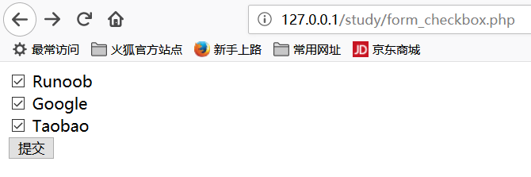

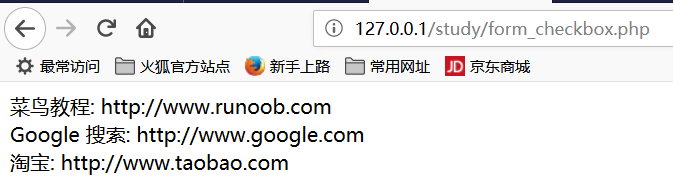

#### 6、表单验证

```powershell
php 脚本执行流程：当用户操作浏览器后，浏览器会发送数据到后台，由后台调用 php 脚本，并将前台的参数传给php
```

```powershell
<!DOCTYPE HTML> 
<html>
    <head>
        <meta charset="utf-8">
        <title>菜鸟教程(runoob.com)</title>
        <style>
         //////////////////这里是一个类， error 类的颜色为红色
       	 .error {color: #FF0000;}    
        </style>
    </head>
    <body> 

<?php
// 定义变量并默认设置为空值
$nameErr = $emailErr = $genderErr = $websiteErr = "";
$name = $email = $gender = $comment = $website = "";

if ($_SERVER["REQUEST_METHOD"] == "POST")
{
    if (empty($_POST["name"]))
    {
        $nameErr = "名字是必需的";
    }
    else
    {
        $name = test_input($_POST["name"]);
        // 检测名字是否只包含字母跟空格
        if (!preg_match("/^[a-zA-Z ]*$/",$name))
        {
            $nameErr = "只允许字母和空格"; 
        }
    }
    
    if (empty($_POST["email"]))
    {
      $emailErr = "邮箱是必需的";
    }
    else
    {
        $email = test_input($_POST["email"]);
        // 检测邮箱是否合法
        if (!preg_match("/([\w\-]+\@[\w\-]+\.[\w\-]+)/",$email))
        {
            $emailErr = "非法邮箱格式"; 
        }
    }
    
    if (empty($_POST["website"]))
    {
        $website = "";
    }
    else
    {
        $website = test_input($_POST["website"]);
        // 检测 URL 地址是否合法
        if (!preg_match("/\b(?:(?:https?|ftp):\/\/|www\.)[-a-z0-9+&@#\/%?=~_|!:,.;]*[-a-z0-9+&@#\/%=~_|]/i",$website))
        {
            $websiteErr = "非法的 URL 的地址"; 
        }
    }
    
    if (empty($_POST["comment"]))
    {
        $comment = "";
    }
    else
    {
        $comment = test_input($_POST["comment"]);
    }
    
    if (empty($_POST["gender"]))
    {
        $genderErr = "性别是必需的";
    }
    else
    {
        $gender = test_input($_POST["gender"]);
    }
}

function test_input($data)
{
    $data = trim($data);
    $data = stripslashes($data);
    $data = htmlspecialchars($data);
    return $data;
}
?>

<h2>PHP 表单验证实例</h2>
<p><span class="error">* 必需字段。</span></p>

<!--  这么麻烦，写这么长的代码，实际效果和 action=""一样 -->
<!-- form method="post" action="<?php echo htmlspecialchars($_SERVER["PHP_SELF"]);?>" --> 
<form method="post" action="">
   名字:   <input type="text" name="name" value="<?php echo $name;?>">
           <span class="error">* <?php echo $nameErr;?></span>
           <br><br>
   E-mail: <input type="text" name="email" value="<?php echo $email;?>">
           <span class="error">* <?php echo $emailErr;?></span>
           <br><br>
   网址:   <input type="text" name="website" value="<?php echo $website;?>">
           <span class="error"><?php echo $websiteErr;?></span>
           <br><br>
   备注:   <textarea name="comment" rows="5" cols="40"><?php echo $comment;?></textarea>
           <br><br>
   性别:
           <input type="radio" name="gender" <?php if (isset($gender) && $gender=="female") echo "checked";?>  value="female">女
           <input type="radio" name="gender" <?php if (isset($gender) && $gender=="male") echo "checked";?>  value="male">男
           <span class="error">* <?php echo $genderErr;?></span>
           <br><br>
           <input type="submit" name="submit" value="Submit"> 
</form>

<?php
	echo "<h2>您输入的内容是:</h2>";
	echo $name;
	echo "<br>";
	echo $email;
	echo "<br>";
	echo $website;
	echo "<br>";
	echo $comment;
	echo "<br>";
	echo $gender;
?>

</body>
</html>
```

```powershell
完美演示表单的正确用法：

<!DOCTYPE HTML> 
<html>
<head>
<meta charset="utf-8">
<title>菜鸟教程(runoob.com)</title>
</head>
<body> 

<?php
	// 定义变量并默认设置为空值
	$name = $email = $gender = $comment = $website = "";

	if ($_SERVER["REQUEST_METHOD"] == "POST")
	{
	   $name    = test_input($_POST["name"]);
	   $email   = test_input($_POST["email"]);
	   $website = test_input($_POST["website"]);
	   $comment = test_input($_POST["comment"]);
	   $gender  = test_input($_POST["gender"]);
	}

	function test_input($data)
	{
	   $data = trim($data);
	   $data = stripslashes($data);
	   $data = htmlspecialchars($data);
	   return $data;
	}
?>

<h2>PHP 表单验证实例</h2>
<form method="post" action="<?php echo htmlspecialchars($_SERVER["PHP_SELF"]);?>"> 
   名字:   <input type="text" name="name">
           <br><br>
   E-mail: <input type="text" name="email">
           <br><br>
   网址:   <input type="text" name="website">
           <br><br>
   备注:   <textarea name="comment" rows="5" cols="40"></textarea>
           <br><br>
   性别:
           <input type="radio" name="gender" value="female">女
           <input type="radio" name="gender" value="male">男
           <br><br>
           <input type="submit" name="submit" value="Submit"> 
</form>

<?php
	echo "<h2>您输入的内容是:</h2>";
	echo $name;
	echo "<br>";
	echo $email;
	echo "<br>";
	echo $website;
	echo "<br>";
	echo $comment;
	echo "<br>";
	echo $gender;
?>

</body>
</html>
```

#### 7、简单的正则表达式，验证字符串合法性

```powershell
检测 name 字段是否包含字母和空格，如果 name 字段值不合法，将输出错误信息

$name = test_input($_POST["name"]);
/*
    ^ 表示除此之外
    [a-zA-Z ]即大小写字母和空格
    *$ 即以任意字符结尾
*/
if (!preg_match("/^[a-zA-Z ]*$/",$name)) {
  $nameErr = "只允许字母和空格"; 
}
```

```powershell
检测 e-mail 地址是否合法。如果 e-mail 地址不合法，将输出错误信息

$email = test_input($_POST["email"]);
if (!preg_match("/([\w\-]+\@[\w\-]+\.[\w\-]+)/",$email)) {
  $emailErr = "非法邮箱格式"; 
}
```

```powershell
 验证 URL

$website = test_input($_POST["website"]);
if (!preg_match("/\b(?:(?:https?|ftp):\/\/|www\.)[-a-z0-9+&@#\/%?=~_|!:,.;]*[-a-z0-9+&@#\/%=~_|]/i",$website)) {
  $websiteErr = "非法的 URL 的地址"; 
}
```

```powershell
完善的表单

<!DOCTYPE HTML> 
<html>
<head>
<meta charset="utf-8">
<title>菜鸟教程(runoob.com)</title>
<style>
.error {color: #FF0000;}
</style>
</head>
<body> 

<?php
// 定义变量并默认设置为空值
$nameErr = $emailErr = $genderErr = $websiteErr = "";
$name = $email = $gender = $comment = $website = "";

if ($_SERVER["REQUEST_METHOD"] == "POST")
{
    if (empty($_POST["name"]))
    {
        $nameErr = "名字是必需的";
    }
    else
    {
        $name = test_input($_POST["name"]);
        // 检测名字是否只包含字母跟空格
        if (!preg_match("/^[a-zA-Z ]*$/",$name))
        {
            $nameErr = "只允许字母和空格"; 
        }
    }
    
    if (empty($_POST["email"]))
    {
      $emailErr = "邮箱是必需的";
    }
    else
    {
        $email = test_input($_POST["email"]);
        // 检测邮箱是否合法
        if (!preg_match("/([\w\-]+\@[\w\-]+\.[\w\-]+)/",$email))
        {
            $emailErr = "非法邮箱格式"; 
        }
    }
    
    if (empty($_POST["website"]))
    {
        $website = "";
    }
    else
    {
        $website = test_input($_POST["website"]);
        // 检测 URL 地址是否合法
        if (!preg_match("/\b(?:(?:https?|ftp):\/\/|www\.)[-a-z0-9+&@#\/%?=~_|!:,.;]*[-a-z0-9+&@#\/%=~_|]/i",$website))
        {
            $websiteErr = "非法的 URL 的地址"; 
        }
    }
    
    if (empty($_POST["comment"]))
    {
        $comment = "";
    }
    else
    {
        $comment = test_input($_POST["comment"]);
    }
    
    if (empty($_POST["gender"]))
    {
        $genderErr = "性别是必需的";
    }
    else
    {
        $gender = test_input($_POST["gender"]);
    }
}

function test_input($data)
{
    $data = trim($data);
    $data = stripslashes($data);
    $data = htmlspecialchars($data);
    return $data;
}
?>

<h2>PHP 表单验证实例</h2>
<p><span class="error">* 必需字段。</span></p>
<form method="post" action="<?php echo htmlspecialchars($_SERVER["PHP_SELF"]);?>"> 
   名字: <input type="text" name="name" value="<?php echo $name;?>">
   <span class="error">* <?php echo $nameErr;?></span>
   <br><br>
   E-mail: <input type="text" name="email" value="<?php echo $email;?>">
   <span class="error">* <?php echo $emailErr;?></span>
   <br><br>
   网址: <input type="text" name="website" value="<?php echo $website;?>">
   <span class="error"><?php echo $websiteErr;?></span>
   <br><br>
   备注: <textarea name="comment" rows="5" cols="40"><?php echo $comment;?></textarea>
   <br><br>
   性别:
   <input type="radio" name="gender" <?php if (isset($gender) && $gender=="female") echo "checked";?>  value="female">女
   <input type="radio" name="gender" <?php if (isset($gender) && $gender=="male") echo "checked";?>  value="male">男
   <span class="error">* <?php echo $genderErr;?></span>
   <br><br>
   <input type="submit" name="submit" value="Submit"> 
</form>

<?php
echo "<h2>您输入的内容是:</h2>";
echo $name;
echo "<br>";
echo $email;
echo "<br>";
echo $website;
echo "<br>";
echo $comment;
echo "<br>";
echo $gender;
?>

</body>
</html>
```

##十一、include 和 require 语句

```powershell
include 和 require 除了处理错误的方式不同之外，在其他方面都是相同的：

    require 生成一个致命错误（E_COMPILE_ERROR），在错误发生后脚本会停止执行。
    include 生成一个警告（E_WARNING），在错误发生后脚本会继续执行。

```


##十二、`fopen / fclose`

###1、`fgets`

```powershell
<?php
    $file = fopen("welcome.txt", "r") or exit("无法打开文件!");
    // 读取文件每一行，直到文件结尾
    while(!feof($file))
    {
        echo fgets($file). "<br>";
    }
    fclose($file);
?> 
```

```powershell
welcome.txt内容为：
aaaaa
bbbbbbbbbbb
cccccccccc
xxxxxxxxxxx
```

浏览器输出：

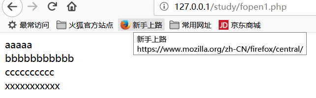

###2、`fgetc`

```powershell
<?php
    $file=fopen("welcome.txt","r") or exit("无法打开文件!");
    while (!feof($file))
    {
        echo fgetc($file);
    }
    fclose($file);
?> 
文本文件内容：
aaaaa
bbbbbbbbbbb
cccccccccc
xxxxxxxxxxx

浏览器输出:
aaaaa bbbbbbbbbbb cccccccccc xxxxxxxxxxx 
```

## 十三、PHP 文件上传

### 1、首先建立一个  ./upload目录，用于上传文件

### 2、编写前端界面，让用户选择要上传的文件

```php+HTML
<html>
	<head>
		<meta charset="utf-8">
		<title>菜鸟教程(runoob.com)</title>
	</head>
	
	<body>
		<form action="upload_file.php" method="post" enctype="multipart/form-data">
			<label for="file">文件名：</label>
			<input type="file" name="file" id="file"><br>
			<input type="submit" name="submit" value="提交">
		</form>
	</body>
</html>
```

### 3、编写指定的，处理上传文件的 php 脚本

````powershell
<?php
// 允许上传的图片后缀
$allowedExts = array("gif", "jpeg", "jpg", "png");
$temp = explode(".", $_FILES["file"]["name"]);
echo '要上传的文件大小：'.'$_FILES["file"]["size"].'<br/>';
$extension = end($temp);     // 获取文件后缀名
if ((($_FILES["file"]["type"] == "image/gif")
    || ($_FILES["file"]["type"] == "image/jpeg")
    || ($_FILES["file"]["type"] == "image/jpg")
    || ($_FILES["file"]["type"] == "image/pjpeg")
    || ($_FILES["file"]["type"] == "image/x-png")
    || ($_FILES["file"]["type"] == "image/png"))
    && ($_FILES["file"]["size"] < 204800)   // 小于 200 kb
    && in_array($extension, $allowedExts))
{
	if ($_FILES["file"]["error"] > 0)
	{
		echo "错误：: " . $_FILES["file"]["error"] . "<br>";
	}
	else
	{
		echo "上传文件名: " . $_FILES["file"]["name"] . "<br>";
		echo "文件类型: " . $_FILES["file"]["type"] . "<br>";
		echo "文件大小: " . ($_FILES["file"]["size"] / 1024) . " kB<br>";
		echo "文件临时存储的位置: " . $_FILES["file"]["tmp_name"] . "<br>";
		
		// 判断当期目录下的 upload 目录是否存在该文件
		// 如果没有 upload 目录，你需要创建它，upload 目录权限为 777
		if (file_exists("upload/" . $_FILES["file"]["name"]))
		{
			echo $_FILES["file"]["name"] . " 文件已经存在。 ";
		}
		else
		{
			// 如果 upload 目录不存在该文件则将文件上传到 upload 目录下
			move_uploaded_file($_FILES["file"]["tmp_name"], "upload/" . $_FILES["file"]["name"]);
			echo "文件存储在: " . "upload/" . $_FILES["file"]["name"];
		}
	}
}
else
{
	echo "非法的文件格式";
}
?>
````

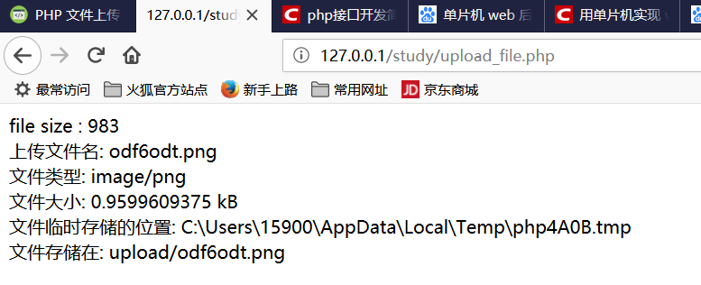

##十四、`Cookie`

```powershell
cookie 常用于识别用户。
cookie 是一种服务器留在用户计算机上的小文件。每当同一台计算机通过浏览器请求页面时，这台计算机将会发送 cookie。通过 PHP，您能够创建并取回 cookie 的值。

setcookie() 函数用于设置 cookie。
注释：setcookie() 函数必须位于 <html> 标签之前
```


###1、设置`cookie`

```php+HTML
<?php
	setcookie("user", "runoob", time()+3600); //同时设置了 cookie 失效时间。
?>

<html>
</html>
```


###2、取回 cookie

```powershell
<?php
    // 输出 cookie 值
    echo $_COOKIE["user"];

    // 查看所有 cookie
    print_r($_COOKIE);
?>

浏览器输出：
runoobArray ( [user] => runoob ) 
```


### 3、判断 `cookie`是否设置

> is_cookie_set.php文件内容：

```powershell
<html>
	<head>
		<meta charset="utf-8">
		<title>菜鸟教程(runoob.com)</title>
	</head>
	
	<body>
		<?php
			if (isset($_COOKIE["user"]))
				echo "欢迎 " . $_COOKIE["user"] . "!<br>";
			else
				echo "普通访客!<br>";
		?>
	</body>
</html>

浏览器输出：
欢迎 runoob!
```

###4、删除 `cookie`

```powershell
当删除 cookie 时，您应当使过期日期变更为过去的时间点。
删除的实例：

<?php
    // 设置 cookie 过期时间为过去 1 小时
    setcookie("user", "", time()-3600);
?>

浏览器输入 http://127.0.0.1/study/remove_cookie.php 执行此脚本后。
再次执行上一个用例，http://127.0.0.1/study/is_cookie_set.php浏览器输出变为：
普通访客!
```

### 5、如果浏览器不支持 cookie 怎么办

```powershell
那只能采用表单等其它办法
```

## 十五、`session`

```powershell
您在计算机上操作某个应用程序时，您打开它，做些更改，然后关闭它。这很像一次对话（Session）。计算机知道您是谁。它清楚您在何时打开和关闭应用程序。然而，在因特网上问题出现了：由于 HTTP 地址无法保持状态，Web 服务器并不知道您是谁以及您做了什么。

PHP session 解决了这个问题，它通过在服务器上存储用户信息以便随后使用（比如用户名称、购买商品等）。然而，会话信息是临时的，在用户离开网站后将被删除。如果您需要永久存储信息，可以把数据存储在数据库中。

Session 的工作机制是：为每个访客创建一个唯一的 id (UID)，并基于这个 UID 来存储变量。UID 存储在 cookie 中，或者通过 URL 进行传导。
```

###1、开始`session`

```powershell
<?php session_start(); ?>

<html>
    <body>
    </body>
</html>

session_start() 函数必须位于 <html> 标签之前，上面的代码会向服务器注册用户的会话，以便您可以开始保存用户信息，同时会为用户会话分配一个 UID
```

###2、存储 Session 变量

> 创建并操作 session 的脚本：session.php

````powershell
存储和取回 session 变量的正确方法是使用 PHP $_SESSION 变量

<?php
	session_start();

	if(isset($_SESSION['views']))
	{
		$_SESSION['views']=$_SESSION['views']+1;
	}
	else
	{
		$_SESSION['views']=1;
	}
	echo "浏览量：". $_SESSION['views'];
?>

<html>
	<head>
		<meta charset="utf-8">
		<title>菜鸟教程(runoob.com)</title>
	</head>
	
	<body>
	</body>
</html>

浏览器输出（每刷新一次，浏览量增加一）：
浏览量：2 
````

###3、销毁 Session

```powershell
如果您希望删除某些 session 数据，可以使用 unset() 或 session_destroy() 函数。
unset() 函数用于释放指定的 session 变量。
也可以通过调用 session_destroy() 函数彻底销毁 session。
```

```powershell
unset_session.php 脚本内容如下

<?php
    session_start();
    if(isset($_SESSION['views']))
    {
        unset($_SESSION['views']);
    }
?>

浏览器输入http://127.0.0.1/study/unset_session.php并回车，然后再执行 http://127.0.0.1/study/session.php，发现输出又变回了1。
```

```powershell
销毁全部 session 的脚本： destroy_session.php

<?php
	session_start(); //这一句必须加上，否则无法销毁 session
	session_destroy();
?>

浏览器输入http://127.0.0.1/study/destroy_session.php并回车，然后再执行 http://127.0.0.1/study/session.php，发现输出又变回了1。
```

## 十六、PHP 发送电子邮件

```powershell
PHP 运行邮件函数需要一个已安装且正在运行的邮件系统(如：sendmail、postfix、qmail等)。所用的程序通过在 php.ini 文件中的配置设置进行定义。请在我们的 PHP Mail 参考手册 阅读更多内容。
```

**语法**

  mail(to,subject,message,headers,parameters) 

| 参数       | 描述                                                         |
| ---------- | ------------------------------------------------------------ |
| to         | 必需。规定 email 接收者。                                    |
| subject    | 必需。规定 email 的主题。**注释：**该参数不能包含任何新行字符。 |
| message    | 必需。定义要发送的消息。应使用 LF (\n) 来分隔各行。每行应该限制在 70 个字符内。 |
| headers    | 可选。规定附加的标题，比如 From、Cc 和 Bcc。应当使用 CRLF (\r\n) 分隔附加的标题。 |
| parameters | 可选。对邮件发送程序规定额外的参数。                         |

```powershell
发邮件代，实际测试未成功，因为本地 outlook 账号设置较为麻烦。
而发邮件依赖的是本地邮件程序：

<?php
    $to = "someone@example.com";         // 邮件接收者
    $subject = "参数邮件";                // 邮件标题
    $message = "Hello! 这是邮件的内容。";  // 邮件正文
    $from = "someonelse@example.com";   // 邮件发送者
    $headers = "From:" . $from;         // 头部信息设置
    mail($to,$subject,$message,$headers);
    echo "邮件已发送";
?>
```


## 十七、出错处理

###1、die 函数打印错误提示

```powershell
<?php
	if(!file_exists("welcome2.txt"))
	{
		die("文件不存在<br/>");
	}
	else
	{
		echo "文件存在，准备打开<br/>";
		$file=fopen("welcome.txt","r");
		echo "文件存在，准备成功打开<br/>";
		fclose($file);
		echo "文件成功关闭<br/>";
	}
?>
```

### 2、创建自定义出错处理函数，自动触发

```powershell
由 set_error_handler 设置自定义报错函数。
当 echo 一个未定义的变量时，触发报错。

<?php
    // 错误处理函数
    function customError($errno, $errstr)
    {
        echo "<b>Error:</b> [$errno] $errstr";
    }

    // 设置错误处理函数
    set_error_handler("customError");

    // 触发错误
    echo($test);
?>
```

### 3、手动触发，自定义的错误处理函数

```powershell
<?php
	// 错误处理函数
	function customError($errno, $errstr)
	{
		echo "<b>Error:</b> [$errno] $errstr<br/>";
		echo "脚本结束";
		die();
	}

	// 设置错误处理函数
	set_error_handler("customError", E_USER_WARNING);

	// 触发错误
	$test=2;
	if ($test>1)
	{
		trigger_error("变量值必须小于等于 1", E_USER_WARNING);
	}
?>
```

###4、错误记录，error_log

```powershell
在默认的情况下，根据在 php.ini 中的 error_log 配置，PHP 向服务器的记录系统或文件发送错误记录。通过使用 error_log() 函数，您可以向指定的文件或远程目的地发送错误记录。

通过电子邮件向您自己发送错误消息，是一种获得指定错误的通知的好办法。
```

```powershell
//将错误通过邮件发送给自己

<?php
// 错误处理函数
function customError($errno, $errstr)
{
    echo "<b>Error:</b> [$errno] $errstr<br>";
    echo "已通知网站管理员";
    error_log("Error: [$errno] $errstr",1,
    "someone@example.com","From: webmaster@example.com");
}

// 设置错误处理函数
set_error_handler("customError",E_USER_WARNING);

// 触发错误
$test=2;
if ($test>1)
{
    trigger_error("变量值必须小于等于 1",E_USER_WARNING);
}
?>
```

##十八、PHP 异常处理

```powershell
当异常被抛出时，其后的代码不会继续执行，PHP 会尝试查找匹配的 "catch" 代码块。

如果异常没有被捕获，而且又没用使用 set_exception_handler() 作相应的处理的话，那么将发生一个严重的错误（致命错误），并且输出 "Uncaught Exception" （未捕获异常）的错误消息。
```

### 1、抛出一个异常，同时不去捕捉它

```powershell
<?php
	echo "throw_exception.php is called 1<br/>";
	// 创建一个有异常处理的函数
	function checkNum($number)
	{
		echo "throw_exception.php is called 3 <br/>";
		echo "number = ". $number ."<br/>";
		if($number>1)
		{
			echo "throw exception here!<br/>";
			throw new Exception("Value must be 1 or below");
			echo "throw exception finished here!<br/>";
		}
		return true;
	}
	echo "throw_exception.php is called 2<br/>";
	// 触发异常
	checkNum(2);
?>

通过 echo 一步一步跟踪，发现 throw new Exception 这一句确实执行了，而且后面一句"throw exception finished here!<br/>"没有打印出来。表明确实出错
```

###2、Try、throw 和 catch

```powershell
<?php
	// 创建一个有异常处理的函数
	function checkNum($number)
	{
		if($number>1)
		{
			throw new Exception("变量值必须小于等于 1");
		}
		return true;
	}
		
	// 在 try 块 触发异常
	try
	{
		checkNum(2);
		// 如果抛出异常，以下文本不会输出
		echo '如果输出该内容，说明 $number 变量';
	}
	// 捕获异常
	catch(Exception $e)
	{
		echo 'Message: ' .$e->getMessage();
	}
?>

浏览器输出：
Message: 变量值必须小于等于 1
```

###3、创建一个自定义的 Exception 类

```powershell
创建自定义的异常处理程序非常简单。我们简单地创建了一个专门的类，当 PHP 中发生异常时，可调用其函数。该类必须是 exception 类的一个扩展。

这个自定义的 customException 类继承了 PHP 的 exception 类的所有属性，您可向其添加自定义的函数。
```

```powershell
<?php
	class customException extends Exception
	{
		public function errorMessage()
		{
			// 错误信息
			$errorMsg = '错误行号 '.$this->getLine().' in '.$this->getFile()
			.': <b>'.$this->getMessage().'</b> 不是一个合法的 E-Mail 地址';
			return $errorMsg;
		}
	}

	$email = "someone@example...com";
	 
	try
	{
		// 检测邮箱
		if(filter_var($email, FILTER_VALIDATE_EMAIL) === FALSE)
		{
			// 如果是个不合法的邮箱地址，抛出异常
			throw new customException($email);
		}
	}
	 
	catch (customException $e)
	{
		//display custom message
		echo $e->errorMessage();
	}
?>

浏览器输出：
错误行号 23 in E:\phptools\ApacheServer\Apache\htdocs\study\custo_Exception.php: someone@example...com 不是一个合法的 E-Mail 地址
```

###4、多个异常

```powershell
可以为一段脚本使用多个异常，来检测多种情况。

可以使用多个 if..else 代码块，或一个 switch 代码块，或者嵌套多个异常。这些异常能够使用不同的 exception 类，并返回不同的错误消息
```

```powershell
<?php
class customException extends Exception
{
    public function errorMessage()
    {
        // 错误信息
        $errorMsg = '错误行号 '.$this->getLine().' in '.$this->getFile()
        .': <b>'.$this->getMessage().'</b> 不是一个合法的 E-Mail 地址';
        return $errorMsg;
    }
}
 
$email = "someone@example.com";
 
try
{
    // 检测邮箱
    if(filter_var($email, FILTER_VALIDATE_EMAIL) === FALSE)
    {
        // 如果是个不合法的邮箱地址，抛出异常
        throw new customException($email);
    }
    // 检测 "example" 是否在邮箱地址中
    if(strpos($email, "example") !== FALSE)
    {
        throw new Exception("$email 是 example 邮箱");
    }
}
catch (customException $e)
{
    echo $e->errorMessage();
}
catch(Exception $e)
{
    echo $e->getMessage();
}
?>

浏览器输出：
someone@example.com 是 example 邮箱
```

### 5、重新抛出异常

```powershell
<?php
class customException extends Exception
{
    public function errorMessage()
    {
        // 错误信息
        $errorMsg = $this->getMessage().' 不是一个合法的 E-Mail 地址。';
        return $errorMsg;
    }
}
 
$email = "someone@example.com";
 
try
{
    try
    {
        // 检测 "example" 是否在邮箱地址中
        if(strpos($email, "example") !== FALSE)
        {
            // 如果是个不合法的邮箱地址，抛出异常.-----第一次抛出异常
            throw new Exception($email);
        }
    }
    catch(Exception $e)
    {
        // 重新抛出异常，第二次抛出异常
        throw new customException($email);
    }
}
catch (customException $e)
{
    // 显示自定义信息，最终捕捉异常，并调用自定义的异常处理函数，打印错误消息
    echo $e->errorMessage();
}
?>
```

###6、设置顶层异常处理器

```powershell
set_exception_handler() 函数可设置处理所有未捕获异常的用户定义函数
```

```powershell
<?php
	function myException($exception)
	{
		echo "<b>Exception:</b> " , $exception->getMessage();
	}
	 
	set_exception_handler('myException');
	 
	throw new Exception('Uncaught Exception occurred');
?>
浏览器输出：
Exception: Uncaught Exception occurred
```

## 十九、PHP 过滤器

```powershell
PHP 过滤器用于验证和过滤来自非安全来源的数据，比如用户的输入。
测试、验证和过滤用户输入或自定义数据是任何 Web 应用程序的重要组成部分。
PHP 的过滤器扩展的设计目的是使数据过滤更轻松快捷
```

```powershell
过滤器函数：
    filter_var() ------------ 通过一个指定的过滤器来过滤单一的变量
    filter_var_array() ------ 通过相同的或不同的过滤器来过滤多个变量
    filter_input ------------ 获取一个输入变量，并对它进行过滤
    filter_input_array ------ 获取多个输入变量，并通过相同的或不同的过滤器对它们进行过滤
```

### 1、验证一个整数

```powershell
<?php
    $int = 123;
	$int2 = 123.4;

    if (!filter_var($int, FILTER_VALIDATE_INT))
    {
        echo("$int 不是一个合法的整数<br/>");
    }
    else
    {
        echo("$int 是个合法的整数<br/>");
    }
	
    if (!filter_var($int2, FILTER_VALIDATE_INT))
    {
        echo("$int2 不是一个合法的整数<br/>");
    }
    else
    {
        echo("$int2 是个合法的整数<br/>");
    }
?>
浏览器输出：
123 是个合法的整数
123.4 不是一个合法的整数
```

### 2、验证变量的选项

> 验证300是不是 (0,256)之间的一个整数

```powershell
<?php
	$var=300;
	 
	$int_options = array(
		"options"=>array
		(
			"min_range"=>0,
			"max_range"=>256
		)
	);
	 
	if(!filter_var($var, FILTER_VALIDATE_INT, $int_options))
	{
		echo("不是一个合法的整数");
	}
	else
	{
		echo("是个合法的整数");
	}
?>

浏览器输出：
不是一个合法的整数
```

###3、验证来自表单的输入 

```powershell
<?php
	if(!filter_has_var(INPUT_GET, "email"))
	{
		echo("没有 email 参数");
	}
	else
	{
		if (!filter_input(INPUT_GET, "email", FILTER_VALIDATE_EMAIL))
		{
			echo "不是一个合法的 E-Mail";
		}
		else
		{
			echo "是一个合法的 E-Mail";
		}
	}
?>

场景一：浏览器输入：http://127.0.0.1/study/filter_input.php 回车，得到输出：
没有 email 参数

场景二：浏览器输出：http://127.0.0.1/study/filter_input.php?email=test@runoob.com 回车，得到输出：
是一个合法的 E-Mail
```

### 4、净化输入

```powershell
<?php
	if(!filter_has_var(INPUT_GET, "url"))
	{
		echo("没有 url 参数");
	}
	else
	{
		$url = filter_input(INPUT_GET, "url", FILTER_SANITIZE_URL);
		echo $url;
	}
?>
浏览器输入：
http://127.0.0.1/study/pure_input.php?url=http://www.ru%C3%A5%C3%A5no%C3%B8%C3%B8ob.com/

输出：http://www.runoob.com/
即 filter_input 函数把 http://www.ru%C3%A5%C3%A5no%C3%B8%C3%B8ob.com/ 中的非法字符清除掉了
```

###5、过滤多个输入

```powershell
同时对年龄和 email 进行过滤：
<?php
$filters = array
(
    "name" => array
    (
    	//过滤姓名中的非法字符
        "filter"=>FILTER_SANITIZE_STRING
    ),
    "age" => array
    (
    	//对年龄进行合法性过滤
        "filter"=>FILTER_VALIDATE_INT,
        "options"=>array
        (
            "min_range"=>1,
            "max_range"=>120
        )
    ),
    //对邮件地址进行合法性过滤
    "email"=> FILTER_VALIDATE_EMAIL
);
 
$result = filter_input_array(INPUT_GET, $filters);
 
if (!$result["age"])
{
    echo("年龄必须在 1 到 120 之间。<br>");
}
elseif(!$result["email"])
{
    echo("E-Mail 不合法<br>");
}
else
{
    echo("输入正确");
}
?>

浏览器输入：http://127.0.0.1/study/filter_input_array.php?email=ab@b.com&age=92
浏览器输出：
输入正确
```

### 6、使用自定义过滤器

```powershell
通过使用 FILTER_CALLBACK 过滤器，可以调用自定义的函数，把它作为一个过滤器来使用。这样，我们就拥有了数据过滤的完全控制权。

您可以创建自己的自定义函数，也可以使用已存在的 PHP 函数。
将您准备用到的过滤器的函数，按指定选项的规定方法进行规定。在关联数组中，带有名称 "options"。
```

```powershell
<?php
	function convertSpace($string)
	{
		return str_replace("_", ".", $string);
	}
	 
	$string = "www_runoob_com!";
	 
	echo filter_var($string, FILTER_CALLBACK, array("options"=>"convertSpace"));
?>

浏览器输入：http://127.0.0.1/study/FILTER_CALLBACK.php
浏览器输出：
www.runoob.com! 
```

##二十、PHP 高级过滤器

###1、检测一个数字是否在一个范围内

```powershell
<?php
$int = 122;
$min = 1;
$max = 200;

if (filter_var($int, FILTER_VALIDATE_INT, array("options" => array("min_range"=>$min, "max_range"=>$max))) === false) {
    echo("变量值不在合法范围内");
} else {
    echo("变量值在合法范围内");
}
?> 
浏览器输出：
变量值在合法范围内 
```

### 2、检测 ipv6 地址

```powershell
<?php
	$ip = "2001:0db8:85a3:08d3:1319:8a2e:0370:7334";

	if (!filter_var($ip, FILTER_VALIDATE_IP, FILTER_FLAG_IPV6) === false) {
		echo("$ip 是一个 IPv6 地址");
	} else {
		echo("$ip 不是一个 IPv6 地址");
	}
?> 
浏览器输出：
2001:0db8:85a3:08d3:1319:8a2e:0370:7334 是一个 IPv6 地址 
```

### 3、检测 url 是否否包含 query_string

```powershell
<?php
	$url = "http://www.runoob.com";
	$url2 = "http://www.runoob.com?query_string=good";

	if (!filter_var($url, FILTER_VALIDATE_URL, FILTER_FLAG_QUERY_REQUIRED) === false) {
		echo("$url 是一个合法的 URL<br/>");
	} else {
		echo("$url 不是一个合法的 URL<br/>");
	}
	if (!filter_var($url2, FILTER_VALIDATE_URL, FILTER_FLAG_QUERY_REQUIRED) === false) {
		echo("$url2 是一个合法的 URL<br/>");
	} else {
		echo("$url2 不是一个合法的 URL<br/>");
	}
?> 

浏览器输出：
http://www.runoob.com 不是一个合法的 URL
http://www.runoob.com?query_string=good 是一个合法的 URL
```

###4、移除 ASCII 值大于 127 的字符

```powershell
<?php
	$str = "<h1>Hello WorldÆØÅ!</h1>";

	$newstr = filter_var($str, FILTER_SANITIZE_STRING, FILTER_FLAG_STRIP_HIGH);
	echo $newstr;
?>

浏览器输出：
Hello World!
```

## 二十一、PHP JSON#

###1、JSON 函数

| 函数            | 描述                                          |
| --------------- | --------------------------------------------- |
| json_encode     | 对变量进行 JSON 编码                          |
| json_decode     | 对 JSON 格式的字符串进行解码，转换为 PHP 变量 |
| json_last_error | 返回最后发生的错误                            |

### 2、将 PHP 数组转换为 JSON 格式数据 

```powershell
<?php
   $arr = array('a' => 1, 'b' => 2, 'c' => 3, 'd' => 4, 'e' => 5);
   echo json_encode($arr);
?>
 
浏览器输出：
{"a":1,"b":2,"c":3,"d":4,"e":5}
```

###3、将 PHP 对象转换为 JSON 格式数据 

```powershell
<?php
   class Emp {
       public $name = "";
       public $hobbies  = "";
       public $birthdate = "";
   }
   $e = new Emp();
   $e->name = "sachin";
   $e->hobbies  = "sports";
   //$e->birthdate = date('m/d/Y h:i:s a', "8/5/1974 12:20:03 p");
   $e->birthdate = date('m/d/Y h:i:s a', strtotime("8/5/1974 12:20:03"));

   echo json_encode($e);
?>

浏览器输出：
{"name":"sachin","hobbies":"sports","birthdate":"08\/05\/1974 12:20:03 pm"}
```

### 4、将 json 数据转化为 php 类型

```powershell
<?php
   $json = '{"a":1,"b":2,"c":3,"d":4,"e":5}';

   var_dump(json_decode($json));
   echo '<br/>'.'<br/>';
   var_dump(json_decode($json, true));
?>
浏览器输出：
object(stdClass)#1 (5) { ["a"]=> int(1) ["b"]=> int(2) ["c"]=> int(3) ["d"]=> int(4) ["e"]=> int(5) }

array(5) { ["a"]=> int(1) ["b"]=> int(2) ["c"]=> int(3) ["d"]=> int(4) ["e"]=> int(5) } 
```

## 二十二、PHP MySQL

###1、连接 MySQL(mysqli接口)

```powershell
<?php
	$servername = "localhost";
	$username = "admin";
	$password = "123456";
	 
	// 创建连接
	$conn = new mysqli($servername, $username, $password);
	 
	// 检测连接
	if ($conn->connect_error) {
		die("连接失败: " . $conn->connect_error);
	} 
	echo "连接成功";
	$conn->close();
	echo "断开数据库连接";
?>

浏览器输出：
连接成功
断开数据库连接
```

### 2、连接 MySQL(PDO 接口)

```powershell
<?php
	$servername = "localhost";
	$username = "admin";
	$password = "123456";
	 
	try {
		$conn = new PDO("mysql:host=$servername;dbname=myDB", $username, $password);
		echo "连接成功"; 
	}
	catch(PDOException $e)
	{
		echo $e->getMessage();
	}
?>

浏览器输出：
could not find driver 

因为需要安装驱动程序：http://php.net/manual/en/pdo.installation.php，但是本机没有安装
```

### 3、创建 MySql 数据库

```powershell
<?php
	$servername = "localhost";
	$username   = "admin";
	$password   = "123456";

	// 创建连接
	$conn = new mysqli($servername, $username, $password);
	// 检测连接
	if ($conn->connect_error) {
		die("连接失败: " . $conn->connect_error);
	}

	// 创建数据库
	$sql = "CREATE DATABASE myDB";
	if ($conn->query($sql) === TRUE) {
		echo "数据库创建成功";
	} else {
		echo "Error creating database: " . $conn->error;
	}

	$conn->close();
?> 

浏览器输出：
数据库创建成功 
```

```powershell
相应的 PDO 创建数据库代码如下，未验证：
<?php
$servername = "localhost";
$username = "username";
$password = "password";

try {
    $conn = new PDO("mysql:host=$servername;dbname=myDB", $username, $password);

    // 设置 PDO 错误模式为异常
    $conn->setAttribute(PDO::ATTR_ERRMODE, PDO::ERRMODE_EXCEPTION);
    $sql = "CREATE DATABASE myDBPDO";

    // 使用 exec() ，因为没有结果返回
    $conn->exec($sql);

    echo "数据库创建成功<br>";
}
catch(PDOException $e)
{
    echo $sql . "<br>" . $e->getMessage();
}

$conn = null;
?> 
```


###4、PHP 创建 MySQL 表

```powershell
mysqli 实现的代码：
<?php
$servername = "localhost";
$username = "username";
$password = "password";
$dbname = "myDB";

// 创建连接
$conn = new mysqli($servername, $username, $password, $dbname);
// 检测连接
if ($conn->connect_error) {
    die("连接失败: " . $conn->connect_error);
}

// 使用 sql 创建数据表
$sql = "CREATE TABLE MyGuests (
id INT(6) UNSIGNED AUTO_INCREMENT PRIMARY KEY,
firstname VARCHAR(30) NOT NULL,
lastname VARCHAR(30) NOT NULL,
email VARCHAR(50),
reg_date TIMESTAMP
)";

if ($conn->query($sql) === TRUE) {
    echo "Table MyGuests created successfully";
} else {
    echo "创建数据表错误: " . $conn->error;
}

$conn->close();
?>
```

> 浏览器输出：


> 相应的数据库查询
>
> 


```php
未经验证码的PDO代码：

<?php
$servername = "localhost";
$username = "username";
$password = "password";
$dbname = "myDBPDO";

try {
    $conn = new PDO("mysql:host=$servername;dbname=$dbname", $username, $password);
    // 设置 PDO 错误模式，用于抛出异常
    $conn->setAttribute(PDO::ATTR_ERRMODE, PDO::ERRMODE_EXCEPTION);

    // 使用 sql 创建数据表
    $sql = "CREATE TABLE MyGuests (
    id INT(6) UNSIGNED AUTO_INCREMENT PRIMARY KEY,
    firstname VARCHAR(30) NOT NULL,
    lastname VARCHAR(30) NOT NULL,
    email VARCHAR(50),
    reg_date TIMESTAMP
    )";

    // 使用 exec() ，没有结果返回
    $conn->exec($sql);
    echo "数据表 MyGuests 创建成功";
}
catch(PDOException $e)
{
    echo $sql . "<br>" . $e->getMessage();
}

$conn = null;
?> 
```

### 5、向表 table 插入记录

```powershell
<?php
	$servername = "localhost";
	$username   = "admin";
	$password   = "123456";
	$dbname     = "myDB";

	// 创建连接
	$conn = new mysqli($servername, $username, $password, $dbname);
	// 检测连接
	if ($conn->connect_error) {
		die("连接失败: " . $conn->connect_error);
	}

	$sql = "INSERT INTO MyGuests (firstname, lastname, email)
	VALUES ('John', 'Doe', 'john@example.com')";

	if ($conn->query($sql) === TRUE) {
		echo "新记录插入成功";
	} else {
		echo "Error: " . $sql . "<br>" . $conn->error;
	}

	$conn->close();
?> 

浏览器输出：
新记录插入成功 
```

```powershell
PDO接口实现，未测试：
<?php
    $servername = "localhost";
    $username = "username";
    $password = "password";
    $dbname = "myDBPDO";

    try {
        $conn = new PDO("mysql:host=$servername;dbname=$dbname", $username, $password);
        // 设置 PDO 错误模式，用于抛出异常
        $conn->setAttribute(PDO::ATTR_ERRMODE, PDO::ERRMODE_EXCEPTION);
        $sql = "INSERT INTO MyGuests (firstname, lastname, email)
        VALUES ('John', 'Doe', 'john@example.com')";
        // 使用 exec() ，没有结果返回
        $conn->exec($sql);
        echo "新记录插入成功";
    }
    catch(PDOException $e)
    {
        echo $sql . "<br>" . $e->getMessage();
    }

    $conn = null;
?> 
```

### 6、插入多条记录

```powershell
<?php
	$servername = "localhost";
	$username   = "admin";
	$password   = "123456";
	$dbname     = "myDB";

	// 创建链接
	$conn = new mysqli($servername, $username, $password, $dbname);
	// 检查链接
	if ($conn->connect_error) {
		die("连接失败: " . $conn->connect_error);
	} 
	 
	$sql = "INSERT INTO MyGuests (firstname, lastname, email)
	        VALUES ('John', 'Doe', 'john@example.com');";
	$sql .= "INSERT INTO MyGuests (firstname, lastname, email)
	        VALUES ('Mary', 'Moe', 'mary@example.com');";
	$sql .= "INSERT INTO MyGuests (firstname, lastname, email)
	        VALUES ('Julie', 'Dooley', 'julie@example.com')";
	 
	if ($conn->multi_query($sql) === TRUE) {
		echo "新记录插入成功";
	} else {
		echo "Error: " . $sql . "<br>" . $conn->error;
	}
	 
	$conn->close();
?>

浏览器输出：
新记录插入成功

查询 mysql 数据库：
mysql> select * from myguests;
+----+-----------+----------+-------------------+---------------------+
| id | firstname | lastname | email             | reg_date            |
+----+-----------+----------+-------------------+---------------------+
|  1 | John      | Doe      | john@example.com  | 2018-05-13 19:00:25 |
|  2 | John      | Doe      | john@example.com  | 2018-05-13 19:07:14 |
|  3 | Mary      | Moe      | mary@example.com  | 2018-05-13 19:07:14 |
|  4 | Julie     | Dooley   | julie@example.com | 2018-05-13 19:07:14 |
+----+-----------+----------+-------------------+---------------------+
4 rows in set (0.00 sec)
```

### 7、MySQLi 使用预处理语句

```powershell
<?php
$servername = "localhost";
$username   = "admin";
$password   = "123456";
$dbname     = "myDB";
 
// 创建连接
$conn = new mysqli($servername, $username, $password, $dbname);
// 检测连接
if ($conn->connect_error) {
    die("连接失败: " . $conn->connect_error);
} 
else {
	echo "连接成功.<br/>";
    $sql = "INSERT INTO MyGuests(firstname, lastname, email)  VALUES(?, ?, ?)";
 
    // 为 mysqli_stmt_prepare() 初始化 statement 对象
    $stmt = mysqli_stmt_init($conn);
 
    //预处理语句
    if (mysqli_stmt_prepare($stmt, $sql)) {
		echo "绑定参数.<br/>";
        // 绑定参数
        mysqli_stmt_bind_param($stmt, 'sss', $firstname, $lastname, $email);
 
        // 设置参数并执行
        $firstname = 'John';
        $lastname = 'Doe';
        $email = 'john@example.com';
        mysqli_stmt_execute($stmt);
 
        $firstname = 'Mary';
        $lastname = 'Moe';
        $email = 'mary@example.com';
        mysqli_stmt_execute($stmt);
 
        $firstname = 'Julie';
        $lastname = 'Dooley';
        $email = 'julie@example.com';
        mysqli_stmt_execute($stmt);
    }
	$conn->close();
}
?>

浏览器输出：
连接成功.
绑定参数.
```

```powershell
<?php
	$servername = "localhost";
	$username   = "admin";
	$password   = "123456";
	$dbname     = "myDB";
	 
	// 创建连接
	$conn = new mysqli($servername, $username, $password, $dbname);
	 
	// 检测连接
	if ($conn->connect_error) {
		die("连接失败: " . $conn->connect_error);
	}
	echo "数据库连接成功<br/>";
	// 预处理及绑定
	$stmt = $conn->prepare("INSERT INTO MyGuests (firstname, lastname, email) VALUES (?, ?, ?)");
	
	//"sss" 表示处理的三个参数类型均为字符串。s 表示数据类型为字符串
	//i - integer（整型） // d - double（双精度浮点型）
	//b - BLOB（binary large object:二进制大对象）  //s - string（字符串）
	$stmt->bind_param("sss", $firstname, $lastname, $email);
	 
	// 设置参数并执行
	$firstname = "John";
	$lastname = "Doe";
	$email = "john@example.com";
	$stmt->execute();
	 
	$firstname = "Mary";
	$lastname = "Moe";
	$email = "mary@example.com";
	$stmt->execute();
	 
	$firstname = "Julie";
	$lastname = "Dooley";
	$email = "julie@example.com";
	$stmt->execute();

	echo "新记录插入成功";

	$stmt->close();
	$conn->close();
?>

浏览器输出：
新记录插入成功
```

### 8、从 MySQL 数据库读取数据

```powershell
<?php
	$servername = "localhost";
	$username   = "admin";
	$password   = "123456";
	$dbname     = "myDB";
	 
	// 创建连接
	$conn = new mysqli($servername, $username, $password, $dbname);
	// Check connection
	if ($conn->connect_error) {
		die("连接失败: " . $conn->connect_error);
	} 
	 
	$sql = "SELECT id, firstname, lastname FROM MyGuests";
	$result = $conn->query($sql);
	 
	if ($result->num_rows > 0) {
		// 输出数据
		while($row = $result->fetch_assoc()) {
			echo "id: " . $row["id"]. " - Name: " . $row["firstname"]. " " . $row["lastname"]. "<br>";
		}
	} else {
		echo "0 结果";
	}
	$conn->close();
?>

浏览器输出：
id: 1 - Name: John Doe
id: 2 - Name: John Doe
id: 3 - Name: Mary Moe
id: 4 - Name: Julie Dooley
id: 5 - Name: John Doe
id: 6 - Name: Mary Moe
id: 7 - Name: Julie Dooley
id: 8 - Name: John Doe
id: 9 - Name: Mary Moe
```

### 9、MySQL Where 子句

```powershell
<?php
	$con=mysqli_connect("127.0.0.1","admin","123456","myDB");
	// 检测连接
	if (mysqli_connect_errno())
	{
		echo "连接失败: " . mysqli_connect_error();
	}
	
	echo "连接成功.<br/>";

	$result = mysqli_query($con,"select * from myguests where firstname='Mary'");
	echo "数据库查询完毕.<br/>";
	print_r($result) ;
	echo '<br/>';
	while($row = mysqli_fetch_array($result))
	{
		//这里大小写第三。与 SQL 命令行效果不同
		echo $row['firstname'] . " " . $row['lastname']."<br>";
	}
	$con->close();
?>

浏览器输出：
连接成功.
数据库查询完毕.
mysqli_result Object ( [current_field] => 0 [field_count] => 5 [lengths] => [num_rows] => 7 [type] => 0 )
Mary Moe
Mary Moe
Mary Moe
Mary Moe
Mary Moe
Mary Moe
Mary Moe
```

### 10、MySQL Order By 关键词

```powershell
<?php
	$con=mysqli_connect("127.0.0.1","admin","123456","mydb");
	
	// 检测连接
	if (mysqli_connect_errno())
	{
		echo "连接失败: " . mysqli_connect_error();
	}

	echo '数据库连接成功 <br/>';
	
	$result = mysqli_query($con,"select * from myguests order by lastname");

	echo 'var_dump ' . var_dump($result) .'<br/>';
	
	while($row = mysqli_fetch_array($result))
	{
		echo $row['firstname'];
		echo " " . $row['lastname'];
		echo " " . $row['id'];
		echo "<br>";
	}

	mysqli_close($con);
?>

浏览器输出：
数据库连接成功
object(mysqli_result)#2 (5) { ["current_field"]=> int(0) ["field_count"]=> int(5) ["lengths"]=> NULL ["num_rows"]=> int(22) ["type"]=> int(0) } var_dump
John Doe 1
John Doe 2
John Doe 5
John Doe 8
John Doe 11
John Doe 14
John Doe 17
John Doe 20
Julie Dooley 4
Julie Dooley 7
Julie Dooley 10
Julie Dooley 13
Julie Dooley 16
Julie Dooley 19
Julie Dooley 22
Mary Moe 3
Mary Moe 6
Mary Moe 9
Mary Moe 12
Mary Moe 15
Mary Moe 18
Mary Moe 21
```

### 11、MySQL Update

```powershell
<?php
	$con=mysqli_connect("localhost","admin","123456","mydb");
	// 检测连接
	if (mysqli_connect_errno())
	{
		echo "连接失败: " . mysqli_connect_error();
	}

	mysqli_query($con,"UPDATE myguests SET email='zhou@139.com' WHERE FirstName='John'");

	mysqli_close($con);
?>

执行之后，查询数据库：
mysql> select * from myguests;
+----+-----------+----------+-------------------+---------------------+
| id | firstname | lastname | email             | reg_date            |
+----+-----------+----------+-------------------+---------------------+
|  1 | John      | Doe      | zhou@139.com      | 2018-05-13 20:36:17 |
|  2 | John      | Doe      | zhou@139.com      | 2018-05-13 20:36:17 |
|  3 | Mary      | Moe      | mary@example.com  | 2018-05-13 19:07:14 |
|  4 | Julie     | Dooley   | julie@example.com | 2018-05-13 19:07:14 |
|  5 | John      | Doe      | zhou@139.com      | 2018-05-13 20:36:17 |
|  6 | Mary      | Moe      | mary@example.com  | 2018-05-13 19:13:29 |
|  7 | Julie     | Dooley   | julie@example.com | 2018-05-13 19:13:29 |
|  8 | John      | Doe      | zhou@139.com      | 2018-05-13 20:36:17 |
|  9 | Mary      | Moe      | mary@example.com  | 2018-05-13 19:14:11 |
| 10 | Julie     | Dooley   | julie@example.com | 2018-05-13 19:14:11 |
| 11 | John      | Doe      | zhou@139.com      | 2018-05-13 20:36:17 |
| 12 | Mary      | Moe      | mary@example.com  | 2018-05-13 19:15:12 |
| 13 | Julie     | Dooley   | julie@example.com | 2018-05-13 19:15:12 |
| 14 | John      | Doe      | zhou@139.com      | 2018-05-13 20:36:17 |
| 15 | Mary      | Moe      | mary@example.com  | 2018-05-13 19:15:32 |
| 16 | Julie     | Dooley   | julie@example.com | 2018-05-13 19:15:32 |
| 17 | John      | Doe      | zhou@139.com      | 2018-05-13 20:36:17 |
| 18 | Mary      | Moe      | mary@example.com  | 2018-05-13 19:16:49 |
| 19 | Julie     | Dooley   | julie@example.com | 2018-05-13 19:16:49 |
| 20 | John      | Doe      | zhou@139.com      | 2018-05-13 20:36:17 |
| 21 | Mary      | Moe      | mary@example.com  | 2018-05-13 19:45:30 |
| 22 | Julie     | Dooley   | julie@example.com | 2018-05-13 19:45:30 |
+----+-----------+----------+-------------------+---------------------+
22 rows in set (0.00 sec)
```

###12、MySQL Delete

```powershell
<?php
	$con=mysqli_connect("127.0.0.1","admin","123456","mydb");
	// 检测连接
	if (mysqli_connect_errno())
	{
		echo "连接失败: " . mysqli_connect_error();
	}
	mysqli_query($con,"DELETE FROM myguests WHERE firstname='John'");
	mysqli_close($con);
?>

查询数据库：
mysql> select * from myguests;
+----+-----------+----------+-------------------+---------------------+
| id | firstname | lastname | email             | reg_date            |
+----+-----------+----------+-------------------+---------------------+
|  3 | Mary      | Moe      | mary@example.com  | 2018-05-13 19:07:14 |
|  4 | Julie     | Dooley   | julie@example.com | 2018-05-13 19:07:14 |
|  6 | Mary      | Moe      | mary@example.com  | 2018-05-13 19:13:29 |
|  7 | Julie     | Dooley   | julie@example.com | 2018-05-13 19:13:29 |
|  9 | Mary      | Moe      | mary@example.com  | 2018-05-13 19:14:11 |
| 10 | Julie     | Dooley   | julie@example.com | 2018-05-13 19:14:11 |
| 12 | Mary      | Moe      | mary@example.com  | 2018-05-13 19:15:12 |
| 13 | Julie     | Dooley   | julie@example.com | 2018-05-13 19:15:12 |
| 15 | Mary      | Moe      | mary@example.com  | 2018-05-13 19:15:32 |
| 16 | Julie     | Dooley   | julie@example.com | 2018-05-13 19:15:32 |
| 18 | Mary      | Moe      | mary@example.com  | 2018-05-13 19:16:49 |
| 19 | Julie     | Dooley   | julie@example.com | 2018-05-13 19:16:49 |
| 21 | Mary      | Moe      | mary@example.com  | 2018-05-13 19:45:30 |
| 22 | Julie     | Dooley   | julie@example.com | 2018-05-13 19:45:30 |
+----+-----------+----------+-------------------+---------------------+
14 rows in set (0.00 sec)
```

## 二十三、PHP 数据库 ODBC

###1、创建 ODBC 连接

```powershell
通过一个 ODBC 连接，您可以连接到您的网络中的任何计算机上的任何数据库，只要 ODBC 连接是可用的。

这是创建到达 MS Access 数据库的 ODBC 连接的方法：
   在控制面板中打开管理工具图标。
   双击其中的数据源(ODBC)图标。
   选择系统 DSN 选项卡。
   点击系统 DSN 选项卡中的添加。
   选择Microsoft Access Driver。点击完成。
   在下一个界面，点击选择来定位数据库。
   为数据库起一个数据源名(DSN)。
   点击确定。

win10 查找管理工具很困难，需要运用搜索工具才行,点开之后，进入 控制面板\系统和安全\管理工具\，再选中``
```

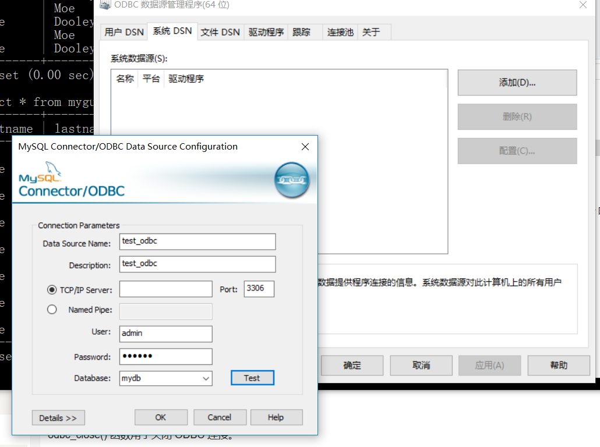

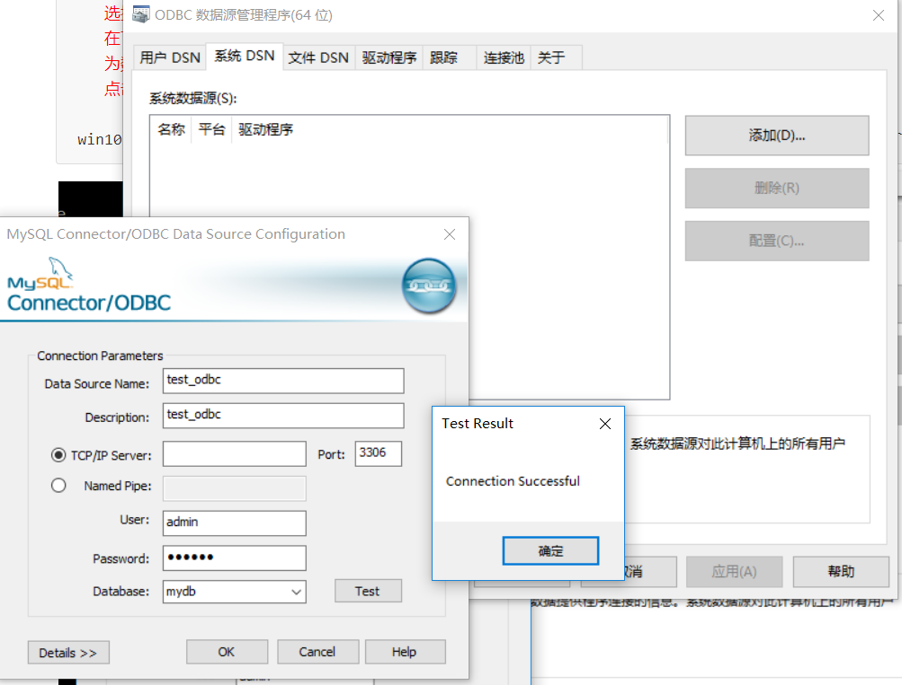


###2、ODBC 实例

```powershell
展示了如何首先创建一个数据库连接，接着创建一个结果集，然后在 HTML 表格中显示数据。
但是多次尝试，都没有成功。这个问题至少挡住我半个小时。先跳过之
```

```
<html>
	<body>

	<?php
		echo 'odbc 连接 mysql 数据库进入测试!<br/>';
		try {
			echo 'trying...<br/>';
			$conn = odbc_connect('test_odbc2', '', '','');
			echo 'try finished...<br/>';
		}
		
		catch (Exception $e)
		{
			echo 'Message: ' .$e->getMessage();
		}
		
		echo 'odbc 连接 mysql 数据库，结果等待打印<br/>';
		if (!$conn)
		{
			//exit("连接失败: " . $conn);
			echo "连接失败.<br/>";
		}
		else
		{
			echo "连接成功.<br/>";
		}
		
		echo 'odbc 连接 mysql 数据库成功<br/>';
		
		$sql="SELECT * FROM myguests";
		$rs=odbc_exec($conn,$sql);

		if (!$rs)
		{
			exit("SQL 语句错误");
		}
		echo "<table><tr>";
		echo "<th>firstname</th>";
		echo "<th>email</th></tr>";

		while (odbc_fetch_row($rs))
		{
			$firstname = odbc_result($rs,"firstname");
			$email     = odbc_result($rs,"email");
			echo "<tr><td>$firstname</td>";
			echo "<td>$email</td></tr>";
		}
		odbc_close($conn);
		echo "</table>";
	?>

	</body>
</html>
```

## 二十四、PHP XML Expat 解析器

```powershell
xml 文件内容如下：
<?xml version="1.0" encoding="ISO-8859-1"?>
<note>
	<to>Tove</to>
	<from>Jani</from>
	<heading>Reminder</heading>
	<body>Don't forget me this weekend!</body>
</note> 
```

```powershell
<?php
	//Initialize the XML parser
	$parser=xml_parser_create();

	//Function to use at the start of an element
	function start($parser,$element_name,$element_attrs)
	{
		switch($element_name)
		{
		case "NOTE":
			echo "-- Note --<br>";
			break;
		case "TO":
			echo "To: ";
			break;
		case "FROM":
			echo "From: ";
			break;
		case "HEADING":
			echo "Heading: ";
			break;
		case "BODY":
			echo "Message: ";	
		}
	}

	//Function to use at the end of an element
	function stop($parser,$element_name)
	{
		echo "<br>";
	}

	//Function to use when finding character data
	function char($parser,$data)
	{
		echo $data;
	}

	//Specify element handler
	xml_set_element_handler($parser,"start","stop");

	//Specify data handler
	xml_set_character_data_handler($parser,"char");

	//Open XML file
	$fp=fopen("test.xml","r");

	//Read data
	while ($data=fread($fp,4096))
	{
		xml_parse($parser,$data,feof($fp)) or
		die (sprintf("XML Error: %s at line %d",
		xml_error_string(xml_get_error_code($parser)),
		xml_get_current_line_number($parser)));
	}

	//Free the XML parser
	xml_parser_free($parser);
	fclose($fp);
?> 

浏览器输出：
-- Note --
To: Tove
From: Jani
Heading: Reminder
Message: Don't forget me this weekend!
```

## 二十五、PHP XML DOM

```powershell
W3C DOM 被分为不同的部分（Core, XML 和 HTML）和不同的级别（DOM Level 1/2/3）

* Core DOM - 为任何结构化文档定义标准的对象集
* XML DOM - 为 XML 文档定义标准的对象集
* HTML DOM - 为 HTML 文档定义标准的对象集

DOM 解析器是基于树的解析器。
如：
<?xml version="1.0" encoding="ISO-8859-1"?>
<from>Jani</from> 

XML DOM 把上面的 XML 视为一个树形结构：
    Level 1: XML 文档
    Level 2: 根元素： <from>
    Level 3: 文本元素： "Jani"
```

### 1、安装

```powershell
DOM XML 解析器函数是 PHP 核心的组成部分。无需安装就可以使用这些函数
```

### 2、例子

```php
//testDom.xml

<?xml version="1.0" encoding="ISO-8859-1"?>
<note>
	<to>Tove</to>
	<from>Jani</from>
	<heading>Reminder</heading>
	<body>Don't forget me this weekend!</body>
</note> 
```

```powershell
<?php
	$xmlDoc = new DOMDocument();
	$xmlDoc->load("testDom.xml");
	
	//saveXML() 函数把内部 XML 文档放入一个字符串，这样我们就可以输出它
	print $xmlDoc->saveXML();
?> 

浏览器输出：
Tove Jani Reminder Don't forget me this weekend! 
```

```powershell
//dom 遍历 xml 文件
<?php
    $xmlDoc = new DOMDocument();
    $xmlDoc->load("testDom.xml");

    $x = $xmlDoc->documentElement;
    foreach ($x->childNodes AS $item)
    {
    	print $item->nodeName . " = " . $item->nodeValue . "<br>";
    }
?> 

浏览器输出：
#text =
to = Tove
#text =
from = Jani
#text =
heading = Reminder
#text =
body = Don't forget me this weekend!
#text = 
```

## 二十六、PHP SimpleXML

### 1、实例

```powershell
// testDom.xml 在前面，搜索即得
<?php
    $xml=simplexml_load_file("testDom.xml");
    print_r($xml);
?>
浏览器输出：
SimpleXMLElement Object ( [to] => Tove [from] => Jani [heading] => Reminder [body] => Don't forget me this weekend! ) 
```

### 2、实例2，输出每个元素的值

```powershell
<?php
	$xml=simplexml_load_file("testDom.xml");
	echo $xml->to . "<br>";
	echo $xml->from . "<br>";
	echo $xml->heading . "<br>";
	echo $xml->body;
?>

浏览器输出：
Tove
Jani
Reminder
Don't forget me this weekend!
```

###3、实例3，输出每个子节点的元素名称和数据：

```powershell
<?php
	$xml=simplexml_load_file("testDom.xml");
	echo $xml->getName() . "<br>";
	 
	foreach($xml->children() as $child)
	{
		echo $child->getName() . ": " . $child . "<br>";
	}
?>

浏览器输出：
note
to: Tove
from: Jani
heading: Reminder
body: Don't forget me this weekend!
```

### 4、simpleXML 手册

```http
http://www.runoob.com/php/php-ref-simplexml.html
```

## 二十七、AJAX 与 PHP

> html 代码：

```powershell
<html>
<head>
<script>
function showHint(str)
{
    if (str.length==0)
    { 
        document.getElementById("txtHint").innerHTML="";
        return;
    }
    if (window.XMLHttpRequest)
    {
        // IE7+, Firefox, Chrome, Opera, Safari 浏览器执行的代码
        xmlhttp=new XMLHttpRequest();
    }
    else
    {    
        //IE6, IE5 浏览器执行的代码
        xmlhttp=new ActiveXObject("Microsoft.XMLHTTP");
    }
    xmlhttp.onreadystatechange=function()
    {
        if (xmlhttp.readyState==4 && xmlhttp.status==200)
        {
            document.getElementById("txtHint").innerHTML=xmlhttp.responseText;
        }
    }
    xmlhttp.open("GET","gethint.php?q="+str,true);
    xmlhttp.send();
}
</script>
</head>
<body>

<p><b>在输入框中输入一个姓名:</b></p>
<form> 
姓名: <input type="text" onkeyup="showHint(this.value)">
</form>
<p>返回值: <span id="txtHint"></span></p>

</body>
</html>
```

> 相应的  gethint.php：

```powershell
<?php
// 将姓名填充到数组中
$a[]="Anna";
$a[]="Brittany";
$a[]="Cinderella";
$a[]="Diana";
$a[]="Eva";
$a[]="Fiona";
$a[]="Gunda";
$a[]="Hege";
$a[]="Inga";
$a[]="Johanna";
$a[]="Kitty";
$a[]="Linda";
$a[]="Nina";
$a[]="Ophelia";
$a[]="Petunia";
$a[]="Amanda";
$a[]="Raquel";
$a[]="Cindy";
$a[]="Doris";
$a[]="Eve";
$a[]="Evita";
$a[]="Sunniva";
$a[]="Tove";
$a[]="Unni";
$a[]="Violet";
$a[]="Liza";
$a[]="Elizabeth";
$a[]="Ellen";
$a[]="Wenche";
$a[]="Vicky";

//从请求URL地址中获取 q 参数
$q=$_GET["q"];

//查找是否由匹配值， 如果 q>0
if (strlen($q) > 0)
{
    $hint="";
    for($i=0; $i<count($a); $i++)
    {
        if (strtolower($q)==strtolower(substr($a[$i],0,strlen($q))))
        {
            if ($hint=="")
            {
                $hint=$a[$i];
            }
            else
            {
                $hint=$hint." , ".$a[$i];
            }
        }
    }
}

// 如果没有匹配值设置输出为 "no suggestion" 
if ($hint == "")
{
    $response="no suggestion";
}
else
{
    $response=$hint;
}

//输出返回值
echo $response;
?>
```

> 实际效果：

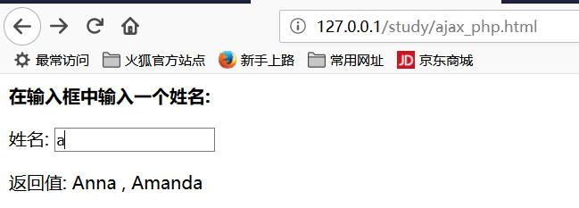

## 二十八、AJAX 与 MySQL

> mysql 源文件 websites.sql ：

```sql
/*
 Navicat MySQL Data Transfer

 Source Server         : 127.0.0.1
 Source Server Version : 50621
 Source Host           : localhost
 Source Database       : RUNOOB

 Target Server Version : 50621
 File Encoding         : utf-8

 Date: 05/18/2016 11:44:07 AM
*/

SET NAMES utf8;
SET FOREIGN_KEY_CHECKS = 0;

-- ----------------------------
--  Table structure for `websites`
-- ----------------------------
DROP TABLE IF EXISTS `websites`;
CREATE TABLE `websites` (
  `id` int(11) NOT NULL AUTO_INCREMENT,
  `name` char(20) NOT NULL DEFAULT '' COMMENT '站点名称',
  `url` varchar(255) NOT NULL DEFAULT '',
  `alexa` int(11) NOT NULL DEFAULT '0' COMMENT 'Alexa 排名',
  `country` char(10) NOT NULL DEFAULT '' COMMENT '国家',
  PRIMARY KEY (`id`)
) ENGINE=InnoDB AUTO_INCREMENT=6 DEFAULT CHARSET=utf8;

-- ----------------------------
--  Records of `websites`
-- ----------------------------
BEGIN;
INSERT INTO `websites` VALUES ('1', 'Google', 'https://www.google.cm/', '1', 'USA'), ('2', '淘宝', 'https://www.taobao.com/', '13', 'CN'), ('3', '菜鸟教程', 'http://www.runoob.com/', '4689', 'CN'), ('4', '微博', 'http://weibo.com/', '20', 'CN'), ('5', 'Facebook', 'https://www.facebook.com/', '3', 'USA');
COMMIT;

SET FOREIGN_KEY_CHECKS = 1;
```

> 导入数据库：

```powershell
C:\Users\15900>mysql -h 127.0.0.1 -u admin -p
Enter password: ******

mysql> show databases;
+--------------------+
| Database           |
+--------------------+
| information_schema |
| my_abc             |
| my_database_test   |
| mydb               |
| mysql              |
| performance_schema |
| sakila             |
| sys                |
| world              |
+--------------------+
9 rows in set (0.01 sec)

mysql> use mydb;
Database changed
mysql> show tables;
+----------------+
| Tables_in_mydb |
+----------------+
| myguests       |
+----------------+
1 row in set (0.00 sec)

mysql> source E:\phptools\ApacheServer\Apache\htdocs\study\websites.sql
Query OK, 0 rows affected (0.01 sec)

Query OK, 0 rows affected (0.00 sec)

Query OK, 0 rows affected, 1 warning (0.00 sec)

Query OK, 0 rows affected (0.04 sec)

Query OK, 0 rows affected (0.00 sec)

Query OK, 5 rows affected (0.01 sec)
Records: 5  Duplicates: 0  Warnings: 0

Query OK, 0 rows affected (0.00 sec)

Query OK, 0 rows affected (0.00 sec)

mysql> show tables;
+----------------+
| Tables_in_mydb |
+----------------+
| myguests       |
| websites       |
+----------------+
2 rows in set (0.00 sec)

mysql> select * from websites;
+----+--------------+---------------------------+-------+---------+
| id | name         | url                       | alexa | country |
+----+--------------+---------------------------+-------+---------+
|  1 | Google       | https://www.google.cm/    |     1 | USA     |
|  2 | 娣樺疂       | https://www.taobao.com/   |    13 | CN      |
|  3 | 鑿滈笩鏁欑▼ | http://www.runoob.com/    |  4689 | CN      |
|  4 | 寰?崥       | http://weibo.com/         |    20 | CN      |
|  5 | Facebook     | https://www.facebook.com/ |     3 | USA     |
+----+--------------+---------------------------+-------+---------+
5 rows in set (0.00 sec)

mysql>
```

> 前端代码 ajax_php_mysql.html：

```powershell
<!DOCTYPE html> 
<html> 
<head> 
<meta charset="utf-8"> 
<title>菜鸟教程(runoob.com)</title> 
<script>
function showSite(str)
{
    if (str=="")
    {
        document.getElementById("txtHint").innerHTML="";
        return;
    } 
    if (window.XMLHttpRequest)
    {
        // IE7+, Firefox, Chrome, Opera, Safari 浏览器执行代码
        xmlhttp=new XMLHttpRequest();
    }
    else
    {
        // IE6, IE5 浏览器执行代码
        xmlhttp=new ActiveXObject("Microsoft.XMLHTTP");
    }
    xmlhttp.onreadystatechange=function()
    {
        if (xmlhttp.readyState==4 && xmlhttp.status==200)
        {
            document.getElementById("txtHint").innerHTML=xmlhttp.responseText;
        }
    }
    xmlhttp.open("GET","getsite_mysql.php?q="+str,true);
    xmlhttp.send();
}
</script>
</head>

<body>
	<form>
		<select name="users" onchange="showSite(this.value)">
			<option value="">选择一个网站:</option>
			<option value="1">Google</option>
			<option value="2">淘宝</option>
			<option value="3">菜鸟教程</option>
			<option value="4">微博</option>
			<option value="5">Facebook</option>
		</select>
	</form>
	<br>
	<div id="txtHint"><b>网站信息显示在这里……</b></div>
</body>
</html>
```

> 后台代码 getsite_mysql.php：

```php+HTML
<?php
	$q = isset($_GET["q"]) ? intval($_GET["q"]) : '';
	 
	if(empty($q)) {
		echo '请选择一个网站';
		exit;
	}
	 
	$con = mysqli_connect('127.0.0.1','admin','123456');
	if (!$con)
	{
		die('Could not connect: ' . mysqli_error($con));
	}
	// 选择数据库
	mysqli_select_db($con,"mydb");
	// 设置编码，防止中文乱码
	mysqli_set_charset($con, "utf8");
	 
	$sql="SELECT * FROM Websites WHERE id = '".$q."'";
	 
	$result = mysqli_query($con,$sql);
	 
	echo "<table border='1'>
		<tr>
		<th>ID</th>
		<th>网站名</th>
		<th>网站 URL</th>
		<th>Alexa 排名</th>
		<th>国家</th>
		</tr>";
	 
	while($row = mysqli_fetch_array($result))
	{
		echo "<tr>";
		echo "<td>" . $row['id'] . "</td>";
		echo "<td>" . $row['name'] . "</td>";
		echo "<td>" . $row['url'] . "</td>";
		echo "<td>" . $row['alexa'] . "</td>";
		echo "<td>" . $row['country'] . "</td>";
		echo "</tr>";
	}
	echo "</table>";
	 
	mysqli_close($con);
?>
```

> 运行效果：

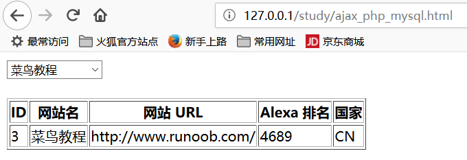

## 二十九、PHP 实例 - AJAX 与 XML

> 用于实验的 cd_catalog.xml ：

```xml
<!-- Edited by XMLSpy® --><CATALOG><CD><TITLE>Empire Burlesque</TITLE><ARTIST>Bob Dylan</ARTIST><COUNTRY>USA</COUNTRY><COMPANY>Columbia</COMPANY><PRICE>10.90</PRICE><YEAR>1985</YEAR></CD><CD><TITLE>Hide your heart</TITLE><ARTIST>Bonnie Tyler</ARTIST><COUNTRY>UK</COUNTRY><COMPANY>CBS Records</COMPANY><PRICE>9.90</PRICE><YEAR>1988</YEAR></CD><CD><TITLE>Greatest Hits</TITLE><ARTIST>Dolly Parton</ARTIST><COUNTRY>USA</COUNTRY><COMPANY>RCA</COMPANY><PRICE>9.90</PRICE><YEAR>1982</YEAR></CD><CD><TITLE>Still got the blues</TITLE><ARTIST>Gary Moore</ARTIST><COUNTRY>UK</COUNTRY><COMPANY>Virgin records</COMPANY><PRICE>10.20</PRICE><YEAR>1990</YEAR></CD><CD><TITLE>Eros</TITLE><ARTIST>Eros Ramazzotti</ARTIST><COUNTRY>EU</COUNTRY><COMPANY>BMG</COMPANY><PRICE>9.90</PRICE><YEAR>1997</YEAR></CD><CD><TITLE>One night only</TITLE><ARTIST>Bee Gees</ARTIST><COUNTRY>UK</COUNTRY><COMPANY>Polydor</COMPANY><PRICE>10.90</PRICE><YEAR>1998</YEAR></CD><CD><TITLE>Sylvias Mother</TITLE><ARTIST>Dr.Hook</ARTIST><COUNTRY>UK</COUNTRY><COMPANY>CBS</COMPANY><PRICE>8.10</PRICE><YEAR>1973</YEAR></CD><CD><TITLE>Maggie May</TITLE><ARTIST>Rod Stewart</ARTIST><COUNTRY>UK</COUNTRY><COMPANY>Pickwick</COMPANY><PRICE>8.50</PRICE><YEAR>1990</YEAR></CD><CD><TITLE>Romanza</TITLE><ARTIST>Andrea Bocelli</ARTIST><COUNTRY>EU</COUNTRY><COMPANY>Polydor</COMPANY><PRICE>10.80</PRICE><YEAR>1996</YEAR></CD><CD><TITLE>When a man loves a woman</TITLE><ARTIST>Percy Sledge</ARTIST><COUNTRY>USA</COUNTRY><COMPANY>Atlantic</COMPANY><PRICE>8.70</PRICE><YEAR>1987</YEAR></CD><CD><TITLE>Black angel</TITLE><ARTIST>Savage Rose</ARTIST><COUNTRY>EU</COUNTRY><COMPANY>Mega</COMPANY><PRICE>10.90</PRICE><YEAR>1995</YEAR></CD><CD><TITLE>1999 Grammy Nominees</TITLE><ARTIST>Many</ARTIST><COUNTRY>USA</COUNTRY><COMPANY>Grammy</COMPANY><PRICE>10.20</PRICE><YEAR>1999</YEAR></CD><CD><TITLE>For the good times</TITLE><ARTIST>Kenny Rogers</ARTIST><COUNTRY>UK</COUNTRY><COMPANY>Mucik Master</COMPANY><PRICE>8.70</PRICE><YEAR>1995</YEAR></CD><CD><TITLE>Big Willie style</TITLE><ARTIST>Will Smith</ARTIST><COUNTRY>USA</COUNTRY><COMPANY>Columbia</COMPANY><PRICE>9.90</PRICE><YEAR>1997</YEAR></CD><CD><TITLE>Tupelo Honey</TITLE><ARTIST>Van Morrison</ARTIST><COUNTRY>UK</COUNTRY><COMPANY>Polydor</COMPANY><PRICE>8.20</PRICE><YEAR>1971</YEAR></CD><CD><TITLE>Soulsville</TITLE><ARTIST>Jorn Hoel</ARTIST><COUNTRY>Norway</COUNTRY><COMPANY>WEA</COMPANY><PRICE>7.90</PRICE><YEAR>1996</YEAR></CD><CD><TITLE>The very best of</TITLE><ARTIST>Cat Stevens</ARTIST><COUNTRY>UK</COUNTRY><COMPANY>Island</COMPANY><PRICE>8.90</PRICE><YEAR>1990</YEAR></CD><CD><TITLE>Stop</TITLE><ARTIST>Sam Brown</ARTIST><COUNTRY>UK</COUNTRY><COMPANY>A and M</COMPANY><PRICE>8.90</PRICE><YEAR>1988</YEAR></CD><CD><TITLE>Bridge of Spies</TITLE><ARTIST>T'Pau</ARTIST><COUNTRY>UK</COUNTRY><COMPANY>Siren</COMPANY><PRICE>7.90</PRICE><YEAR>1987</YEAR></CD><CD><TITLE>Private Dancer</TITLE><ARTIST>Tina Turner</ARTIST><COUNTRY>UK</COUNTRY><COMPANY>Capitol</COMPANY><PRICE>8.90</PRICE><YEAR>1983</YEAR></CD><CD><TITLE>Midt om natten</TITLE><ARTIST>Kim Larsen</ARTIST><COUNTRY>EU</COUNTRY><COMPANY>Medley</COMPANY><PRICE>7.80</PRICE><YEAR>1983</YEAR></CD><CD><TITLE>Pavarotti Gala Concert</TITLE><ARTIST>Luciano Pavarotti</ARTIST><COUNTRY>UK</COUNTRY><COMPANY>DECCA</COMPANY><PRICE>9.90</PRICE><YEAR>1991</YEAR></CD><CD><TITLE>The dock of the bay</TITLE><ARTIST>Otis Redding</ARTIST><COUNTRY>USA</COUNTRY><COMPANY>Atlantic</COMPANY><PRICE>7.90</PRICE><YEAR>1987</YEAR></CD><CD><TITLE>Picture book</TITLE><ARTIST>Simply Red</ARTIST><COUNTRY>EU</COUNTRY><COMPANY>Elektra</COMPANY><PRICE>7.20</PRICE><YEAR>1985</YEAR></CD><CD><TITLE>Red</TITLE><ARTIST>The Communards</ARTIST><COUNTRY>UK</COUNTRY><COMPANY>London</COMPANY><PRICE>7.80</PRICE><YEAR>1987</YEAR></CD><CD><TITLE>Unchain my heart</TITLE><ARTIST>Joe Cocker</ARTIST><COUNTRY>USA</COUNTRY><COMPANY>EMI</COMPANY><PRICE>8.20</PRICE><YEAR>1987</YEAR></CD></CATALOG>
```

前端代码：

```powershell
<html>
<head>
<script>
function showCD(str)
{
    if (str=="")
    {
        document.getElementById("txtHint").innerHTML="";
        return;
    } 
    if (window.XMLHttpRequest)
    {
        // IE7+, Firefox, Chrome, Opera, Safari 浏览器执行
        xmlhttp=new XMLHttpRequest();
    }
    else
    {
        // IE6, IE5 浏览器执行
        xmlhttp=new ActiveXObject("Microsoft.XMLHTTP");
    }
    xmlhttp.onreadystatechange=function()
    {
        if (xmlhttp.readyState==4 && xmlhttp.status==200)
        {
            document.getElementById("txtHint").innerHTML=xmlhttp.responseText;
        }
    }
    xmlhttp.open("GET","getcd.php?q="+str,true);
    xmlhttp.send();
}
</script>
</head>
<body>

<form>
Select a CD:
<select name="cds" onchange="showCD(this.value)">
<option value="">Select a CD:</option>
<option value="Bob Dylan">Bob Dylan</option>
<option value="Bonnie Tyler">Bonnie Tyler</option>
<option value="Dolly Parton">Dolly Parton</option>
</select>
</form>
<div id="txtHint"><b>CD info will be listed here...</b></div>

</body>
</html>
```

相应的 php 代码：

```powershell
<?php
$q=$_GET["q"];

$xmlDoc = new DOMDocument();
$xmlDoc->load("cd_catalog.xml");

$x=$xmlDoc->getElementsByTagName('ARTIST');

for ($i=0; $i<=$x->length-1; $i++)
{
    // 处理元素节点
    if ($x->item($i)->nodeType==1)
    {
        if ($x->item($i)->childNodes->item(0)->nodeValue == $q)
        {
            $y=($x->item($i)->parentNode);
        }
    }
}

$cd=($y->childNodes);

for ($i=0;$i<$cd->length;$i++)
{ 
    // 处理元素节点
    if ($cd->item($i)->nodeType==1)
    {
        echo("<b>" . $cd->item($i)->nodeName . ":</b> ");
        echo($cd->item($i)->childNodes->item(0)->nodeValue);
        echo("<br>");
    }
}
?>
```

实际运行效果：

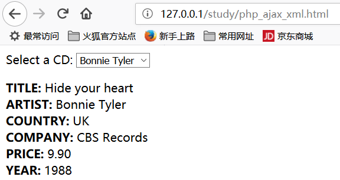

## 三十、 AJAX 实时搜索

```powershell
 XML 文件（links.xml）中进行查找. XML 文件内容如下：
```

```html
<pages><link><title>HTML a 标签</title><url>http://www.runoob.com/tags/tag-a.html</url></link><link><title>HTML br 标签</title><url>http://www.runoob.com/tags/tag-br.html</url></link><link><title>CSS background 属性</title><url>http://www.runoob.com/cssref/css3-pr-background.html</url></link><link><title>CSS border 属性</title><url>http://www.runoob.com/cssref/pr-border.html</url></link><link><title>JavaScript Date 对象</title><url>http://www.runoob.com/jsref/jsref-obj-date.html</url></link><link><title>JavaScript Array 对象</title><url>http://www.runoob.com/jsref/jsref-obj-array.html</url></link></pages>
```

html 代码如下：

```html
<html>
    <head>
        <script>
        function showResult(str)
        {
            if (str.length==0)
            { 
                document.getElementById("livesearch").innerHTML="";
                document.getElementById("livesearch").style.border="0px";
                return;
            }
            if (window.XMLHttpRequest)
            {// IE7+, Firefox, Chrome, Opera, Safari 浏览器执行
                xmlhttp=new XMLHttpRequest();
            }
            else
            {// IE6, IE5 浏览器执行
                xmlhttp=new ActiveXObject("Microsoft.XMLHTTP");
            }
            xmlhttp.onreadystatechange=function()
            {
                if (xmlhttp.readyState==4 && xmlhttp.status==200)
                {
                    document.getElementById("livesearch").innerHTML=xmlhttp.responseText;
                    document.getElementById("livesearch").style.border="1px solid #A5ACB2";
                }
            }
            xmlhttp.open("GET","livesearch.php?q="+str,true);
            xmlhttp.send();
        }
        </script>
    </head>
    <body>

        <form>
        <input type="text" size="30" onkeyup="showResult(this.value)">
        <div id="livesearch"></div>
        </form>

    </body>
</html>
```

后台代码 livesearch.php ：

```powershell
<?php
$xmlDoc=new DOMDocument();
$xmlDoc->load("ajax_xml_search.xml");

$x=$xmlDoc->getElementsByTagName('link');

// 从 URL 中获取参数 q 的值
$q=$_GET["q"];

// 如果 q 参数存在则从 xml 文件中查找数据
if (strlen($q)>0)
{
    $hint="";
    for($i=0; $i<($x->length); $i++)
    {
        $y=$x->item($i)->getElementsByTagName('title');
        $z=$x->item($i)->getElementsByTagName('url');
        if ($y->item(0)->nodeType==1)
        {
            // 找到匹配搜索的链接
            if (stristr($y->item(0)->childNodes->item(0)->nodeValue,$q))
            {
                if ($hint=="")
                {
                    $hint="<a href='" . 
                    $z->item(0)->childNodes->item(0)->nodeValue . 
                    "' target='_blank'>" . 
                    $y->item(0)->childNodes->item(0)->nodeValue . "</a>";
                }
                else
                {
                    $hint=$hint . "<br /><a href='" . 
                    $z->item(0)->childNodes->item(0)->nodeValue . 
                    "' target='_blank'>" . 
                    $y->item(0)->childNodes->item(0)->nodeValue . "</a>";
                }
            }
        }
    }
}

// 如果没找到则返回 "no suggestion"
if ($hint=="")
{
    $response="no suggestion";
}
else
{
    $response=$hint;
}

// 输出结果
echo $response;
?>
```

运行效果：

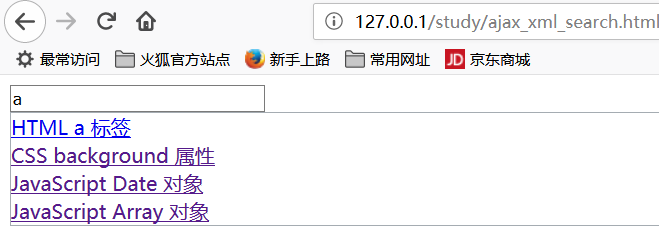

##三十一、php ajax 投票

### 1、间端代码 **poll.html** 

```powershell
<html>
<head>
<meta charset="utf-8">
<title>菜鸟教程(runoob.com)</title>
<script>
function getVote(int) {
  if (window.XMLHttpRequest) {
    // IE7+, Firefox, Chrome, Opera, Safari 执行代码
    xmlhttp=new XMLHttpRequest();
  } else {
    // IE6, IE5 执行代码
    xmlhttp=new ActiveXObject("Microsoft.XMLHTTP");
  }
  xmlhttp.onreadystatechange=function() {
  if (xmlhttp.readyState==4 && xmlhttp.status==200)
    {
      document.getElementById("poll").innerHTML=xmlhttp.responseText;
    }
  }
  xmlhttp.open("GET","poll_vote.php?vote="+int,true);
  xmlhttp.send();
}
</script>
</head>
<body>

<div id="poll">
<h3>你喜欢 PHP 和 AJAX 吗?</h3>
<form>
是:
<input type="radio" name="vote" value="0" onclick="getVote(this.value)">
<br>否:
<input type="radio" name="vote" value="1" onclick="getVote(this.value)">
</form>
</div>

</body>
</html>
```

### 2、后台 php 代码

```powershell
<?php
$vote = htmlspecialchars($_REQUEST['vote']);

// 获取文件中存储的数据
$filename = "poll_result.txt";
$content = file($filename);

// 将数据分割到数组中
$array = explode("||", $content[0]);
$yes = $array[0];
$no = $array[1];

if ($vote == 0)
{
  $yes = $yes + 1;
}

if ($vote == 1)
{
  $no = $no + 1;
}

// 插入投票数据
$insertvote = $yes."||".$no;
$fp = fopen($filename,"w");
fputs($fp,$insertvote);
fclose($fp);
?>

<h2>结果:</h2>
<table>
  <tr>
  <td>是:</td>
  <td>
  <span style="display: inline-block; background-color:green;
      width:<?php echo(100*round($yes/($no+$yes),2)); ?>px;
      height:20px;" ></span>
  <?php echo(100*round($yes/($no+$yes),2)); ?>%
  </td>
  </tr>
  <tr>
  <td>否:</td>
  <td>
  <span style="display: inline-block; background-color:red;
      width:<?php echo(100*round($no/($no+$yes),2)); ?>px;
      height:20px;"></span>
  <?php echo(100*round($no/($no+$yes),2)); ?>%
  </td>
  </tr>
</table>
```

代码原来如此简单，效果却十分漂亮：

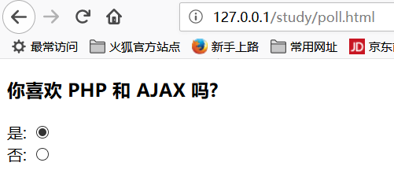


