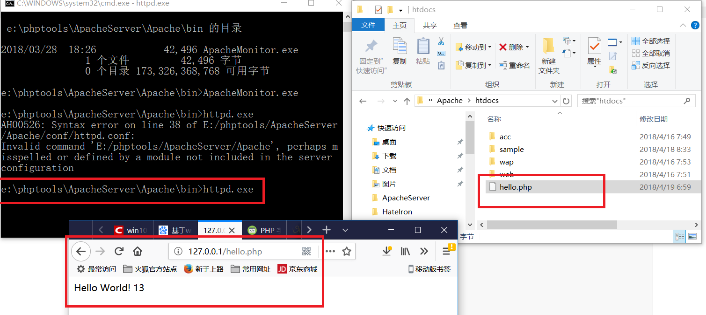
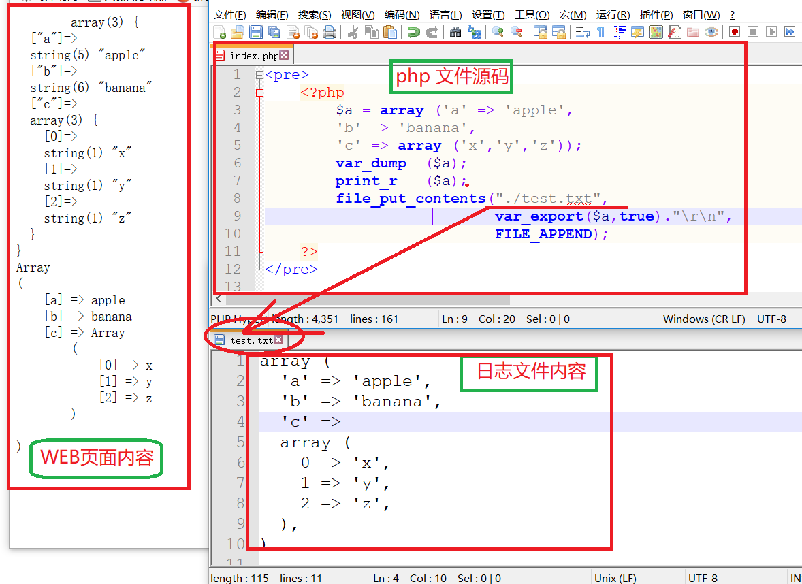
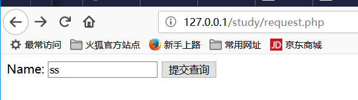

#<center>php</center>

[TOC]

## 一、基于win10搭建php环境

```powershell
这里是基于win10配置php-7.1.0+apache2.4.23+mysql-5.7.16的介绍
```

###工具/原料

>- 环境 win10 64位（32位的电脑选择下载32位的，32位的软件能在64位的电脑运行，反之则不行，最好是下载和电脑位数匹配的）
>- php-7.1.0 php-7.1.0-Win32-VC14-x64.zip 
>- apache 2.4.23 httpd-2.4.23-win64-VC14.zip 
>- mysql-5.7.16 mysql-5.7.16-winx64.zip

###方法/步骤 1、下载相应的软件（没有装vc14的一定要安装)

>- 先去微软官网下载vc14,网址为https://www.microsoft.com/zh-cn/download/details.aspx?id=48145，这里下载中文简体的，然后下载好之后一步步安装就好了。
>- 下载apache 2.4.23， httpd-2.4.23-win64-VC14.zip，网址为http://www.apachelounge.com/download/，这里选择的是免安装版的
>- 下载php-7.1.0，php-7.1.0-Win32-VC14-x64.zip 
>   这里我们选择的是线程安全版，关于线程安全版与非线程安全版的区别可 
>    自行上网查阅相关资料，下载网址为http://windows.php.net/download/ 
>   ，最后注意选择相应位数的版本下载，这里我是下载64位的
>- 下载mysql-5.7.16，mysql-5.7.16-winx64.zip，下载网址为http://dev.mysql.com/downloads/mysql/，同样的选择64位的下载。32位的电脑下载32位的。这个软件也是免安装版的，到时候只要解压到某个文件夹就好了。

###方法/步骤2、开始安装

>* Apache我们这里下载的是zip压缩包，解压后放到合适的位置就好了，这里我们放在E盘的phptools文件夹中的ApacheServer文件夹中，这个文件夹是自己新建的，可以自己命名。
>* php 下载后也是zip包，同样解压到合适位置，我们这里也将其放在E盘的phptools文件夹下的php7.1目录下,php7.1文件夹需要自己新建
>* MySQL选择的是免安装版的，也就是Zip压缩包，这就更简单了，同样是解压到合适的位置，这里我们也将其放在E盘的phptools文件夹下的MySQL目录下,解压安装后如下图

###方法/步骤3、配置PHP

> * 首先将`E:\phptools\php7.1\php.ini-production`  复制一份，并重命名为php.ini；
> * 将 
>   `E:\phptools\php7.1和E:\phptools\php7.1\ext`加入环境变量PATH中,选中计算机，右键属性-->高级系
>    统设置 -->环境变量-->系统变量，找到Path，编辑，在其后加上`;E:\phptools\php7.1;E:\phptools
>    \php7.1\ext`

### 方法/步骤4、配置Apache

> * 用记事本打开E:\phptools\ApacheServer\Apache\conf
>
>   查找ServerRoot，修改ServerRoot `"C:/Apache24" => ServerRoot "E:/phptools/ApacheServer/Apache"`（这里输入的是你解压apache安装包后放的位置）
>
> * 查找#ServerName www.example.com:80 ，修改为 ServerName 
>   localhost:80 (去掉前面的#)，如果你的电脑的80端口已经被占用了的话，这里我们就不能用80端口了，可以修改成其它的端口，比如90。当然我们还要搜索Listen，把80端口改成90，其它的就不用修改了，只需要修改这两个地方。
>
> * 查找DocumentRoot "c:/Apache24/htdocs" ， 修改为DocumentRoot "E:/phptools/ApacheServer/Apache/htdocs" 
>
> * 查找`<Directory "c:/Apache24/htdocs"> `，修改为 `<Directory " E:/phptools/ApacheServer/Apache/htdocs ">`
>
> * 找到DirectoryIndex index.html ，修改为 DirectoryIndex index.html index.php index.htm (这里我们添加了index.php index.htm)
>
> * 查找ScriptAlias /cgi-bin/ "c:/Apache24/cgi-bin/"  ，修改为 ScriptAlias /cgi- bin/ "E:/phptools/ApacheServer/Apache/cgi-bin"
>
> * 查找`<Directory "c:/Apache24/cgi-bin"> `修改为 `<Directory "E:/phptools/ApacheServer/Apache/cgi-bin/">`
>
> * 最后在E:/phptools/ApacheServer/Apache/conf/httpd.conf最后一行加上
>
>   ````
>   LoadModule php7_module "E:/phptools/php7.1/php7apache2_4.dll"
>   AddHandler application/x-httpd-php .php .html .htm
>   AddType application/x-http-php .php .html .htm
>   PHPIniDir "E:/phptools/php7.1"
>   ````

###方法/步骤5、然后将Apache安装到系统服务中

> + 然后我们如果把Apache安装到系统服务中的话，我们就可以直接在系统服务中启动了。具体方法是打开任务管理器——>服务——>找到Apache，然后右键启动就好了。
> + 当然这里不安装也是可以的，只是启动Apache的时候要到E:\phptools\ApacheServer\Apache\bin\ApacheMonitor.exe中去，启动前还要运行httpd.exe

### 方法/步骤6、开启几个常用的php扩展

> - 用记事本打开E:\phptools\php7.1\php.ini
>
>   将`; extension_dir = "ext"`修改为` extension_dir = "ext" `（去掉extension前面的分号）
>
>   将`;extension=php_mbstring.dll `修改为`extension=php_mbstring.dll`（去掉extension前面的分号,这是php多字节字符串扩展）
>
>   将`;extension=php_mysqli.dll `修改为 `extension=php_mysqli.dll`（去掉extension前面的分号） 

### 方法/步骤7、MySQL的配置

```
MySQL免安装版环境配置已有朋友写过相关经验，我就不赘述了，参考

经验朋友niyikai写的经验即可。

但是这里需要注意的是5.7版本里面没有data文件夹。在启动之前需要初始化，使用cmd命令行进入bin文件夹后，再输入mysqld --initialize ,这样才能正常启动MySQL。还有密码的问题，5.7版本的MySQL随机附带了一个登录密码。这个密码在后来生成的data文件夹下。文件的名字是你的计算机名.err。

2016-12-10T16:18:50.886005Z 1 [Note] A temporary password is generated for root@localhost: fdglskdjggsl    加粗的即为登录密码。还有需要注意的是cmd命令必须是以管理员权限运行的，否则权限不够，会报错。下图就是MySQL成功启动并且登录后的界面。
```

## 二、环境配置好后，验证一下

<a href="./win10_PHP_Apache_MySQL_EnvSetup.html">win10_PHP_Apache_MySQL_EnvSetup.html</a>


## 三、第一个页面

###1、第一个静态页面

```powershell
在 E:\phptools\ApacheServer\Apache\htdocs 目录下，建立一个 index.php ，内容如下：

<!DOCTYPE html>
<html>
<body>

<?php
echo "Hello World!<br/>";
echo strlen("Hello world!\n"); 
?>

</body>
</html>
```

> 
>
> 启动 apache服务器，并浏览之
>
> 

### 2、用于调试的函数

#### A、exit 和 die 函数，效果相同，输出一个字符串，然后退出

```php
<?php exit("hello word"); ?>
<?php die("hello word"); ?>
```

####B、var_dump()和print_r()

```powershell
网页内容：
<pre>
	<?php
		$a = array  ('a' => 'apple',
					'b' => 'banana',
					'c' => array ('x','y','z'));
		var_dump  ($a);
		print_r   ($a);
	?>
</pre>

输出：
array(3) {
  ["a"]=>
  string(5) "apple"
  ["b"]=>
  string(6) "banana"
  ["c"]=>
  array(3) {
    [0]=>
    string(1) "x"
    [1]=>
    string(1) "y"
    [2]=>
    string(1) "z"
  }
}
Array
(
    [a] => apple
    [b] => banana
    [c] => Array
        (
            [0] => x
            [1] => y
            [2] => z
        )
)
```

###3、`PHP file_put_contents()`将内容打印到后台文件中查看




##四、 PHP 学习正式开始（runoob 誊写）

### 1、helloworld 样例

```powershell
//基本输出指令是 echo 和 print
<!DOCTYPE html>
<html>
<body>

<h1>My first PHP page</h1>

<?php
echo "Hello World!";
?>

</body>
</html>
```

### 2、PHP变量

```powershell
php 文件内容：
<?php
	$x=5;
	$y=6;
	$z=$x+$y;
	echo $z;
?>

将此文件放到 apache 根目录的一个子目录下，然后访问之：
http://127.0.0.1/study/var.php

输出
11
```


###3、变量作用域

```powershell
 <?php
$x=5; // 全局变量

function myTest()
{
    $y=10; // 局部变量
    echo "<p>测试函数内变量:<p>";
    echo "变量 x 为: $x";
    echo "<br>";
    echo "变量 y 为: $y";
} 

myTest();

echo "<p>测试函数外变量:<p>";
echo "变量 x 为: $x";
echo "<br>";
echo "变量 y 为: $y";
?> 
```

### 4、global 关键字

```powershell
<?php
$x=5;
$y=10;
 
function myTest()
{
    //声明 x 、 y 为全局变量
    global $x,$y;
    $y=$x+$y;
}
 
myTest();
echo $y; // 输出 15
?>


PHP 将所有全局变量存储在一个名为 $GLOBALS[index] 的数组中。 index 保存变量的名称。这个数组可以在函数内部访问，也可以直接用来更新全局变量。

上面的实例可以写成这样：

<?php
$x=5;
$y=10;
 
function myTest()
{
    $GLOBALS['y']=$GLOBALS['x']+$GLOBALS['y'];
} 
 
myTest();
echo $y;
?>
```

### 5、static 关键字

```powershell
<?php
function myTest()
{
    static $x=0;
    echo $x;
    $x++;
}
 
myTest();
myTest();
myTest();
?>
输出：
012
```

### 6、参数

```php
<?php
function myTest($x)
{
    echo $x;
}
myTest(5);
?>
```

### 7、`echo / print` 语句

> echo 语句

```php
<?php
	$txt1="学习 PHP";
	$txt2="RUNOOB.COM";
	$cars=array("Volvo","BMW","Toyota");
	 
	echo $txt1;
	echo "<br>";
	echo "在 $txt2 学习 PHP ";
	echo "<br>";
	echo "我车的品牌是 {$cars[0]}";
?>

//输出如下：
学习 PHP
在 RUNOOB.COM 学习 PHP
我车的品牌是 Volvo
```

> print 语句

```php
<?php
$txt1="学习 PHP";
$txt2="RUNOOB.COM";
$cars=array("Volvo","BMW","Toyota");
 
print $txt1;
print "<br>";
print "在 $txt2 学习 PHP ,use print";
print "<br>";
print "我车的品牌是 {$cars[0]}";
?>
//输出如下：
学习 PHP
在 RUNOOB.COM 学习 PHP ,use print
我车的品牌是 Volvo
```

### 8、EOF关键字

```powershell
<?php
echo <<<EOF
    <h1>我的第一个标题</h1>
    <p>我的第一个段落。</p>
EOF;
// 结束需要独立一行且前后不能空格
?>
```

### 9、数据类型

```powershell
String（字符串）, Integer（整型）, Float（浮点型）, 
Boolean（布尔型）, Array（数组）, Object（对象）, NULL（空值）。
```

```powershell
<?php 
	$x = 5985;
	var_dump($x);
	echo "<br>"; 
	$x = -345; // 负数 
	var_dump($x);
	echo "<br>"; 
	$x = 0x8C; // 十六进制数
	var_dump($x);
	echo "<br>";
	$x = 047; // 八进制数
	var_dump($x);
?>

输出：
int(5985)
int(-345)
int(140)
int(39) 
```

> 浮点类型数据

```powershell
<?php 
	$x = 10.365;
	var_dump($x);
	echo "<br>"; 
	$x = 2.4e3;
	var_dump($x);
	echo "<br>"; 
	$x = 8E-5;
	var_dump($x);
?>

//输出
float(10.365)
float(2400)
float(8.0E-5) 
```

> 数组类型

```powershell
<?php 
$cars=array("Volvo","BMW","Toyota");
var_dump($cars);
?>
输出：
array(3) { [0]=> string(5) "Volvo" [1]=> string(3) "BMW" [2]=> string(6) "Toyota" } 
```

> NULL 数据类型

```powershell
<?php
$x="Hello world!";
$x=null;
var_dump($x);
?>
输出：
NULL 
```

> 常量

```powershell
区分大小写的常量
<?php
// 区分大小写的常量名
define("GREETING", "欢迎访问 Runoob.com");
echo GREETING;    // 输出 "欢迎访问 Runoob.com"
echo '<br>';
echo greeting;   // 输出 "greeting"
?>
输出：
欢迎访问 Runoob.com
greeting
```

```powershell
不区分大小写的常量
<?php
// 不区分大小写的常量名
define("GREETING", "欢迎访问 Runoob.com", true);
echo greeting;  // 输出 "欢迎访问 Runoob.com"
?>

输出：
欢迎访问 Runoob.com
```


```powershell
常量是全局的：
<?php
define("GREETING", "欢迎访问 Runoob.com");
 
function myTest() {
    echo GREETING;
}
 
myTest();    // 输出 "欢迎访问 Runoob.com"
?>
```

###10、PHP`合并`运算符

```powershell
 <?php
$txt1="Hello world!";
$txt2="What a nice day!";
echo $txt1 . " " . $txt2;
?> 

输出：
Hello world! What a nice day! 
```

### 11、库函数

```powershell
<?php
	//strlen 函数不包含最后的`\n`
	echo strlen("Hello world!"); //输出：12
?> 

<?php
	echo strpos("Hello world!","world"); //输出：6
?> 

完整的 php 函数手册：
	http://www.runoob.com/php/php-ref-string.html
```


### 12、PHP 运算符

```php
<?php 
	$x=10; 
	$y=6;
	echo ($x + $y); // 输出16
	echo '<br>';  // 换行
	 
	echo ($x - $y); // 输出4
	echo '<br>';  // 换行
	 
	echo ($x * $y); // 输出60
	echo '<br>';  // 换行
	 
	echo ($x / $y); // 输出1.6666666666667
	echo '<br>';  // 换行
	 
	echo ($x % $y); // 输出4
	echo '<br>';  // 换行
	 
	echo -$x;     //输出：-10
	
	echo '<br>';
	var_dump(intdiv(10, 3)); //输出： int(3) 
?>
```

```powershell
赋值运算：

<?php 
	$x=10; 
	echo $x; // 输出10
	echo '<br/>';
	$y=20; 
	$y += 100;
	echo $y; // 输出120
    echo '<br/>';
	$z=50;
	$z -= 25;
	echo $z; // 输出25
	echo '<br/>';
	$i=5;
	$i *= 6;
	echo $i; // 输出30
	echo '<br/>';
	$j=10;
	$j /= 5;
	echo $j; // 输出2
	echo '<br/>';
	$k=15;
	$k %= 4;
	echo $k; // 输出3
?>

输出：
10
120
25
30
2
3
```

```powershell
字符串连接并赋值：
<?php
	$a = "Hello";
	$b = $a . " world!";
	echo $b; // 输出Hello world! 
	print '<br/>';
	
	$x="Hello";
	$x .= " world!";
	echo $x; // 输出Hello world! 
?>

输出：
Hello world!
Hello world!
```

```powershell
自加自减操作：
<?php
	$x=10; 
	echo ++$x; // 输出11
	echo '<br/>';

	$y=10; 
	echo $y++; // 输出10
	echo '<br/>';

	$z=5;
	echo --$z; // 输出4
	echo '<br/>';

	$i=5;
	echo $i--; // 输出5
	echo '<br/>';
?>
```


###13、PHP 比较运算符

| 运算符  | 名称       | 描述                                           | 实例               |
| ------- | ---------- | ---------------------------------------------- | ------------------ |
| x == y  | 等于       | 如果 x 等于 y，则返回 true                     | 5==8 返回 false    |
| x === y | 绝对等于   | 如果 x 等于 y，且它们类型相同，则返回 true     | 5==="5" 返回 false |
| x != y  | 不等于     | 如果 x 不等于 y，则返回 true                   | 5!=8 返回 true     |
| x <> y  | 不等于     | 如果 x 不等于 y，则返回 true                   | 5<>8 返回 true     |
| x !== y | 绝对不等于 | 如果 x 不等于 y，或它们类型不相同，则返回 true | 5!=="5" 返回 true  |
| x > y   | 大于       | 如果 x 大于 y，则返回 true                     | 5>8 返回 false     |
| x < y   | 小于       | 如果 x 小于 y，则返回 true                     | 5<8 返回 true      |
| x >= y  | 大于等于   | 如果 x 大于或者等于 y，则返回 true             | 5>=8 返回 false    |
| x <= y  | 小于等于   | 如果 x 小于或者等于 y，则返回 true             | 5<=8 返回 true     |

```php
<!DOCTYPE html>
<html>
	<body>
	<?php
		$x=100; 
		$y="100";

		var_dump($x == $y); // returns true because values are equal
		echo "<br>";
		var_dump($x === $y); // returns false because types are not equal
		echo "<br>";
		var_dump($x != $y); // returns false because values are equal
		echo "<br>";
		var_dump($x !== $y); // returns true because types are not equal
		echo "<br>";

		$a=50;
		$b=90;

		var_dump($a > $b);
		echo "<br>";
		var_dump($a <  $b);
	?>  
	</body>
</html>
        
//输出：
bool(true)
bool(false)
bool(false)
bool(true)
bool(false)
bool(true) 
```


###14、PHP 逻辑运算符

| 运算符   | 名称 | 描述                                         | 实例                                |
| -------- | ---- | -------------------------------------------- | ----------------------------------- |
| x and y  | 与   | 如果 x 和 y 都为 true，则返回 true           | x=6 y=3(x < 10 and y > 1) 返回 true |
| x or y   | 或   | 如果 x 和 y 至少有一个为 true，则返回 true   | x=6 y=3(x==6 or y==5) 返回 true     |
| x xor y  | 异或 | 如果 x 和 y 有且仅有一个为 true，则返回 true | x=6 y=3 (x==6 xor y==3) 返回 false  |
| x && y   | 与   | 如果 x 和 y 都为 true，则返回 true           | x=6 y=3 (x < 10 && y > 1) 返回 true |
| x \|\| y | 或   | 如果 x 和 y 至少有一个为 true，则返回 true   | x=6 y=3 (x==5 \|\| y==5) 返回 false |
| ! x      | 非   | 如果 x 不为 true，则返回 true                | x=6 y=3 !(x==y) 返回 true           |

### 15、三元运算符

```powershell
<?php
	$test = '菜鸟教程';
	// 普通写法
	$username = isset($test) ? $test : 'nobody';
	echo $username, PHP_EOL,"<br/>";

	// PHP 5.3+ 版本写法
	$username = $test ?: 'nobody';
	echo $username, PHP_EOL;
?>

输出：
菜鸟教程
菜鸟教程
```

> 日期函数

```powershell
<?php
	echo "今天是 " . date("Y/m/d") . "<br>";
	echo "今天是 " . date("Y.m.d") . "<br>";
	echo "今天是 " . date("Y-m-d") . "<br>";
	echo "今天是 " . date("l");
?>

输出：
今天是 2018/05/06
今天是 2018.05.06
今天是 2018-05-06
今天是 Sunday
```

### 16、switch 语句

```powershell
<?php
$favcolor="red";
switch ($favcolor)
{
case "red":
    echo "你喜欢的颜色是红色!";
    break;
case "blue":
    echo "你喜欢的颜色是蓝色!";
    break;
case "green":
    echo "你喜欢的颜色是绿色!";
    break;
default:
    echo "你喜欢的颜色不是 红, 蓝, 或绿色!";
}
?>

输出：
你喜欢的颜色是红色!
```

### 17、数组

```powershell
<?php
	$cars=array("Volvo","BMW","Toyota");
	echo "I like " . $cars[0] . ", " . $cars[1] . " and " . $cars[2] . "."."<br/>";
	echo "array size: " . count($cars);
?>

输出：
I like Volvo, BMW and Toyota.
array size: 3
```

> #### 遍历数组

```powershell
<?php
	$cars=array("Volvo","BMW","Toyota");
	$arrlength=count($cars);
	 
	for($x=0;$x<$arrlength;$x++)
	{
		echo $cars[$x];
		echo "<br>";
	}
?>

输出：
Volvo
BMW
Toyota
```

> 关联数组

```powershell
<?php
	$age=array("Peter"=>"35","Ben"=>"37","Joe"=>"43");
	echo "Peter is " . $age['Peter'] . " years old.";
?>
输出：
Peter is 35 years old.
```

> 关联数组2

```powershell
<?php
	$age=array("Peter"=>"35","Ben"=>"37","Joe"=>"43");
	
	foreach($age as $x=>$x_value)
	{
		echo "Key=" . $x . ", Value=" . $x_value;
		echo "<br>";
	}
?>

输出：
Peter is 35 years old.
```

### 18、排序

```powershell
<?php
	$cars=array("Volvo","BMW","Toyota");
	$arrlength=count($cars);
	 
	for($x=0;$x<$arrlength;$x++)
	{
		echo $cars[$x];
		echo "<br>";
	}
	echo($cars);
	echo("<br/>-----------------<br/>");
	sort($cars);
	
	for($x=0;$x<$arrlength;$x++)
	{
		echo $cars[$x];
		echo "<br>";
	}
	echo($cars);
?> 
输出：
Volvo
BMW
Toyota
Array
-----------------
BMW
Toyota
Volvo
Array 
```


> 排序：一个数字数组的排序

```powershell
<?php
	$numbers=array(4,6,2,22,11);
	$arrlength=count($numbers);
	for($x=0;$x<$arrlength;$x++)
	{
		echo $numbers[$x];
		echo "<br>";
	}
	echo($numbers);
	echo("<br/>-----------------<br/>");
	sort($numbers);
	
	for($x=0;$x<$arrlength;$x++)
	{
		echo $numbers[$x];
		echo "<br>";
	}
	echo($numbers);
?> 

输出：
4
6
2
22
11
Array
-----------------
2
4
6
11
22
Array 
```


```powershell
其它相关的排序函数：rsort / asort / ksort / arsort / krsort
```

```powershell
php 写的冒泡排序：

<?php
	// 从大到小排序
	$numArray = array(3,2,6,5,8,10);
	$numCount = count($numArray);
	for($i=$numCount-1;$i>=0;$i--){
		for($j=0;$j<$i;$j++){
			if($numArray[$j]< $numArray[$j+1]){
				$aa = $numArray[$j+1];
				$numArray[$j+1]=$numArray[$j];
				$numArray[$j]=$aa;
			}
		}
	}

	print_r($numArray);
?>

输出：
Array ( [0] => 10 [1] => 8 [2] => 6 [3] => 5 [4] => 3 [5] => 2 ) 
```


### 19、php 超全局变量，是 PHP系统自带的变量

- $GLOBALS
- $_SERVER
- $_REQUEST
- $_POST
- $_GET
- $_FILES
- $_ENV
- $_COOKIE
- $_SESSION

####A、$GLOBALS 是PHP的一个超级全局变量组，在PHP脚本的全部作用域中都可以访问。

```powershell
<?php 
    $x = 75; 
    $y = 25;

    function addition() 
    { 
        $GLOBALS['z'] = $GLOBALS['x'] + $GLOBALS['y']; 
    }

    addition(); 
    echo $z; 
?>
输出：
100
```

####B、`_SERVER`

```php
$_SERVER 是一个包含了诸如头信息(header)、路径(path)、以及脚本位置(script locations)等等信息的数组。这个数组中的项目由 Web 服务器创建。不能保证每个服务器都提供全部项目；服务器可能会忽略一些，或者提供一些没有在这里列举出来的项目。 

<?php 
    echo "\$_SERVER['PHP_SELF'] --->>> ".$_SERVER['PHP_SELF'] . "<br/>";
    echo "\$_SERVER['GATEWAY_INTERFACE']  --->>> ".$_SERVER['GATEWAY_INTERFACE'] . "<br/>";
    echo "\$_SERVER['SERVER_ADDR'] --->>> ".$_SERVER['SERVER_ADDR'] . "<br/>";
    echo "\$_SERVER['SERVER_NAME'] --->>> ".$_SERVER['SERVER_NAME'] . "<br/>";
    echo "\$_SERVER['SERVER_SOFTWARE'] --->>> ".$_SERVER['SERVER_SOFTWARE'] . "<br/>";
    echo "\$_SERVER['SERVER_PROTOCOL'] --->>> ".$_SERVER['SERVER_PROTOCOL'] . "<br/>";
    echo "\$_SERVER['REQUEST_METHOD'] --->>> ".$_SERVER['REQUEST_METHOD'] . "<br/>";
    echo "\$_SERVER['REQUEST_TIME'] --->>> ".$_SERVER['REQUEST_TIME'] . "<br/>";
    echo "\$_SERVER['QUERY_STRING'] --->>> ".$_SERVER['QUERY_STRING'] . "<br/>"; 
    echo "\$_SERVER['HTTP_ACCEPT'] --->>> ".$_SERVER['HTTP_ACCEPT'] . "<br/>";
    echo "\$_SERVER['HTTP_ACCEPT_CHARSET']--->>> ".$_SERVER['HTTP_ACCEPT_CHARSET']  . "<br/>";
    echo "\$_SERVER['HTTP_HOST'] --->>> ".$_SERVER['HTTP_HOST'] . "<br/>";
    echo "\$_SERVER['HTTP_REFERER'] --->>> ".$_SERVER['HTTP_REFERER'] . "<br/>";
    echo "\$_SERVER['HTTPS'] --->>> ".$_SERVER['HTTPS'] . "<br/>";
    echo "\$_SERVER['REMOTE_ADDR'] --->>> ".$_SERVER['REMOTE_ADDR']."<br/>";
    echo "\$_SERVER['REMOTE_HOST'] --->>> ".$_SERVER['REMOTE_HOST']."<br/>";
    echo "\$_SERVER['REMOTE_PORT'] --->>> ".$_SERVER['REMOTE_PORT']."<br/>";
    echo "\$_SERVER['SCRIPT_FILENAME'] --->>> ".$_SERVER['SCRIPT_FILENAME']. "<br/>";
    echo "\$_SERVER['SERVER_ADMIN'] --->>> ".$_SERVER['SERVER_ADMIN']. "<br/>";
    echo "\$_SERVER['SERVER_PORT'] --->>> ".$_SERVER['SERVER_PORT']."<br/>";
    echo "\$_SERVER['SERVER_SIGNATURE'] --->>> ".$_SERVER['SERVER_SIGNATURE']."<br/>";
    echo "\$_SERVER['PATH_TRANSLATED'] --->>> ".$_SERVER['PATH_TRANSLATED']."<br/>";
    echo "\$_SERVER['SCRIPT_NAME'] --->>> ".$_SERVER['SCRIPT_NAME']."<br/>";
    echo "\$_SERVER['SCRIPT_URI'] --->>> ".$_SERVER['SCRIPT_URI']."<br/>";
?>

输出：
$_SERVER['PHP_SELF'] --->>> /study/server.php
$_SERVER['GATEWAY_INTERFACE'] --->>> CGI/1.1
$_SERVER['SERVER_ADDR'] --->>> 127.0.0.1
$_SERVER['SERVER_NAME'] --->>> 127.0.0.1
$_SERVER['SERVER_SOFTWARE'] --->>> Apache/2.4.33 (Win64) PHP/7.2.4
$_SERVER['SERVER_PROTOCOL'] --->>> HTTP/1.1
$_SERVER['REQUEST_METHOD'] --->>> GET
$_SERVER['REQUEST_TIME'] --->>> 1525787770
$_SERVER['QUERY_STRING'] --->>>
$_SERVER['HTTP_ACCEPT'] --->>> text/html,application/xhtml+xml,application/xml;q=0.9,*/*;q=0.8
$_SERVER['HTTP_ACCEPT_CHARSET']--->>>
$_SERVER['HTTP_HOST'] --->>> 127.0.0.1
$_SERVER['HTTP_REFERER'] --->>>
$_SERVER['HTTPS'] --->>>
$_SERVER['REMOTE_ADDR'] --->>> 127.0.0.1
$_SERVER['REMOTE_HOST'] --->>>
$_SERVER['REMOTE_PORT'] --->>> 55243
$_SERVER['SCRIPT_FILENAME'] --->>> E:/phptools/ApacheServer/Apache/htdocs/study/server.php
$_SERVER['SERVER_ADMIN'] --->>> admin@example.com
$_SERVER['SERVER_PORT'] --->>> 80
$_SERVER['SERVER_SIGNATURE'] --->>>
$_SERVER['PATH_TRANSLATED'] --->>>
$_SERVER['SCRIPT_NAME'] --->>> /study/server.php
$_SERVER['SCRIPT_URI'] --->>> 
```


| 元素/代码                       | 描述                                                         |
| ------------------------------- | ------------------------------------------------------------ |
| $_SERVER['PHP_SELF']            | 当前执行脚本的文件名，与 document root 有关。例如，在地址为 http://example.com/test.php/foo.bar 的脚本中使用 $_SERVER['PHP_SELF'] 将得到 /test.php/foo.bar。__FILE__ 常量包含当前(例如包含)文件的完整路径和文件名。 从 PHP 4.3.0 版本开始，如果 PHP 以命令行模式运行，这个变量将包含脚本名。之前的版本该变量不可用。 |
| $_SERVER['GATEWAY_INTERFACE']   | 服务器使用的 CGI 规范的版本；例如，"CGI/1.1"。               |
| $_SERVER['SERVER_ADDR']         | 当前运行脚本所在的服务器的 IP 地址。                         |
| $_SERVER['SERVER_NAME']         | 当前运行脚本所在的服务器的主机名。如果脚本运行于虚拟主机中，该名称是由那个虚拟主机所设置的值决定。(如: www.runoob.com) |
| $_SERVER['SERVER_SOFTWARE']     | 服务器标识字符串，在响应请求时的头信息中给出。 (如：Apache/2.2.24) |
| $_SERVER['SERVER_PROTOCOL']     | 请求页面时通信协议的名称和版本。例如，"HTTP/1.0"。           |
| $_SERVER['REQUEST_METHOD']      | 访问页面使用的请求方法；例如，"GET", "HEAD"，"POST"，"PUT"。 |
| $_SERVER['REQUEST_TIME']        | 请求开始时的时间戳。从 PHP 5.1.0 起可用。 (如：1377687496)   |
| $_SERVER['QUERY_STRING']        | query string（查询字符串），如果有的话，通过它进行页面访问。 |
| $_SERVER['HTTP_ACCEPT']         | 当前请求头中 Accept: 项的内容，如果存在的话。                |
| $_SERVER['HTTP_ACCEPT_CHARSET'] | 当前请求头中 Accept-Charset: 项的内容，如果存在的话。例如："iso-8859-1,*,utf-8"。 |
| $_SERVER['HTTP_HOST']           | 当前请求头中 Host: 项的内容，如果存在的话。                  |
| $_SERVER['HTTP_REFERER']        | 引导用户代理到当前页的前一页的地址（如果存在）。由 user agent 设置决定。并不是所有的用户代理都会设置该项，有的还提供了修改 HTTP_REFERER 的功能。简言之，该值并不可信。) |
| $_SERVER['HTTPS']               | 如果脚本是通过 HTTPS 协议被访问，则被设为一个非空的值。      |
| $_SERVER['REMOTE_ADDR']         | 浏览当前页面的用户的 IP 地址。                               |
| $_SERVER['REMOTE_HOST']         | 浏览当前页面的用户的主机名。DNS 反向解析不依赖于用户的 REMOTE_ADDR。 |
| $_SERVER['REMOTE_PORT']         | 用户机器上连接到 Web 服务器所使用的端口号。                  |
| $_SERVER['SCRIPT_FILENAME']     | 当前执行脚本的绝对路径。                                     |
| $_SERVER['SERVER_ADMIN']        | 该值指明了 Apache 服务器配置文件中的 SERVER_ADMIN 参数。如果脚本运行在一个虚拟主机上，则该值是那个虚拟主机的值。(如：someone@runoob.com) |
| $_SERVER['SERVER_PORT']         | Web 服务器使用的端口。默认值为 "80"。如果使用 SSL 安全连接，则这个值为用户设置的 HTTP 端口。 |
| $_SERVER['SERVER_SIGNATURE']    | 包含了服务器版本和虚拟主机名的字符串。                       |
| $_SERVER['PATH_TRANSLATED']     | 当前脚本所在文件系统（非文档根目录）的基本路径。这是在服务器进行虚拟到真实路径的映像后的结果。 |
| $_SERVER['SCRIPT_NAME']         | 包含当前脚本的路径。这在页面需要指向自己时非常有用。__FILE__ 常量包含当前脚本(例如包含文件)的完整路径和文件名。 |
| $_SERVER['SCRIPT_URI']          | URI 用来指定要访问的页面。例如 "/index.html"。               |

####C、`$_REQUEST`

```powershell
PHP $_REQUEST 用于收集HTML表单提交的数据。

以下实例显示了一个输入字段（input）及提交按钮(submit)的表单(form)。 当用户通过点击 "Submit" 按钮提交表单数据时, 表单数据将发送至<form>标签中 action 属性中指定的脚本文件。 在这个实例中，我们指定文件来处理表单数据。如果你希望其他的PHP文件来处理该数据，你可以修改该指定的脚本文件名。 然后，我们可以使用超级全局变量 $_REQUEST 来收集表单中的 input 字段数据:
```

```powershell
例1，如来自 runoob ：

<html>
	<body>
		<!-- 这一句的作用，是指定按下‘提交’按钮后，发送给服务器的命令由谁来处理
		     而 "<?php echo $_SERVER['PHP_SELF'];?>" 这条语句，则是输出了这个 html 文件的文件名。
		     所以这条语句实际效果：
		         form method="post" action="./自身文件名" 
         -->
		<form method="post" action="<?php echo $_SERVER['PHP_SELF'];?>">
			Name: <input type="text" name="fname">
			<input type="submit">
		</form>

         <!-- 
              这是响应页面的后台脚本。
              文本框内输入的内容，是一个名叫 'fname' 的变量，被提取到 $name 中去
              然后再打印出来
         -->
		<?php
			$name = $_REQUEST['fname'].' is here';
			echo $name;
		?>
	</body>
</html>
```


```powershell
例2，对上例的改造，代码逻辑更加直观：

<html>
	<body>
	    <!-- 按下‘提交’按钮后，指定处理此命令的脚本为 ./echo.php -->
		<form method="post" action="./echo.php">
			Name: <input type="text" name="fname">
			<input type="submit">
		</form>
	</body>
</html>

相应的 ./echo.php 内容：
<?php
	$txt1="学习 PHP";
	$txt2="RUNOOB.COM";
	$cars=array("Volvo","BMW","Toyota");
	 
	print $txt1;
	print "<br>";
	print "在 $txt2 学习 PHP ";
	print "<br>";
	print "我车的品牌是 {$cars[0]}";
?>
```

> 运行效果：




####D、`$_POST`

```powershell
PHP $_POST 被广泛应用于收集表单数据，在HTML form标签的指定该属性："method="post"。
以下实例显示了一个输入字段（input）及提交按钮(submit)的表单(form)。 当用户通过点击 "Submit" 按钮提交表单数据时, 表单数据将发送至<form>标签中 action 属性中指定的脚本文件。
```

```php+HTML
<html>
	<body>
		<form method="post" action="<?php echo $_SERVER['PHP_SELF'];?>">
			Name: <input type="text" name="fname">
				  <input type="submit">
		</form>

		<?php
             //<!-- 这里使用 _POST 和使用 _REQUEST 效果相同，都能提取到前台发送过来的字符串 -->
			$name = $_POST['fname'];
			echo $name.' from post mesage<br/>';
		?>

	</body>
</html>
```


####E、`$_GET`

```POWERSHELL
PHP $_GET 同样被广泛应用于收集表单数据，在HTML form标签的指定该属性："method="get"。
$_GET 也可以收集URL中发送的数据
```

```html
<html>
    <body>
        <!-- 指定此链接由哪个 php 文件处理，并给它带上参数 -->
        <a href="test_get.php?subject=PHP&web=runoob.com">Test $GET</a>
    </body>
</html> 
```

```powershell
处理事件 php 脚本内容如下：
<html>
	<body>
		<?php
			echo "Study " . $_GET['subject'] . " at " . $_GET['web'];
		?>
	</body>
</html>
```


### 五、语法

####1、`while`循环

