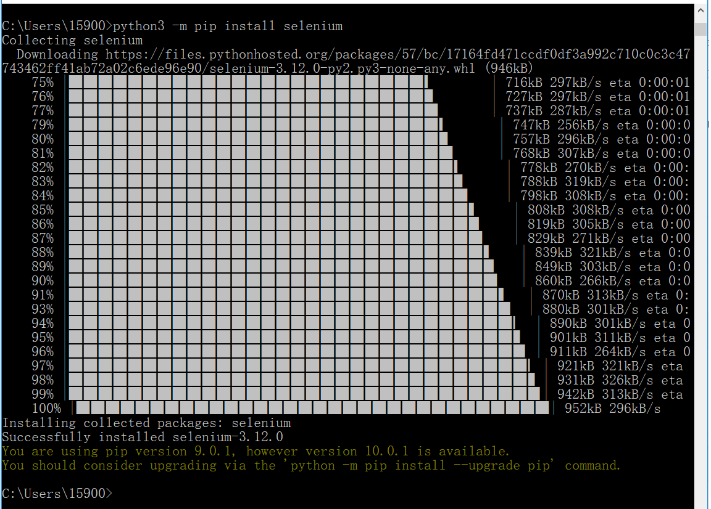

#<center>python+selenium</center>

[TOC]

# 一、`selenium`的优点

*  免费，也不用再为破解QTP而大伤脑筋

*  小巧，对于不同的语言它只是一个包而已，而QTP需要下载安装1个多G 的程序。

*  这也是最重要的一点，不管你以前更熟悉C、 java、ruby、python、或都是C# ，你都可以通过selenium完成自动化测试，而QTP只支持VBS 

*  支持多平台：windows、linux、MAC ，支持多浏览器：ie、ff、safari、opera、chrome

*  支持分布式测试用例的执行，可以把测试用例分布到不同的测试机器的执行，相当于分发机的功能。

# 二、安装工具及依赖包

##1、python 安装

### A、windows 版

```
https://www.python.org/downloads/
```

### B、linux 版

## 2、`selenium`安装

### A、通过 pip学习安装



###B、通过下载安装包安装

``` powershell
https://pypi.python.org/pypi/selenium 点击左边的 download 按钮

或者：
玩客云 >分区1 > onecloud > tools > selenium-3.12.0.tar.gz
玩客云 >分区1 > onecloud > tools > selenium-3.12.0-py2.py3-none-any.whl

采用 selenium.tar.gz 来安装，先将其解压成目录，CMD进入目录，执行如下命令：
C:\Users\15900\Downloads\selenium-3.12.0\selenium-3.12.0>python3 setup.py install
...
...
Installed c:\programs\python\python36\lib\site-packages\selenium-3.12.0-py3.6.egg
Processing dependencies for selenium==3.12.0
Finished processing dependencies for selenium==3.12.0
```

# 三、geckodriver 驱动安装

## 1、资源路径

```powershell
https://github.com/mozilla/geckodriver/releases
或者：
玩客云 >分区1 > onecloud > tools > geckodriver-v0.20.1-arm7hf.tar.gz
玩客云 >分区1 > onecloud > tools > geckodriver-v0.20.1-linux32.tar.gz
玩客云 >分区1 > onecloud > tools > geckodriver-v0.20.1-linux64.tar.gz
玩客云 >分区1 > onecloud > tools > geckodriver-v0.20.1-macos.tar.gz
玩客云 >分区1 > onecloud > tools > geckodriver-v0.20.1-win32.zip
玩客云 >分区1 > onecloud > tools > geckodriver-v0.20.1-win64.zip
```

## 2、 windows 安装方法

```powershell
将 geckodriver-v0.20.1-win64.zip 解压得到geckodriver.exe，将其拖放到 firefox 的安装目录
C:\Program Files (x86)\Mozilla Firefox
```

## 3、linux 安装方法

```powershell
解压后将 geckodriverckod 存放至 /usr/local/bin/ 路径下即可
```


# 四、用例

## 1、打开百度并停留显示2秒

```python
from selenium import webdriver
from selenium.common.exceptions import NoSuchElementException
from selenium.webdriver.common.keys import Keys
import time

browser = webdriver.Firefox() # Get local session of firefox
browser.get("http://www.baidu.com") # Load page
print ("web site found ...")
#assert "baidu!" in browser.title
#print ("assert succ ...")
#elem = browser.find_element_by_name("p") # Find the query box
#elem.send_keys("seleniumhq" + Keys.RETURN)
time.sleep(2) # Let the page load, will be added to the API
#try:
#    browser.find_element_by_xpath("//a[contains(@href,'http://seleniumhq.org')]")
#except NoSuchElementException:
#    assert 0, "can't find seleniumhq"
browser.close()
```

## 2、

 


