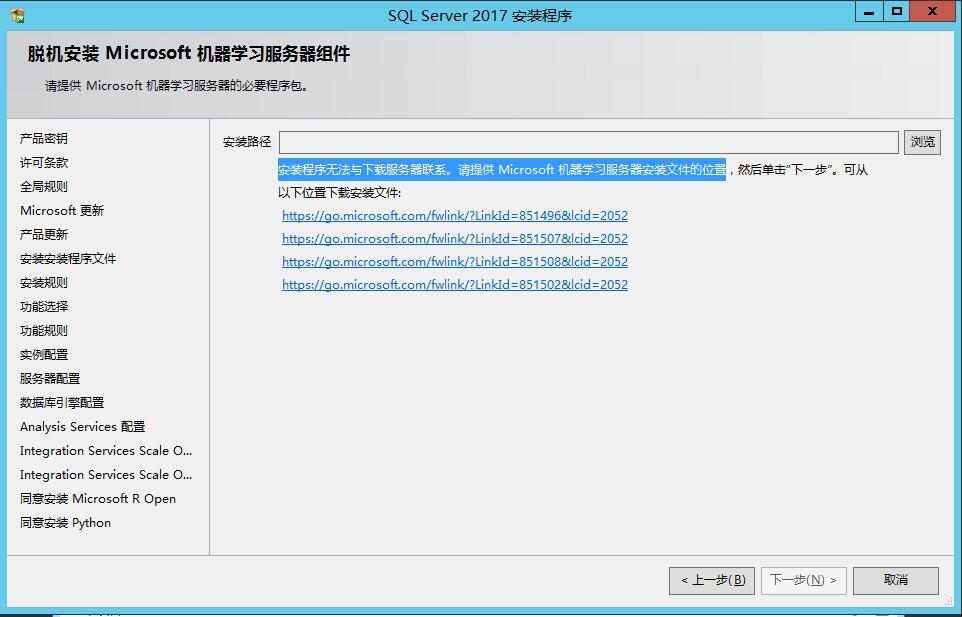
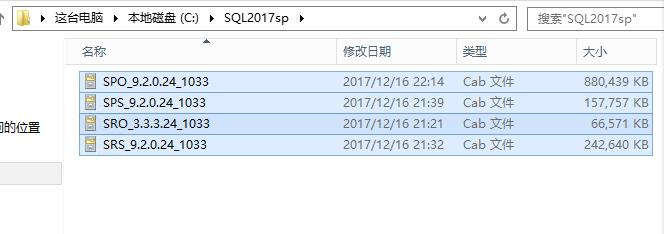
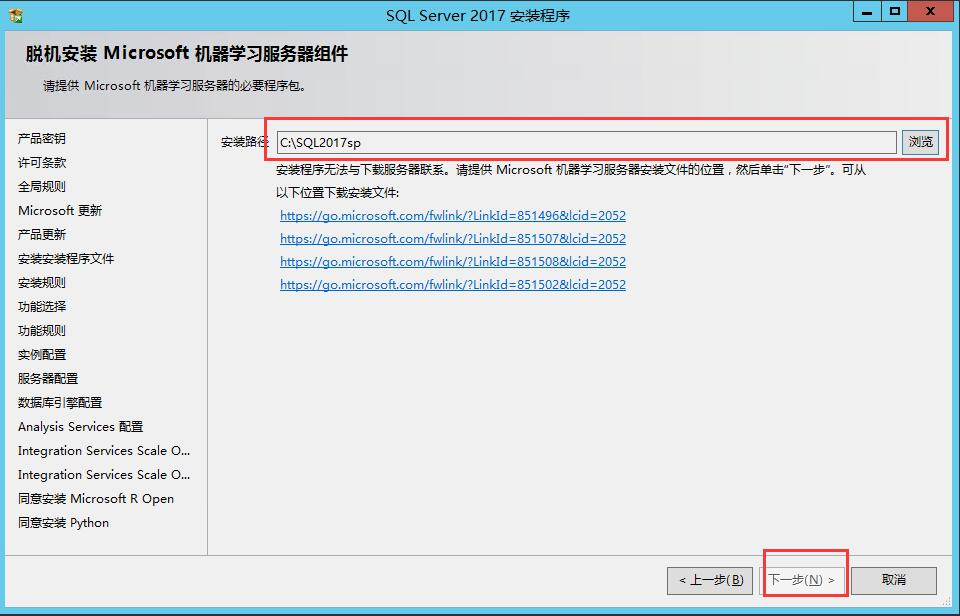
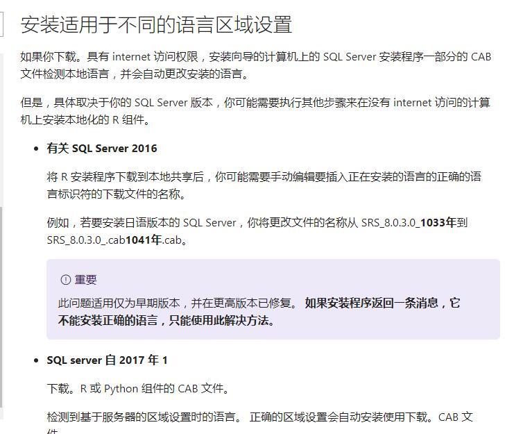
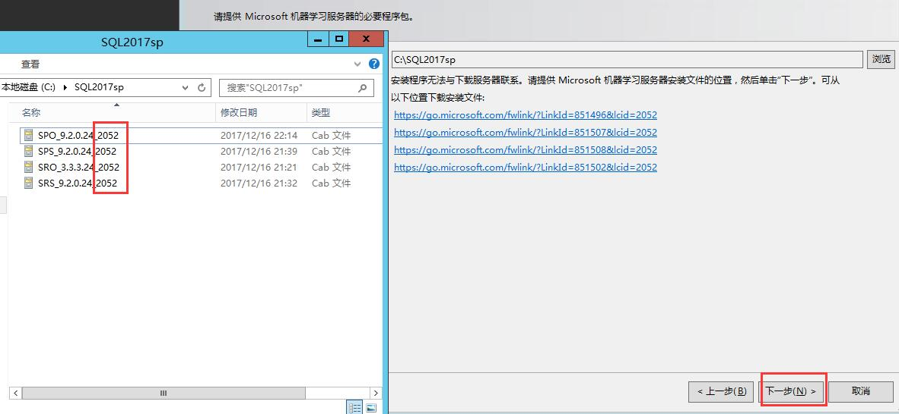

# <center>关于SQL server 2017无法安装机器学习服务的问题解决方式</center>

[TOC]

#一、资源下载

> ###安装sql server2017，在安裝机器学习服务器时会出现如下问题，无法进行在线安装，需要先将四个地址对应的安装包进行下载 



#二、下载后的文件如下



# 三、选择文件所存放的位置后发现，还是不能点击下一步 



# 四、更正语言后即可安装

```powershell
查询微软的文档后发现语言不一致，需要将文件的后缀1033修改为2052 注：1033为英文 2052表示中文
参考文档：https://docs.microsoft.com/zh-cn/sql/advanced-analytics/python/setup-python-machine-learning-services
```



# 五、修改名称后，重新进行选择，发现可以点击下一步




