# <center>关于SQL server 2017的御载</center>

[TOC]

#一、原因

> ###发现 visual studio 2013 无法连接到 sql  server 2017, 提示不兼容 
>
> 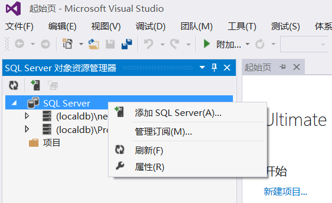
>
> 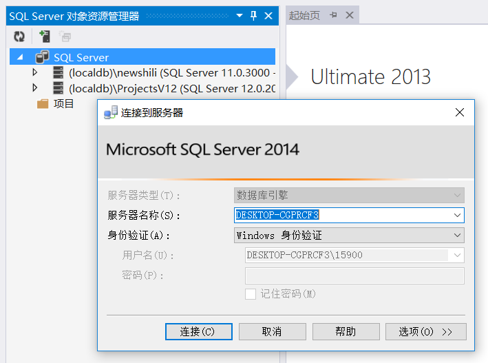
>
> 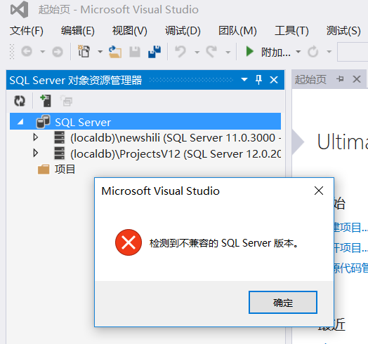


#二、御载步骤

##I、进入控制面板

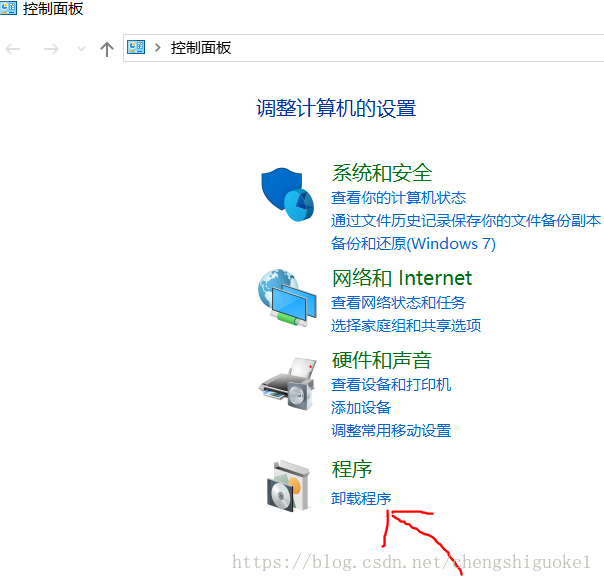

## II、找到sql server2017(64位) 

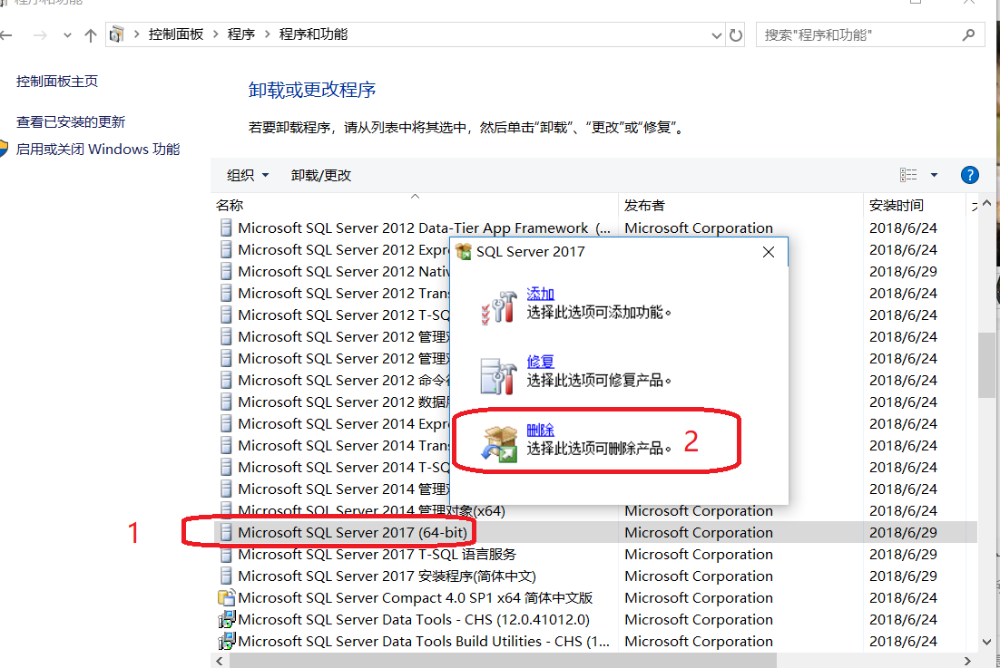

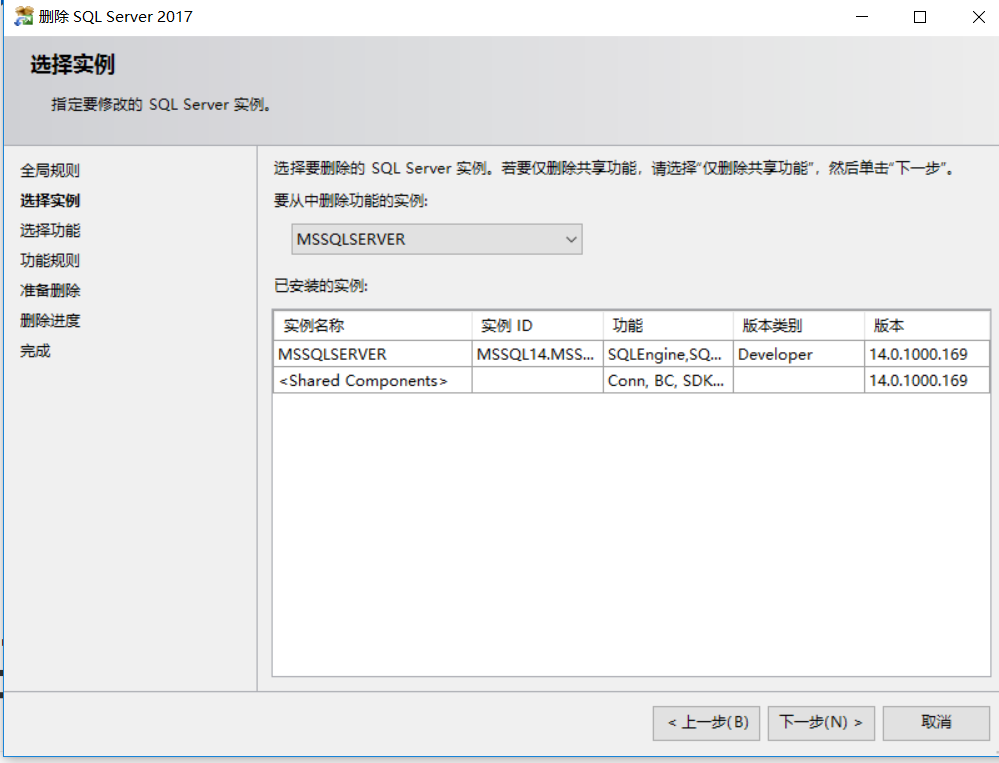

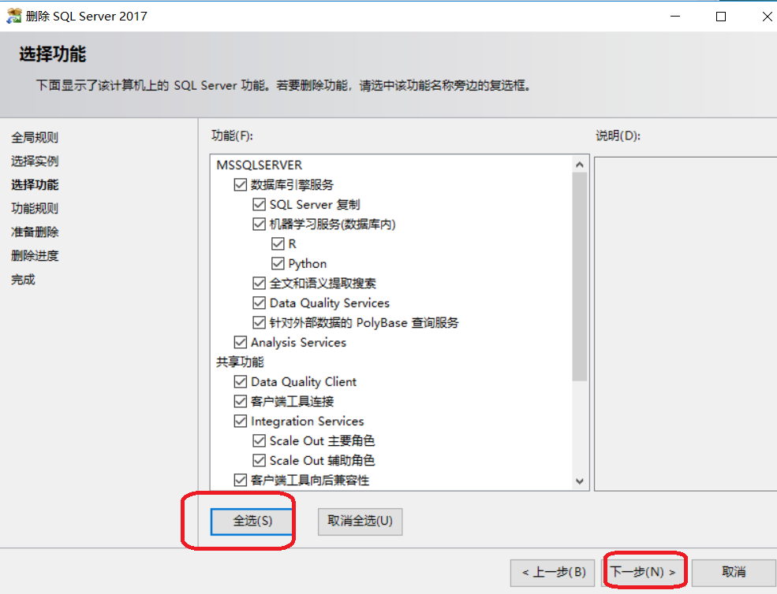

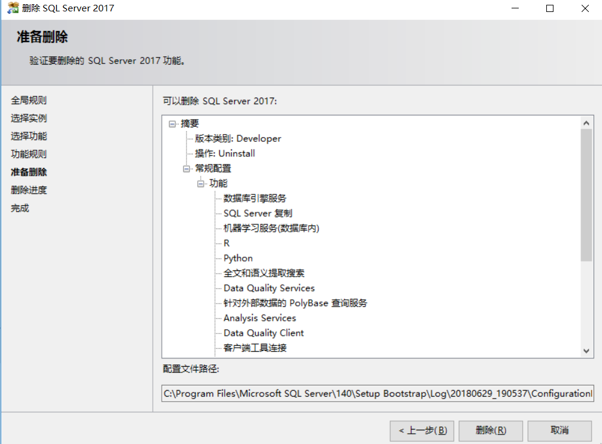

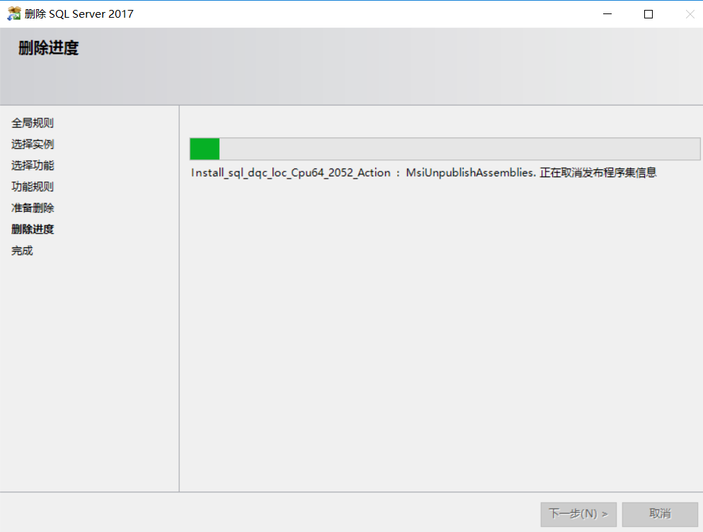

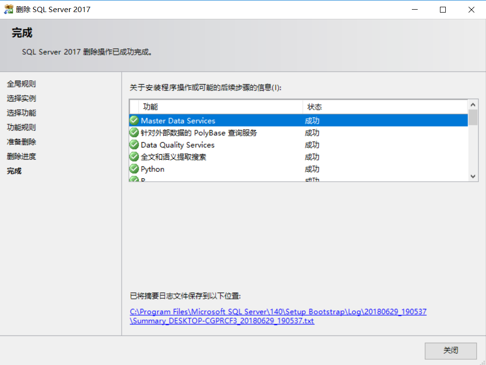


# 三、手动删除目录

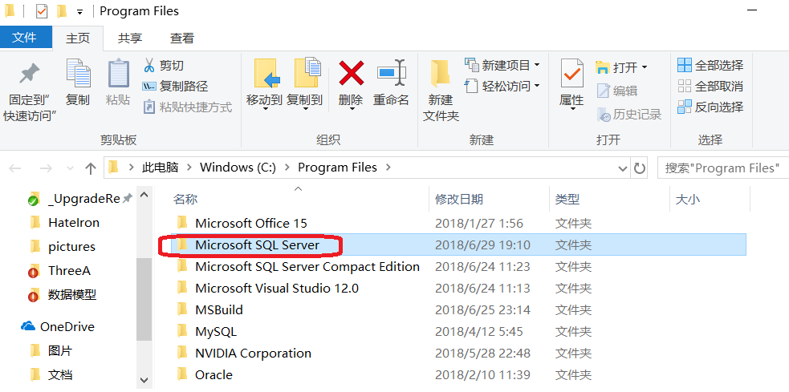

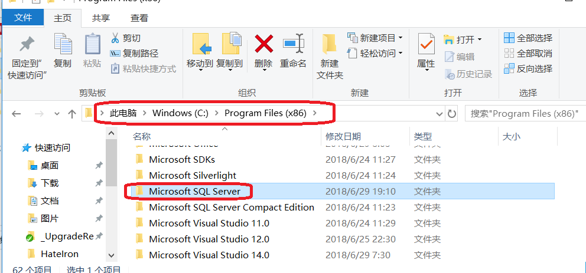


# 四、清理注册表

##I、删除注册表(win+R打开运行，输入regedit，回车运行，就会出来注册表编辑器。)

```powershell
1.将HKEY_LOCAL_MACHINE—SOFTWARE—Microsoft下的Microsoft SQL Server文件夹删除，以及下面截图的这几项
```


## II、

```powershell
2.将HKEY_CURRENT_USER—Software—-Microsoft下的Microsoft SQL Server文件夹全部删除
```

 

# 五、重启电脑


