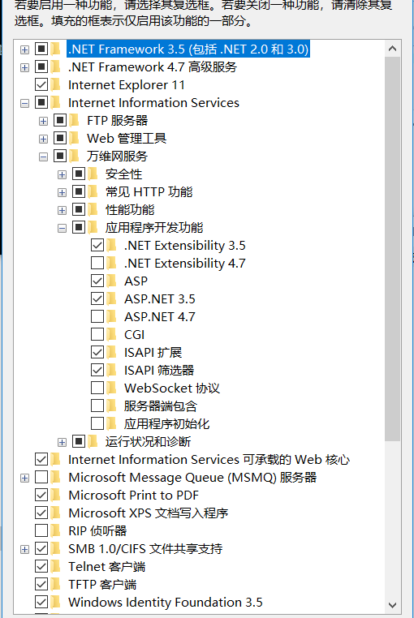
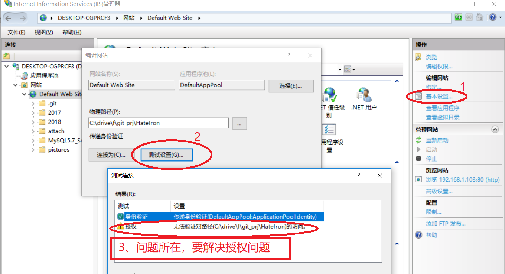
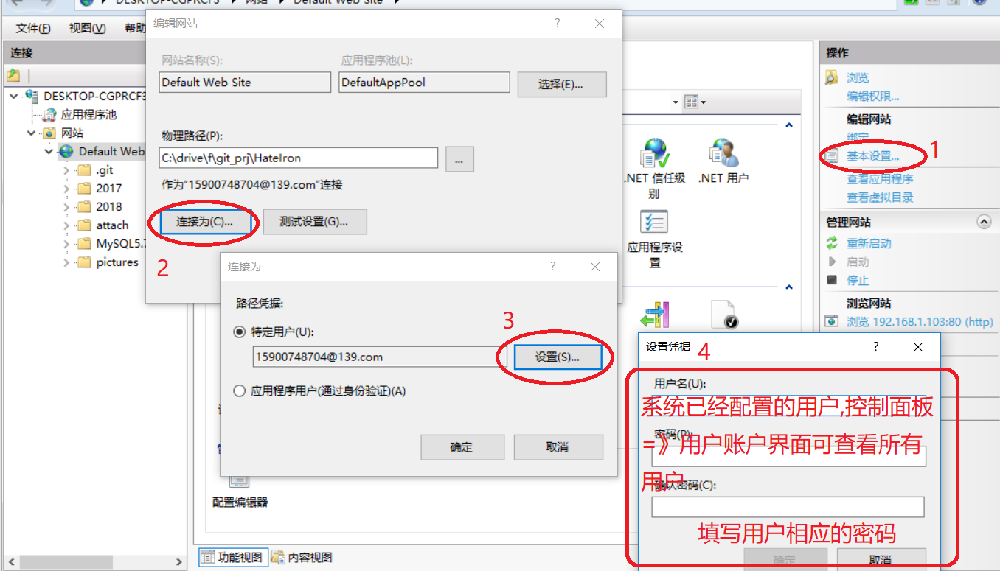
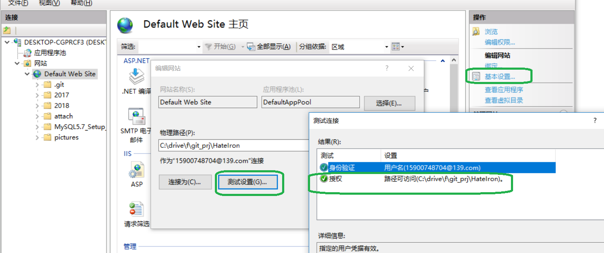
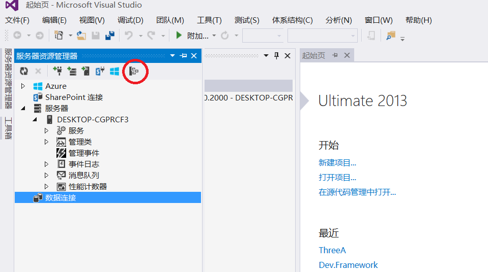
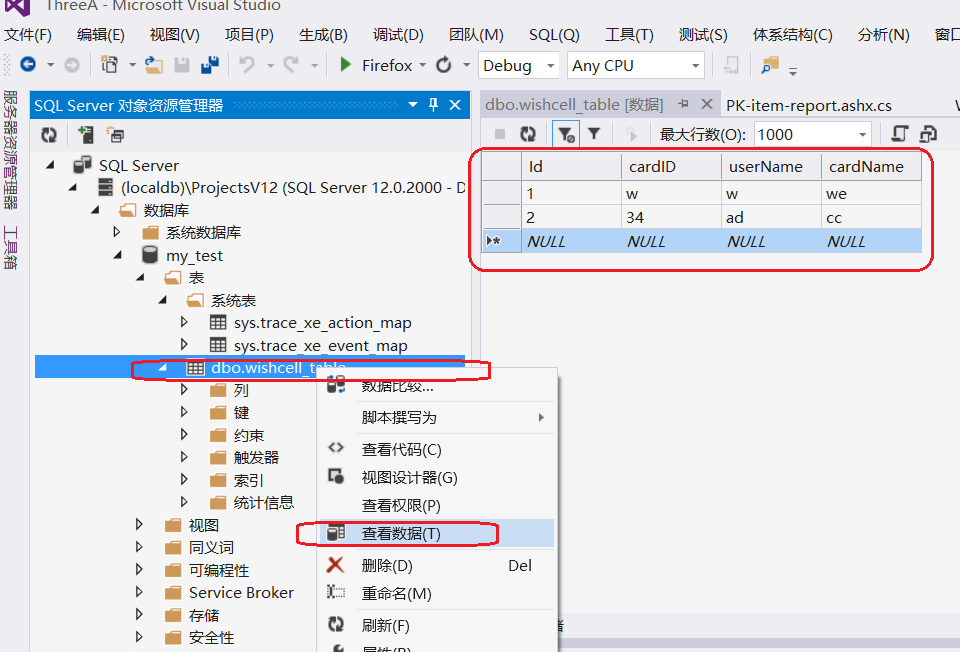
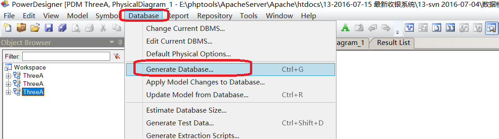

# <center>windows常用操作技巧</center>

[TOC]

#一、mstsc -v 远程发现串口连接不上设备

1. **mstsc -v**
2. **本地资源**
3. **详细信息**
4. **将“端口”去掉**
5. **再重新连接，secureCRT 可成功连接串口**

#二、`win7`断开 `samba`的方法

* 执行命令: `control keymgr.dll`，删除相应凭证
* 然后重启PC，否则无法删除干净
* 或者不删除、不重启，而是编辑之，将保存的用户名/密码更改一下，立即生效


# 三、windows  架构 IIS 服务器

> ## 此帮助文件来源于：
>
> https://jingyan.baidu.com/article/eb9f7b6d9e73d1869364e8d8.html  第一个不全 
>
> https://blog.csdn.net/staunchkai/article/details/78975865                     第二个补充
>
> https://jingyan.baidu.com/article/20b68a886d7312796cec62ef.html   第三个讲述IIS验证

## I、打开控制面板

```powershell
直接在左下角输入“控制面板”，即弹出控制面板，WIN10这方面智能一点
```

## II、开启 IIS 服务

```powershell
打开控制面板后=》选择程序=》启用或关闭windows功能 =》Internet Information Services =》勾选如下内容
（事实上还可以选择更多）
```



##III、配置IIS网站

```powershell
左边栏输入“管理工具”，找到管理工具 =》 Internet information Services(IIS)管理器 =》点击左边栏，在 计算机 名下，网站文件夹下已经默认存在一个网站
```


##IV、IIS无法验证对路径…………的访问【解决方法】

```powershell
网站启动之后，发现无法访问。
```





```powershell
新建一个用户，或者使用系统已有用户
```





## V、授权配置无法保存，意外

```powershell
再次访问本地WEB服务，失败依旧。于是到授权界面。发现又变成了授权失败。原因何在？
```

原来在配置 IIS 授权时，应该将 WEB 服务停掉。我样配置好之后再启动服务，状态就不会丢了


## VI、授权问题解决，仍然无法正常访问

至此僵住。无法突破


# 四、配置 visual studio 2013 内置 sql-server

## I、在Visual Studio中单击“工具”——“连接到数据库”

> 在弹出的“选择数据源”对话框中选择“Microsoft SQL Server”，单击“继续” 


## II、在“添加连接”对话框中的“服务器名”中输入“自己的计算机名“

```powershell
在“添加连接”对话框中的“服务器名”中输入“自己的计算机名\SQLEXPRESS”，如“HAIYANG-PC\SQLEXPRESS”，单击“确定”。也可以先单击“测试连接”按钮进行测试，会弹出对话框提示。 
```

### 1、查看本机”计算机名“

```powershell
右击”此电脑“=》属性
```


### 2、配置服务器名为”本地计算机名“后，测试失败


###3、升级 VISUAL STUDIO 浪费了90分钟，无济于事

###4、于是继续看 http://www.cnblogs.com/qixi233/p/4766451.html 

> 人家下面已经给出了解决办法，只怪自己没有看完，工具-->选最下面的“选项”->>输入'sql server'


### 5、点击'SQL SERVER'对象资源管理器



> 发现已经得到一个名叫 master 的数据库了


##III、数据库操作

### 6、添加新数据库，添加新表

> 右击数据库，==》添加数据库，即可添加好自己的数据库，然后添加自己的表


### 7、更新数据库，即看到新增的表


###8、增加数据

```powershell
右击新建的表，dbo.wishcell_table ，然后选择“查看表格”，然后就可以随意添加内容
```



### 9、怎样在代码中取得数据


## IV、visual studio 2013 内置数据库，创建数据库失败


###1、为本机数据库端口，专门放开防火墙

```powershell
控制面板->>系统安全->>Windows防火墙->>高级设置
1、新建入站规则
2、选择端口，下一步
3、选择特定本地端口，填写1433，然后全部下一步
```

### 2、配置防火墙之后，问题仍然存在

### 3、继续在百度寻寻觅觅，终于找到答案

```powershell
https://blog.csdn.net/md912165100/article/details/51499754
```

```powershell
LocalDB 命令的使用：
C:\Program Files\Microsoft SQL Server\110\Tools\Binn>SqlLocalDB.exe info
MSSQLLocalDB
newshili
v11.0

创建新的数据库：
C:\Program Files\Microsoft SQL Server\110\Tools\Binn>SqlLocalDB.exe create newshili
已使用版本 11.0 创建 LocalDB 实例“newshili”。

由于之前数据库被手动删除，无法找回。
直接将 visual studio 2013 重启。发现自动加载了：
	(localdb)\ProjectsV12(SQL Server 12.0.2000 - DESKTOP-CGPRCF3\15900)

然后，手动添加刚刚在命令行创建的数据库： newshili
```


###4、SQL 数据库连接中`Integrated Security`问题

```powershell
一、Integrated Security=True 的时候，连接语句前面的 UserID, PW 不起作用，即采用windows身份验证模式。
   只有设置为 False 或省略该项的时候，才按照 UserID, PW 来连接。
二、Integrated Security 可以设置为: True, false, yes, no
   还可以设置为：sspi ，相当于 True，建议用这个代替 True。
三、initial catalog与database的区别是什么
   Initial Catalog: / DataBase:
   两者没有任何区别只是名称不一样，就好像是人类的真实姓名与曾用名一样。。都可以叫你
四、你可以使用SQL SERVER的用户名和密码进行登录，如：
    "Provider=SQLOLEDB.1;Persist Security Info=False;Initial Catalog=数据库名;Data     Source=192.168.0.1;User ID=sa;Password=密码"
```


#五、利用 `.PDM `文件得到`sql`脚本

```powershell
项目中数据库需用到大量表，但是不知如何创建。
看到有 Workspace.sws / ThreeA.pdm 等文件。于是开始一段 sybase 探索之路
```

## I、 sybase 资源获取

```powershell
1、百度云盘：PowerDesigner165_破解版.rar / PowerDesigner165安装程序.zip
2、玩客云---分区1---onecloud---tools---PowerDesigner165_破解版.rar
   玩客云---分区1---onecloud---tools---PowerDesigner165安装程序.zip
```

## II、利用 pdm 文件生成 sql 脚本

```powershell
双击 WorkSpace.sws，打开工作空间，里面带了三个项目,按图操作
```




# 六、visual studio 2013利用 sql 文件创建表

```
打开一个 SQL 语句编辑器（具体怎么打开，又不会了）。
可以右击数据库，选择创建新表，然后会弹出一个SQL语句编辑环境，直接在这里进行语句编辑也可以。

直接将刚刚生成的 crebas.sql 内容复制---粘贴到编辑区，然后点执行，很快在数据库中生成很多表
```


# 七、安装免费的 SQL-SERVER

```powershell
鉴于 visual studio 2013 内置 SQL-SERVER 死活连接不上。只得尝试独立安装 SQL-SERVER
```

## 1、资源获取

```powershell
1、从此界面给出的四个链接地址下载
2、玩客云--分区1--onecloud--SPS_9.2.0.24_1033.cab
                --onecloud--SRO_3.3.3.24_1033.cab
                --onecloud--SPS_9.2.0.24_1033.cab
                --onecloud--SRS_9.2.0.24_1033.cab
   实际安装时，必须将 1033 改为 2052
```

## 2、安装

```powershell
可以三种方式安装：正式版（180天试用期）、开发版（无功能限制，但是不能商用）、简化版。
本人直接安装开发版。

安装过程中填写的一些参数：
https://desktop-cgprcf3:8391
CN=desktop-cgprcf3; CN=192.168.1.103；CN=127.0.0.1；
添加的本机用户名：
MSSQLSERVER 是默认的数据库名。
sa 密码： wishcell
```

## 3、安装过程中，出现问题

```powershell
安装到“脱机安装 Microsoft 机器学习服务器组件” 的时候，无法进行下一步。
为此浪费许多时间
```

解决方法：

<iframe src="sql_server_2017安装机器学习组件问题解决.html" width="1000px" height="1500px" scrolling="yes" boarder="no"></iframe>


# 八、免费的 sql server 2017 与 visual studio 2013 不兼容

````powershell
于是只得御载之。具体御载过程如下：
````

<iframe src="./sql_server_2017怎样御载.html" width="1000px" height="1500px" boarder="1px" scrolling="yes"></iframe>

#九、 visual studio 2013 对接 sql server 2008 express

 ## I、 sql server 2008 express 资源获取

```powershell
玩客云 》 分区1 》 oncloud 》tools 》　SQLServer2008JTZWB_XiaZaiZhiJia.zip
```

## II、正常安装，速度比 2017 快很多

## III、连接。

```powershell
sql server 2008 安装完成后，重启电脑，开启服务，发现 visual studio 2013　很容易添加本机服务器，并进行操作。建数据库，建表
```

## IV、`C#`代码连接数据库

```powershell
与连接本 LocalSqlDB 一样。仍然是连接是报异常
```

# 十、将安装时 windows 认证改为 sql server 认证

<iframe src="./sql_server安装时windows认证改为sql_server认证.html" width="1000px" height="1500px" boarder="1px" scrolling="yes"></iframe>

# 十一、换个思路，C++写代码连接 sql-server2008

##I、第一个例子，失败

```cpp
#include <iostream>
#include <windows.h>
#include <sqlext.h>
int main() {
    SQLHENV env;        //environment handle
    SQLHDBC dbc;        //connection handle
    SQLHSTMT stmt;      //state handle
    SQLRETURN ret;      //result return
 
    /* Allocate an environment handle */
    SQLAllocHandle(SQL_HANDLE_ENV, SQL_NULL_HANDLE, &env);
    /* We need ODBC 3 support */
    SQLSetEnvAttr(env, SQL_ATTR_ODBC_VERSION, (void *)SQL_OV_ODBC3, 0);
    /* Allocate a connection handle */
    SQLAllocHandle(SQL_HANDLE_DBC, env, &dbc);

    std::cout << "now tring to connect" << std::endl;
    /* Connect to the odbc */
    SQLDriverConnectW(dbc, NULL, L"DRIVER={SQL Server};SERVER=127.0.0.1;DATABASE=SQL_Local;User ID=sa;Password=wishcell;", SQL_NTS, NULL, 0, NULL, SQL_DRIVER_COMPLETE);
    std::cout << "I tried!" << std::endl;

    /* Check for success */
    if (SQL_SUCCESS != SQLAllocHandle(SQL_HANDLE_STMT, dbc, &stmt))
    {
        std::cout << "Failed to connect" << std::endl;
    }
    else
    {
        std::cout << "Succeed to connect" << std::endl;
        /*  close connection */
        SQLFreeHandle(SQL_HANDLE_STMT, stmt);
        SQLDisconnect(dbc);
        SQLFreeHandle(SQL_HANDLE_DBC, dbc);
        SQLFreeHandle(SQL_HANDLE_ENV, env);
    }
    //std::cin.get();
    return 0;
}
```

```powershell
编译：
	$ g++ -g connect_db.cpp -lws2_32 -mwindows -lcomctl32 -lwinmm -lodbc32 -lwinspool -lwsock32 -Wwrite-strings -o connect_db
```


## II、例二。ODBC连接 SQLServer 和 MySQL

<iframe src="./cpp_ODBC_SqlServer2008.html" width="1000px" height="1500px" boarder="1px" scrolling="yes"></iframe>


#十二、 `Microsoft SQL Server Management studio`执行脚本报错及解决办法

<iframe src="./HRESULT_E_FAIL_mscorlib.html" width="1000px" height="1000px" boarder="1px" scrolling="yes"></iframe>

# 十三、偷 Microsoft 的 visual studio 2017

```powershell
下载地址点击这里(https://visualstudio.microsoft.com/zh-hans/downloads/)
    该版本堪称史上最大IDE，随便勾了几个选项，就要占用几十个GB的安装空间，最后果断选择了最小安装包，只要600多Mb
    安装成功，随便打开一个项目之后，就获得提示：要打开这个项目，还需要继续安装xxx和xxx选项，点击确定后弹出安装界面，vs自动帮我勾选了4个多G的安装内容（赞一下这个安装方式，按需安装，尽量减少磁盘空间占用）
    最后就是贴出安装序列号啦，建议大家安装企业版，功能最强大

企业版：NJVYC-BMHX2-G77MM-4XJMR-6Q8QF
专业版：KBJFW-NXHK6-W4WJM-CRMQB-G3CDH
```


# 十四、 delphi

## I、基础安装

<iframe src="./delphi.html" width="1000px" height="1000px" boarder="1px" scrolling="yes"></iframe>


 


